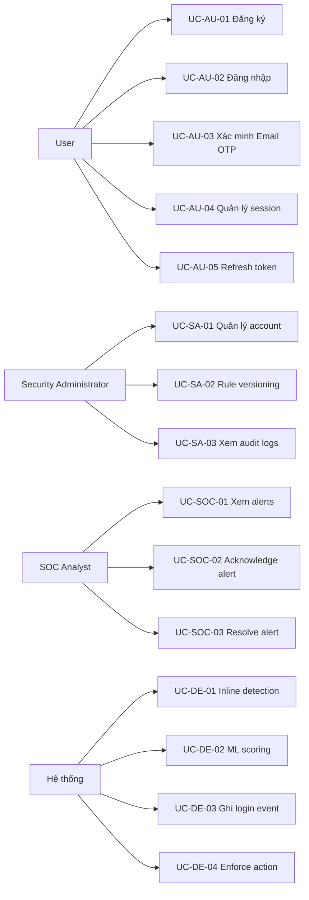

# Đặc tả Use Case Sentinel Auth

## 1. Phạm vi Use Case

Tài liệu mô tả tất cả Use Case của hệ thống **Sentinel Auth** — FastAPI single-process xử lý auth + detection + ML inline.

**Actors chính:**

---

## 2. Danh sách Use Case

### 2.1 Nhóm Auth & Session

| Mã | Tên Use Case | Actor chính | Mô tả |
|---|---|---|---|
| UC-AU-01 | Đăng ký tài khoản | User | Tạo account mới với role nền `USER`. |
| UC-AU-02 | Đăng nhập | User | Verify credentials, kiểm tra MFA flags, inline detection, trả token hoặc yêu cầu MFA. |
| UC-AU-03 | Xác minh Email OTP | User | Verify OTP 6 số, tạo session/token, xóa MFA one-time flag. |
| UC-AU-04 | Logout và quản lý session | User | Revoke session hiện tại, xem/revoke session thuộc chính mình. |
| UC-AU-05 | Refresh token | User | Dùng refresh token lấy access token mới. |

### 2.2 Nhóm Security Administrator

| Mã | Tên Use Case | Actor chính | Mô tả |
|---|---|---|---|
| UC-SA-01 | Quản lý account | Security Administrator | Gán/revoke role, khóa/mở khóa account, bật/tắt MFA persistent, xem danh sách account. |
| UC-SA-02 | Rule versioning | Security Administrator | Tạo, xem, activate/deactivate rule versions. |
| UC-SA-03 | Xem audit logs | Security Administrator | Tra cứu audit trail, lọc theo actor/action/resource/time. |

### 2.3 Nhóm SOC

| Mã | Tên Use Case | Actor chính | Mô tả |
|---|---|---|---|
| UC-SOC-01 | Xem danh sách alerts | SOC Analyst | Xem, lọc, phân trang alerts. |
| UC-SOC-02 | Acknowledge alert | SOC Analyst | Ghi nhận đã xem xét alert, chuyển trạng thái. |
| UC-SOC-03 | Resolve alert | SOC Analyst | Kết thúc xử lý alert (resolved hoặc false_positive). |

### 2.4 Nhóm Detection Engine

| Mã | Tên Use Case | Actor chính | Mô tả |
|---|---|---|---|
| UC-DE-01 | Inline detection | Hệ thống | Gọi rule scoring + ML scoring inline trong login request. |
| UC-DE-02 | ML scoring | Hệ thống | Tính anomaly score từ feature vector. |
| UC-DE-03 | Ghi login event | Hệ thống | Lưu login_attempt và detection_logs vào database. |
| UC-DE-04 | Enforce action | Hệ thống | Áp dụng REQUIRE_MFA / REVOKE_SESSIONS / LOCK_USER. |

---

## 3. Đặc tả chi tiết

### UC-AU-01 Đăng ký tài khoản

| Thuộc tính | Nội dung |
|---|---|
| **Actor chính** | User |
| **Tiền điều kiện** | Username và email chưa tồn tại trong hệ thống. |
| **Kích hoạt** | User gửi POST `/api/v1/auth/register` với username, email, password. |
| **Luồng chính** | 1. Validate username (3–50 ký tự, alphanumeric + `_`), email (valid format), password (≥8 ký tự). 2. Kiểm tra trùng username/email. 3. Hash password bằng Argon2id. 4. Tạo User record: `status=ACTIVE`, `admin_mfa_required=false`, `detection_mfa_once=false`. 5. Gán role nền `USER` (không gán special roles). 6. Ghi Audit Log. 7. Trả 201 với user_id, không trả password. |
| **Request** | `POST /api/v1/auth/register` → `{"username": "string", "email": "string", "password": "string"}` |
| **Response thành công** | `201 Created` → `{"id": "uuid", "username": "string", "email": "string", "created_at": "datetime"}` |
| **Response lỗi** | `422 Unprocessable Entity` (schema sai); `409 Conflict` (trùng username/email) |
| **Ngoại lệ** | Dữ liệu không hợp lệ trả `422`; trùng username/email trả `409`. |
| **Hậu điều kiện** | Account mới có thể login với role `USER`. Không có quyền Admin. |

---

### UC-AU-02 Đăng nhập

| Thuộc tính | Nội dung |
|---|---|
| **Actor chính** | User |
| **Tiền điều kiện** | Account tồn tại và chưa bị `LOCKED`. |
| **Kích hoạt** | User gửi POST `/api/v1/auth/login` với username, password, source_ip. |
| **Luồng chính** | 1. Rate limit: kiểm tra số request/phút/IP (max 5). Vượt → `429`. 2. Tìm user theo username, verify Argon2id hash. 3. Kiểm tra `status != LOCKED`. 4. Inline detection (UC-DE-01): gọi rule scoring + ML scoring. 5. Risk decision: `allow` / `challenge` / `block`. Nếu `block` → trả `403`. 6. Nếu `allow` và không có MFA flags → tạo Session, sinh access JWT + refresh token (hash trước khi lưu). Trả `200`. 7. Nếu `allow` và có MFA flags → tạo PreAuthTransaction, sinh OTP 6 số, hash + lưu. Gửi email OTP (Mailpit). Trả `200` + `mfa_required=true` + `session_id`. |
| **Inline Detection** | Gọi `detect_inline()` trong cùng process: rule_score → anomaly_score → combined risk_level. |
| **Request** | `POST /api/v1/auth/login` → `{"username": "string", "password": "string", "source_ip": "string?"}` |
| **Response thành công** | `200 OK` → `{"access_token": "string", "refresh_token": "string", "session_id": "uuid", "mfa_required": false}` |
| **Response MFA required** | `200 OK` → `{"access_token": "", "refresh_token": "", "session_id": "uuid", "mfa_required": true}` |
| **Response lỗi** | `401 Unauthorized` (sai credentials); `403 Forbidden` (blocked by detection); `429 Too Many Requests` (rate limit); `423 Locked` (account locked) |
| **Ngoại lệ** | Rate limit → `429`; account `LOCKED` → `423`; detection block → `403`; wrong password → generic `401` (không tiết lộ account tồn tại). |
| **Hậu điều kiện** | Hoặc có JWT + session; hoặc có PreAuthTransaction + OTP pending; hoặc login bị từ chối. |

---

### UC-AU-03 Xác minh Email OTP

| Thuộc tính | Nội dung |
|---|---|
| **Actor chính** | User |
| **Tiền điều kiện** | Có PreAuthTransaction `PENDING` của user, chưa hết hạn (5 phút), chưa bị `EXPIRED` hoặc `FAILED`. |
| **Kích hoạt** | User gửi POST `/api/v1/auth/mfa/verify` với session_id và OTP 6 số. |
| **Luồng chính** | 1. Tìm PreAuthTransaction theo session_id, kiểm tra ownership + status + expiry. 2. Verify OTP với stored hash (constant-time comparison). 3. Nếu đúng: đánh dấu `status=COMPLETED`; tạo Session + JWT. Nếu MFA là one-time (detection), xóa `detection_mfa_once`. Nếu MFA là persistent (admin), giữ nguyên. 4. Ghi LoginEvent (outcome=`mfa_success`). Trả `200`. 5. Nếu sai: tăng `fail_count`. Đến 3 → `status=FAILED`. Trả `401`. |
| **Request** | `POST /api/v1/auth/mfa/verify` → `{"session_id": "uuid", "mfa_code": "string"}` |
| **Response thành công** | `200 OK` → `{"access_token": "string", "refresh_token": "string", "session_id": "uuid"}` |
| **Response lỗi** | `400 Bad Request` (sai format); `401 Unauthorized` (sai OTP hoặc hết hạn); `404 Not Found` (session không tồn tại) |
| **Ngoại lệ** | OTP sai: `401` + tăng fail_count. Đến 3 lần: `status=FAILED`, trả `401`. OTP hết hạn: trả `401`. |
| **Hậu điều kiện** | User có JWT + session. MFA persistent giữ nguyên; MFA one-time được xóa. |

---

### UC-AU-04 Logout và quản lý session

| Thuộc tính | Nội dung |
|---|---|
| **Actor chính** | User |
| **Tiền điều kiện** | User có JWT hợp lệ. |
| **Kích hoạt** | User gọi endpoint logout hoặc xem/revoke session. |
| **Luồng chính** | 1. **Logout**: REVOKE session hiện tại (đặt `revoked_at`). 2. **Xem session**: GET `/api/v1/auth/sessions` → chỉ trả sessions thuộc `current_user`. 3. **Revoke session lạ**: DELETE `/api/v1/auth/sessions/{id}` → kiểm tra session thuộc `current_user` trước khi đặt `revoked_at`. |
| **Request** | `POST /api/v1/auth/logout`; `GET /api/v1/auth/sessions`; `DELETE /api/v1/auth/sessions/{id}` |
| **Response thành công** | `200 OK`; `200 OK` với list sessions; `204 No Content` |
| **Ngoại lệ** | Session không thuộc user → `403 Forbidden`; session không tồn tại → `404 Not Found` |
| **Hậu điều kiện** | Session bị revoke không dùng để truy cập protected API hoặc refresh token. |

---

### UC-AU-05 Refresh token

| Thuộc tính | Nội dung |
|---|---|
| **Actor chính** | User |
| **Tiền điều kiện** | Refresh token hợp lệ, chưa bị revoke. |
| **Kích hoạt** | User gửi POST `/api/v1/auth/refresh` với refresh_token. |
| **Luồng chính** | 1. Verify refresh token hash tồn tại và chưa revoked. 2. Sinh access token mới. 3. Có thể rotate refresh token (tùy implementation). |
| **Request** | `POST /api/v1/auth/refresh` → `{"refresh_token": "string"}` |
| **Response thành công** | `200 OK` → `{"access_token": "string", "refresh_token": "string?"}` |
| **Response lỗi** | `401 Unauthorized` (token không hợp lệ hoặc revoked) |

---

### UC-SA-01 Quản lý account

| Thuộc tính | Nội dung |
|---|---|
| **Actor chính** | Security Administrator |
| **Tiền điều kiện** | Admin có JWT với role `SECURITY_ADMIN` hoặc `SECURITY_MANAGER`. |
| **Kích hoạt** | Admin gọi các endpoint quản lý account. |
| **Luồng chính (gán role)** | 1. Xác thực JWT + role. 2. Validate role hợp lệ (`SECURITY_ADMIN`, `SOC_ANALYST`, `SECURITY_MANAGER`). 3. Thêm record vào `user_roles`. 4. Revoke mọi session của target user. 5. Ghi Audit Log với before/after state. |
| **Luồng chính (thu hồi role)** | 1. Kiểm tra target không phải `SECURITY_ADMIN` cuối cùng `ACTIVE`. 2. Xóa record `user_roles` tương ứng. 3. Revoke mọi session của target. 4. Ghi Audit Log. |
| **Luồng chính (khóa account)** | 1. Kiểm tra target không phải Security Admin cuối cùng `ACTIVE`. 2. Đặt `status=LOCKED`. 3. Revoke mọi session. 4. Ghi Audit Log. |
| **Luồng chính (mở khóa)** | 1. Đặt `status=ACTIVE`. 2. Ghi Audit Log. |
| **Luồng chính (MFA toggle)** | 1. Cập nhật `admin_mfa_required` của target user. 2. Ghi Audit Log. |
| **Luồng chính (xem danh sách)** | GET `/api/v1/admin/users` → danh sách account, hỗ trợ lọc `role`, `status`, phân trang. |
| **Request** | `GET /api/v1/admin/users`; `POST /api/v1/admin/users/{id}/roles`; `DELETE /api/v1/admin/users/{id}/roles/{role}`; `POST /api/v1/admin/users/{id}/lock`; `DELETE /api/v1/admin/users/{id}/lock`; `PUT /api/v1/admin/users/{id}/mfa` |
| **Response thành công** | `200 OK` / `201 Created` / `204 No Content` tùy endpoint |
| **Ngoại lệ** | Không đủ quyền → `403`; không tìm thấy user → `404`; cố gỡ SECURITY_ADMIN cuối → `409 Conflict`; không gỡ role `USER` → `422` |
| **Hậu điều kiện** | Quyền mới có hiệu lực ngay (session cũ bị revoke). Audit log ghi nhận. |

---

### UC-SA-02 Rule Versioning

| Thuộc tính | Nội dung |
|---|---|
| **Actor chính** | Security Administrator |
| **Tiền điều kiện** | Admin có JWT với role `SECURITY_ADMIN`. |
| **Luồng chính (tạo version)** | POST `/api/v1/admin/rules` với `{"version": "string", "rules_json": {...}}`. Chưa active. |
| **Luồng chính (activate)** | PUT `/api/v1/admin/rules/{id}/activate` → đặt `is_active=true`, deactivate version cũ. |
| **Luồng chính (xem)** | GET `/api/v1/admin/rules` → danh sách versions. GET `/api/v1/admin/rules/active` → version đang active. |
| **Hậu điều kiện** | Login dùng rule set của version active. |

---

### UC-SA-03 Xem Audit Logs

| Thuộc tính | Nội dung |
|---|---|
| **Actor chính** | Security Administrator |
| **Tiền điều kiện** | Admin có JWT với role `SECURITY_ADMIN`. |
| **Luồng chính** | GET `/api/v1/admin/audit-logs` → danh sách audit entries, lọc theo `actor`, `action`, `resource`, `from`/`to` timestamp, phân trang. |
| **Hậu điều kiện** | Không có — chỉ đọc. |

---

### UC-SOC-01 Xem danh sách alerts

| Thuộc tính | Nội dung |
|---|---|
| **Actor chính** | SOC Analyst |
| **Tiền điều kiện** | User có JWT với role `SOC_ANALYST`. |
| **Kích hoạt** | User gọi GET `/api/v1/soc/alerts`. |
| **Luồng chính** | 1. Xác thực JWT + role `SOC_ANALYST`. 2. Query bảng `alerts` kèm `login_attempts` join. 3. Áp dụng filter: `status`, `risk_level`, `assigned_to`, date range. 4. Phân trang (default 20/page). 5. Trả danh sách alerts. |
| **Request** | `GET /api/v1/soc/alerts?status=open&risk_level=high&page=1&limit=20` |
| **Response thành công** | `200 OK` → `{"data": [...], "total": int, "page": int, "limit": int}` |
| **Ngoại lệ** | Không đủ quyền → `403` |
| **Hậu điều kiện** | Không có. |

---

### UC-SOC-02 Acknowledge alert

| Thuộc tính | Nội dung |
|---|---|
| **Actor chính** | SOC Analyst |
| **Tiền điều kiện** | Alert tồn tại và đang `open`. |
| **Luồng chính** | 1. Xác thực JWT + role. 2. Kiểm tra alert `status=open`. 3. Cập nhật `status=acknowledged`, `assigned_to=<current_user>`, `notes`. 4. Ghi Audit Log. |
| **Request** | `PUT /api/v1/soc/alerts/{id}/acknowledge` → `{"notes": "string?"}` |
| **Response thành công** | `200 OK` → alert object đã cập nhật |
| **Ngoại lệ** | Alert không tồn tại → `404`; Alert không ở trạng thái `open` → `409 Conflict` |
| **Hậu điều kiện** | Alert có assignee. Không SOC khác nhận alert trùng. |

---

### UC-SOC-03 Resolve alert

| Thuộc tính | Nội dung |
|---|---|
| **Actor chính** | SOC Analyst |
| **Tiền điều kiện** | Alert đang `acknowledged` hoặc `open`. |
| **Luồng chính** | 1. Kiểm tra alert tồn tại. 2. Cập nhật `status=resolved` hoặc `status=false_positive`. 3. Ghi `resolved_by=<current_user>`, `resolved_at=NOW()`, `notes`. 4. Ghi Audit Log. |
| **Request** | `PUT /api/v1/soc/alerts/{id}/resolve` → `{"status": "resolved"|"false_positive", "notes": "string?"}` |
| **Response thành công** | `200 OK` → alert object |
| **Ngoại lệ** | Alert không tồn tại → `404` |
| **Hậu điều kiện** | Alert kết thúc vòng đời. Không thay đổi được nữa. |

---

### UC-DE-01 Inline Detection

| Thuộc tính | Nội dung |
|---|---|
| **Actor chính** | Hệ thống (được gọi từ UC-AU-02) |
| **Tiền điều kiện** | Có login context: username, IP, user-agent, timestamp, failed_attempts. |
| **Luồng chính** | 1. Load active rule version từ `rule_versions`. 2. Evaluate mỗi rule → rule_score 0.0–1.0. 3. Tính combined rule_score (trung bình hoặc max). 4. Gọi ML scoring (UC-DE-02) → anomaly_score 0.0–1.0. 5. Kết hợp: `combined_score = w1 * rule_score + w2 * anomaly_score`. 6. Map score → risk_level (low/medium/high/critical). 7. Decision: `allow` (≤0.3), `challenge` (0.3–0.7), `block` (>0.7). 8. Tạo Alert nếu risk_level ≥ high. 9. Ghi detection_logs. 10. Trả kết quả. |
| **Internal Endpoint** | `POST /internal/v1/detect` (X-Internal-Secret required) |
| **Request** | `POST /internal/v1/detect` → `{"username": "string", "source_ip": "string", "user_agent": "string", "timestamp": "datetime", "failed_attempts": int, "risk_level_override": "string?"}` |
| **Response** | `{"rule_score": float, "anomaly_score": float, "ml_score": float, "combined_score": float, "risk_level": "low"|"medium"|"high"|"critical", "decision": "allow"|"challenge"|"block", "rule_hits": [...], "alert_id": "uuid?"}` |
| **Hậu điều kiện** | Detection logs ghi nhận. Alert tạo nếu cần. |

---

### UC-DE-02 ML Scoring

| Thuộc tính | Nội dung |
|---|---|
| **Actor chính** | Hệ thống (được gọi từ UC-DE-01) |
| **Tiền điều kiện** | ML model đã load. |
| **Luồng chính** | 1. Nhận features vector từ login context. 2. Normalize features. 3. Gọi ML model inference → anomaly_score 0.0–1.0. 4. Trả kết quả. Nếu ML unavailable → trả `ml_status=unavailable`, `anomaly_score=null`. |
| **Internal Endpoint** | `POST /internal/v1/ml/score` (X-Internal-Secret required) |
| **Request** | `POST /internal/v1/ml/score` → `{"features": {"login_hour": int, "login_day": int, "ip_country": "string", "ip_reputation": float, "user_agent_family": "string", "asn_reputation": float, "failed_attempts_1h": int, "failed_attempts_24h": int, "geo_velocity_kmh": float, "login_streak": int}}` |
| **Response** | `{"anomaly_score": float, "ml_status": "success"|"unavailable"|"error", "model_version": "string"}` |

---

### UC-DE-03 Ghi Login Event

| Thuộc tính | Nội dung |
|---|---|
| **Actor chính** | Hệ thống (được gọi sau UC-AU-02 và UC-AU-03) |
| **Luồng chính** | 1. Tạo LoginAttempt record: `user_id`, `occurred_at`, `outcome`, `source_ip`, `policy_version`, `request_id`. 2. Ghi detection_logs cho từng stage (rule, ml, combined). 3. Nếu có alert → ghi Alert record. |
| **Hậu điều kiện** | Login attempt có trong database phục vụ detection và audit. |

---

### UC-DE-04 Enforce Action

| Thuộc tính | Nội dung |
|---|---|
| **Actor chính** | Hệ thống (gọi sau UC-DE-01 khi decision = challenge/block) |
| **Tiền điều kiện** | Action nằm trong danh sách cho phép. |
| **Luồng chính** | 1. Parse action: `REQUIRE_MFA` | `REVOKE_SESSIONS` | `LOCK_USER`. 2. Validate action + payload. 3. Áp dụng: `REQUIRE_MFA` → đặt `detection_mfa_once=true`; `REVOKE_SESSIONS` → revoke mọi session; `LOCK_USER` → đặt `status=LOCKED`. 4. Ghi Audit Log với actor `system:detection-engine`. |
| **Internal Endpoint** | `POST /internal/v1/actions` (X-Internal-Secret required) |
| **Request** | `POST /internal/v1/actions` → `{"action": "REQUIRE_MFA"|"REVOKE_SESSIONS"|"LOCK_USER", "target_user_id": "uuid", "reason": "string"}` |
| **Response** | `{"status": "applied", "action": "string", "target_user_id": "uuid"}` |
| **Ngoại lệ** | Action không hỗ trợ → `400`; user không tồn tại → `404`; sai secret → `401` |
| **Hậu điều kiện** | Biện pháp bảo vệ được áp dụng ngay trong process. |
