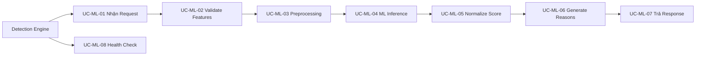

# Đặc tả Use Case ML Service

## 1. Phạm vi Use Case

ML Service không có Use Case với actor con người. Các Use Case dưới đây mô tả tương tác với Detection Engine và internal processing.



## 2. Danh sách Use Case

| Mã | Tên Use Case | Actor chính | Mô tả ngắn |
|---|---|---|---|
| UC-ML-01 | Nhận ML Request | Detection Engine | Nhận request với features, verify secret. |
| UC-ML-02 | Validate Features | Hệ thống | Kiểm tra feature schema và data types. |
| UC-ML-03 | Feature Preprocessing | Hệ thống | Tiền xử lý features theo training pipeline. |
| UC-ML-04 | ML Inference | Hệ thống | Chạy Isolation Forest model. |
| UC-ML-05 | Normalize Score | Hệ thống | Calibrate raw score thành normalized score. |
| UC-ML-06 | Generate Reason Codes | Hệ thống | Sinh reason codes từ feature analysis. |
| UC-ML-07 | Trả ML Response | Hệ thống | Trả về response cho Detection Engine. |
| UC-ML-08 | Health Check | Hệ thống | Cung cấp model availability status. |

## 3. Đặc tả chi tiết

### UC-ML-01 Nhận ML Request

| Thuộc tính | Nội dung |
|---|---|
| Actor chính | Detection Engine (service nội bộ) |
| Tiền điều kiện | Request có `X-Internal-Secret` hợp lệ. |
| Kích hoạt | Detection Engine gọi POST `/internal/score`. |
| Luồng chính | 1. Verify shared secret. 2. Parse payload. 3. Validate JSON structure. 4. Pass to UC-ML-02. |
| Ngoại lệ | Secret sai trả 401; payload invalid trả 400. |
| Hậu điều kiện | Request được validate và chuyển sang preprocessing. |

### UC-ML-02 Validate Features

| Thuộc tính | Nội dung |
|---|---|
| Actor chính | Hệ thống |
| Tiền điều kiện | Payload JSON parsed successfully. |
| Kích hoạt | Sau khi parse payload. |
| Luồng chính | 1. Check required fields: all 6 features present. 2. Validate data types: hour_of_day (0-23 int), fail_count_24h (>=0 int), ip_change_rate_7d (0-1 float), new_device (bool), average_login_interval_seconds (>=0 int), deviation_score (0-1 float). 3. If invalid → return validation error. |
| Ngoại lệ | Feature missing hoặc wrong type → 400 Bad Request. |
| Hậu điều kiện | Features validated và ready cho preprocessing. |

### UC-ML-03 Feature Preprocessing

| Thuộc tính | Nội dung |
|---|---|
| Actor chính | Hệ thống |
| Tiền điều kiện | Features validated. |
| Kích hoạt | Sau khi validation. |
| Luồng chính | 1. Load preprocessing pipeline (fitted scaler, encoders). 2. Apply same transformations như training: - Normalize hour_of_day (cyclic encoding or scaling) - Log transform fail_count if needed - Scale numerical features - Ensure new_device is binary 3. Return preprocessed feature vector. |
| Hậu điều kiện | Feature vector ready cho inference. |

### UC-ML-04 ML Inference

| Thuộc tính | Nội dung |
|---|---|
| Actor chính | Hệ thống |
| Tiền điều kiện | Feature vector ready. |
| Kích hoạt | Sau preprocessing. |
| Luồng chính | 1. Check model is loaded and ready. 2. Run Isolation Forest.predict() để get raw anomaly score. 3. For Isolation Forest: - decision_function() returns raw score (negative = anomaly, positive = normal) - Convert to normalized scale. 4. Store inference metadata (model version, timestamp). |
| Luồng phụ Model Unavailable | Nếu model không loaded → trả model_status != ready. |
| Hậu điều kiện | Raw anomaly score computed. |

### UC-ML-05 Normalize Score

| Thuộc tính | Nội dung |
|---|---|
| Actor chính | Hệ thống |
| Tiền điều kiện | Raw anomaly score computed. |
| Kích hoạt | Sau inference. |
| Luồng chính | 1. Isolation Forest decision_function returns: - negative values for anomalies - positive values for normal points 2. Convert: normalized_score = (raw_score - min) / (max - min) scaled to 0-1 3. Higher score = more anomalous. 4. Apply threshold (configurable) to determine is_anomaly. 5. Default threshold: 0.5 (tunable). |
| Hậu điều kiện | Normalized score (0-1) và is_anomaly flag ready. |

### UC-ML-06 Generate Reason Codes

| Thuộc tính | Nội dung |
|---|---|
| Actor chính | Hệ thống |
| Tiền điều kiện | Normalized score computed. |
| Kích hoạt | Sau normalization. |
| Luồng chính | 1. Analyze feature contributions nếu pipeline hỗ trợ. 2. Map feature anomalies to reason codes: - hour_of_day unusual → "unusual_time" - fail_count_24h high → "high_fail_count" - ip_change_rate_7d high → "ip_unstable" - new_device == true → "new_device" - average_login_interval unusual → "unusual_interval" - deviation_score high → "behavioral_drift" 3. Return array of applicable reason codes. |
| Hậu điều kiện | Reason codes array ready. |
| Lưu ý | Baseline có thể không có explainability → reason_codes = [] |

### UC-ML-07 Trả ML Response

| Thuộc tính | Nội dung |
|---|---|
| Actor chính | Hệ thống |
| Tiền điều kiện | Score normalized, reasons generated. |
| Kích hoạt | Sau khi có đầy đủ result. |
| Luồng chính | 1. Build response JSON: - request_id (echo from request) - normalized_anomaly_score - is_anomaly - model_version - reason_codes - model_status: "ready" 2. Return 200 OK với response body. |
| Ngoại lệ | Internal error → 500 với model_status: "error" |
| Hậu điều kiện | Detection Engine nhận đầy đủ ML evidence. |

### UC-ML-08 Health Check

| Thuộc tính | Nội dung |
|---|---|
| Actor chính | Detection Engine (hoặc orchestrator) |
| Tiền điều kiện | None. |
| Kích hoạt | GET /health hoặc /internal/health |
| Luồng chính | 1. Check model is loaded. 2. Check dependencies (DB, disk). 3. Return status: - ready: model loaded, can serve requests - degraded: model loaded but with warnings - error: model not loaded or critical issue |
| Response | 200 OK với body: `{"status": "ready|degraded|error", "model_version": "v1.0", "model_status": "ready"}` |
| Hậu điều kiện | Detection Engine biết ML availability. |

## 4. Contract với Detection Engine

### ML Request (Detection Engine → ML Service)

```json
{
  "request_id": "550e8400-e29b-41d4-a716-446655440000",
  "features": {
    "hour_of_day": 14,
    "fail_count_24h": 2,
    "ip_change_rate_7d": 0.15,
    "new_device": true,
    "average_login_interval_seconds": 28800,
    "deviation_score": 0.3
  }
}
```

### ML Response (ML Service → Detection Engine)

```json
{
  "request_id": "550e8400-e29b-41d4-a716-446655440000",
  "normalized_anomaly_score": 0.72,
  "is_anomaly": true,
  "model_version": "v1.0-isolation-forest",
  "reason_codes": ["unusual_time", "new_device"],
  "model_status": "ready"
}
```

### Health Check Response

```json
{
  "status": "ready",
  "model_version": "v1.0-isolation-forest",
  "model_status": "ready",
  "uptime_seconds": 86400
}
```

## 5. Model Status Values

| Status | Ý nghĩa | Action của Detection Engine |
|--------|---------|---------------------------|
| `ready` | Model loaded, can serve requests | Normal processing |
| `degraded` | Model loaded but with warnings | Continue with caution |
| `error` | Model not loaded or critical issue | Fallback to Rule Score only |

## 6. Error Responses

### Validation Error (400)

```json
{
  "error": "validation_error",
  "message": "Invalid features",
  "details": [
    {"field": "hour_of_day", "error": "must be between 0 and 23"}
  ]
}
```

### Unauthorized (401)

```json
{
  "error": "unauthorized",
  "message": "Invalid or missing X-Internal-Secret"
}
```

### Internal Error (500)

```json
{
  "error": "internal_error",
  "message": "ML inference failed",
  "model_status": "error"
}
```
