# Hệ thống Phát hiện Đăng nhập Bất thường — Tài liệu giảng dạy (v3.3)

> **Dành cho:** sinh viên làm đồ án Sentinel Auth
> **Nguồn:** `docs/04-…-detection-engine.md`, `docs/05-dac-ta-use-case-detection-engine.md`,
> `docs/06-phan-tich-doi-tuong-su-dung-detection-engine.md`, `docs/diagrams/ERD_v3.3.md`,
> `docs/diagrams/README.md`, `infra/postgres/schema-detection-v3.3.sql`, `TASK_ASSIGNMENT.md`
> **Nguyên tắc viết:** mọi thuật ngữ chuyên môn đều kèm tiếng Việt trong ngoặc.

---

## Mục lục

| # | Phần | Nội dung |
|---|------|----------|
| 0 | [Bức tranh toàn cảnh](#0-bức-tranh-toàn-cảnh) | Hệ thống gồm những gì |
| 1 | [Vì sao phải tách 3 dịch vụ](#1-vì-sao-phải-tách-3-dịch-vụ) | Quyết định kiến trúc |
| 2 | [Vì sao detection chạy bất đồng bộ](#2-vì-sao-detection-chạy-bất-đồng-bộ) | Outbox pattern |
| 3 | [WF-2: Luồng phát hiện](#3-wf-2-luồng-phát-hiện-đăng-nhập-bất-thường) | 7 bước chi tiết |
| 4 | [Sáu đặc trưng](#4-sáu-đặc-trưng-features) | Đầu vào cho mô hình |
| 5 | [Máy chấm điểm quy tắc](#5-máy-chấm-điểm-quy-tắc-rule-engine) | Rule Engine |
| 6 | [Gộp điểm & phân loại rủi ro](#6-gộp-điểm-và-phân-loại-mức-rủi-ro) | Risk Scoring |
| 7 | [Bốn hành động bảo vệ](#7-bốn-hành-động-bảo-vệ) | Gửi về Core App |
| 8 | [WF-3: Quy trình SOC](#8-wf-3-quy-trình-nhân-viên-soc) | Người xử lý cảnh báo |
| 9 | [Máy trạng thái cảnh báo](#9-máy-trạng-thái-cảnh-báo) | Luật chuyển trạng thái |
| 10 | [Bảy bảng dữ liệu](#10-bảy-bảng-dữ-liệu-detection-db) | Cấu trúc lưu trữ |
| 11 | [Xử lý lỗi](#11-xử-lý-lỗi-và-suy-giảm-êm) | 10 tình huống |
| 12 | [WF-6: Suy luận ML](#12-wf-6-suy-luận-học-máy) | Bên trong ML Service |
| 13 | [Tham chiếu chéo 3 DB](#13-vấn-đề-tham-chiếu-chéo-3-cơ-sở-dữ-liệu) | Điểm khó nhất |
| 14 | [Vòng đời đầu-cuối](#14-vòng-đời-một-lần-đăng-nhập) | Từ T0 đến T6 |
| 15 | [Bản đồ 16 chức năng](#15-bản-đồ-16-chức-năng-nghiệp-vụ) | Tra cứu nhanh |

---

## 0. Bức tranh toàn cảnh

Trước khi đi vào chi tiết, hãy nhìn toàn bộ hệ thống một lần.

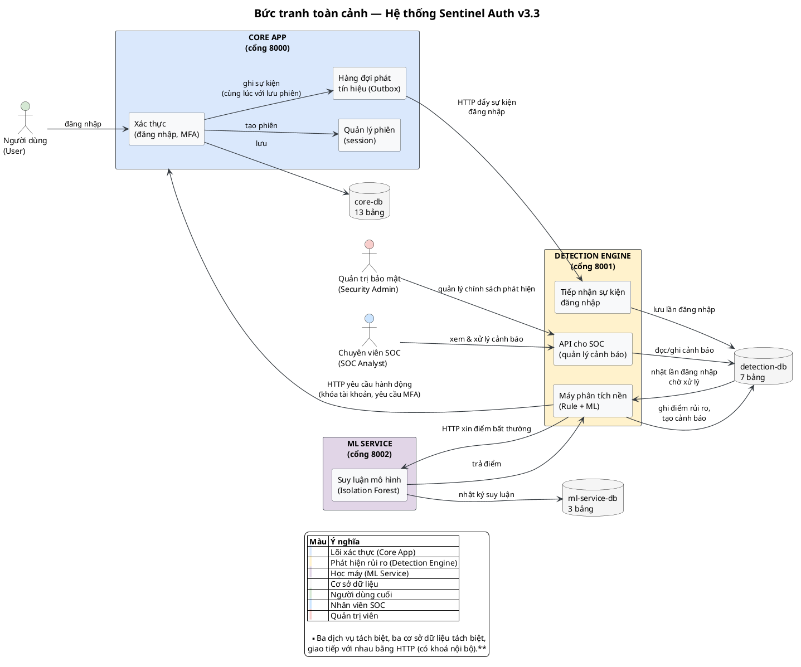

**Ba dịch vụ, ba cơ sở dữ liệu:**

| Dịch vụ | Cổng | Cơ sở dữ liệu | Số bảng | Phụ trách |
|---------|------|---------------|---------|----------|
| **Core App** | 8000 | core-db | 13 | Xác thực, MFA, phiên, quản trị người dùng — *Sony* |
| **Detection Engine** | 8001 | detection-db | 7 | Phát hiện rủi ro, quy trình cảnh báo — *Tuấn Anh* |
| **ML Service** | 8002 | ml-service-db | 3 | Suy luận mô hình — *Khang* |

**Bốn nhóm người dùng:**

| Người | Vai trò trong hệ thống |
|-------|------------------------|
| **Người dùng** (User) | Đăng nhập, xác thực MFA, quản lý phiên của mình |
| **Chuyên viên SOC** | Giám sát bảng điều khiển, tiếp nhận & phân loại cảnh báo |
| **Quản trị bảo mật** (Security Admin) | Quản lý tài khoản, chính sách phát hiện, nhật ký kiểm toán |
| **Quản lý an ninh** (Security Manager) | Xem tổng hợp, phê duyệt cảnh báo được chuyển cấp |

**Cách các thành phần nói chuyện với nhau:**
- Người dùng ↔ Core App: HTTP REST có JWT
- Core App → Detection Engine: HTTP POST, kèm **khoá nội bộ** (internal secret)
- Detection Engine → ML Service: HTTP POST, kèm khoá nội bộ
- Detection Engine → Core App: HTTP POST hành động bảo vệ (vòng ngược lại)

---

## 1. Vì sao phải tách 3 dịch vụ

### 1.1. Lý do tách (tách biệt về mặt tổ chức)

Đây là **quyết định kiến trúc** (architectural decision) quan trọng nhất của dự án. Ba nhóm phát triển có thể làm việc song song mà không đụng nhau:

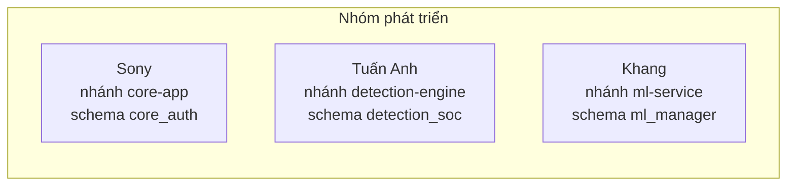

### 1.2. Đánh đổi

| ✅ Có được | ❌ Phải trả giá |
|-----------|----------------|
| Mỗi nhóm deploy, mở rộng độc lập | Phải có hợp đồng API (contract) giữa các bên |
| Lỗi một dịch vụ không kéo sập dịch vụ khác | Phải xử lý trường hợp dịch vụ không sẵn sàng (fallback) |
| Quyền truy cập cơ sở dữ liệu tách bạch | Không thể dùng khoá ngoại xuyên DB (xem [phần 13](#13-vấn-đề-tham-chiếu-chéo-3-cơ-sở-dữ-liệu)) |
| Mô hình học máy tách riêng → có thể thay model không ảnh hưởng lõi | Thêm 1–2 vòng gọi HTTP cho mỗi lần đăng nhập |

> **Điểm quan trọng:** trong bản v3.2, Detection chạy **đồng bộ** (synchronous) ngay trong request đăng nhập. Bản v3.3 đổi sang **bất đồng bộ** (asynchronous). Lý do được giải thích ở phần 2.

---

## 2. Vì sao detection chạy bất đồng bộ (Outbox Pattern)

### 2.1. So sánh hai cách

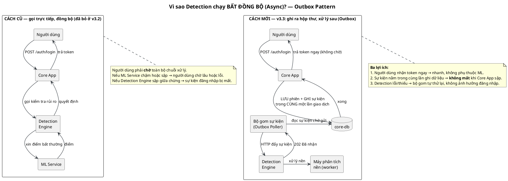

### 2.2. Cơ chế Outbox — từng bước

**Outbox pattern** = mẫu thiết kế *hộp thư giao dịch* (transactional outbox). Nguyên lý cốt lõi:

> **Ghi dữ liệu quan trọng và ghi "tín hiệu" phải nằm trong CÙNG một lần giao dịch (transaction) cơ sở dữ liệu.**

Cụ thể ở đây:

```
BƯỚC 1 — Trong cùng 1 transaction DB:
    INSERT sessions        (tạo phiên cho user)
    INSERT outbox_events   (ghi tín hiệu "có 1 lần đăng nhập")
    COMMIT

BƯỚC 2 — Trả token cho người dùng. Xong. Nhanh.

BƯỚC 3 — Worker nền (Outbox Poller), mỗi ~5 giây:
    SELECT * FROM outbox_events WHERE status='pending' LIMIT 100
    UPDATE ... SET status='processing'
    → chống 2 worker cùng gửi 1 sự kiện (dùng FOR UPDATE SKIP LOCKED)

BƯỚC 4 — HTTP POST sang Detection Engine
    Thành công → UPDATE status='published', published_at=NOW()
    Thất bại  → UPDATE status='pending', retry_count = retry_count + 1
                (tối đa max_retries = 3, sau đó đánh dấu 'failed')

BƯỚC 5 — Detection Engine kiểm tra trùng lặp (idempotency)
    Nếu event_id đã có → trả 200 "đã tồn tại", không tạo lại
    Nếu mới        → INSERT login_attempts, trả 202
```

### 2.3. Ba lợi ích cụ thể

**Lợi ích 1 — Trải nghiệm người dùng tốt**
Login chỉ cần ghi 2 dòng vào DB rồi trả token. Không phải chờ gọi HTTP sang dịch vụ khác, không phải chờ mô hình ML tính toán.

**Lợi ích 2 — Không mất dữ liệu (tính bền vững / durability)**
Tình huống: Core App xử lý login xong, tạo session, rồi **bị sập** trước khi kịp gửi tín hiệu đi.

| Cách | Kết quả |
|------|---------|
| Gọi trực tiếp (đồng bộ) | ❌ Sự kiện đăng nhập **mất vĩnh viễn** → kẻ tấn công không ai phát hiện |
| Outbox pattern | ✅ Sự kiện đã nằm trong DB → Core App khởi động lại → worker gửi tiếp |

**Lợi ích 3 — Cô lập lỗi (fault isolation)**
Detection Engine sập, ML Service treo, DB detection chậm → người dùng vẫn đăng nhập bình thường. Sự kiện tích tụ trong outbox, chờ dịch vụ phục hồi rồi xử lý.

### 2.4. Tính lũy (idempotency) — tại sao gửi lại nhiều lần vẫn an toàn

**Định nghĩa:** một thao tác là *idempotent* (tính lũy) nếu thực hiện nhiều lần cho **cùng một kết quả** như thực hiện một lần.

Trong `schema-detection-v3.3.sql`:

```sql
CREATE TABLE IF NOT EXISTS login_attempts (
    id       UUID PRIMARY KEY DEFAULT gen_random_uuid(),
    event_id UUID NOT NULL UNIQUE,  -- Idempotency key from core-app
    ...
);
```

`event_id` có ràng buộc `UNIQUE`. Nên dù Core App có gửi lại 5 lần do network chập chờn, database vẫn chỉ chứa **một** bản ghi `login_attempts`.

> **Tương tự:** nếu chuyên viên bấm nút "Tiếp nhận" (acknowledge) hai lần, hệ thống trả `409 Conflict` — không tạo ra hai lần tiếp nhận.

---

## 3. WF-2: Luồng phát hiện đăng nhập bất thường

Đây là workflow chính. Nhìn toàn cảnh trước:

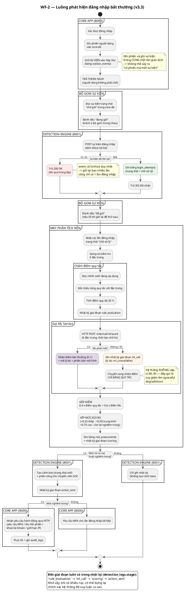

### 3.1. Mười hai lần ghi vào cơ sở dữ liệu

Đếm các điểm ghi `INSERT` / `UPDATE` trong toàn bộ luồng: **12 lần** (8 lần luôn xảy ra, 4 lần chỉ xảy ra khi rủi ro cao). Nếu bạn hiểu được 12 lần ghi này là hiểu được toàn bộ hệ thống.

| # | Bước | Bảng | Thao tác |
|---|------|------|----------|
| 1 | Xác thực đăng nhập, tạo phiên | `sessions` (core-db) | INSERT |
| 2 | Ghi tín hiệu | `outbox_events` (core-db) | INSERT |
| 3 | Worker đánh dấu đang gửi | `outbox_events` | UPDATE |
| 4 | Tiếp nhận sự kiện | `login_attempts` (detection-db) | INSERT |
| 5 | Worker đánh dấu đang xử lý | `login_attempts` | UPDATE |
| 6 | Nhật ký chấm quy tắc | `detection_logs` | INSERT (stage=`rule_evaluation`) |
| 7 | Nhật ký gọi ML | `detection_logs` | INSERT (stage=`ml_call`) |
| 8 | Lưu kết quả chấm điểm | `risk_assessments` | INSERT |
| 9 | Nhật ký gộp điểm | `detection_logs` | INSERT (stage=`scoring`) |
| 10 | Nhật ký hành động | `detection_logs` | INSERT (stage=`action_sent`) |
| 11 | Nếu rủi ro cao: tạo cảnh báo | `alerts` | INSERT |
| 12 | Nếu rủi ro cao: ghi dòng thời gian | `alert_timeline` | INSERT |

### 3.2. Bốn giai đoạn trong nhật ký phát hiện

Cột `stage` của bảng `detection_logs` có ràng buộc `CHECK` chỉ cho phép đúng 4 giá trị:

```sql
stage TEXT NOT NULL CHECK (stage IN (
    'rule_evaluation',   -- đã chấm điểm quy tắc
    'ml_call',           -- đã gọi ML (kể cả khi lỗi)
    'scoring',           -- đã gộp điểm, đã xếp mức
    'action_sent'        -- đã quyết định hành động
))
```

**Ý nghĩa:** với bất kỳ lần đăng nhập nào, luôn có đủ 4 dòng nhật ký. Khi có khiếu nại "sao tôi bị khoá tài khoản", có thể dựng lại chính xác hệ thống đã suy luận ra sao ở từng bước.

### 3.3. Cấu trúc bảng `login_attempts`

```sql
CREATE TABLE IF NOT EXISTS login_attempts (
    id                 UUID PRIMARY KEY DEFAULT gen_random_uuid(),
    event_id           UUID NOT NULL UNIQUE,   -- khoá chống trùng
    user_id            UUID,                   -- NULL nếu đăng nhập sai (không biết user nào)
    username_attempted TEXT,                   -- lưu lại username đã thử
    outcome            TEXT NOT NULL CHECK (outcome IN (
                          'success', 'failure', 'mfa_required',
                          'mfa_success', 'mfa_failed', 'blocked', 'locked', 'rate_limited')),
    mfa_used           BOOLEAN NOT NULL DEFAULT FALSE,
    ip_address         INET,                   -- kiểu INET: so sánh được theo mạng
    user_agent         TEXT,
    timestamp          TIMESTAMPTZ NOT NULL DEFAULT NOW(),
    status             TEXT NOT NULL DEFAULT 'pending'
                       CHECK (status IN ('pending', 'processed', 'failed')),
    policy_id          UUID REFERENCES policies(id) ON DELETE SET NULL,
    request_id         UUID NOT NULL DEFAULT gen_random_uuid(),
    primary_alert_id   UUID,
    risk_level         TEXT CHECK (risk_level IN ('low','medium','high','critical')),
    detection_decision TEXT CHECK (detection_decision IN ('allow','challenge','block')),
    created_at         TIMESTAMPTZ NOT NULL DEFAULT NOW(),
    updated_at         TIMESTAMPTZ NOT NULL DEFAULT NOW()
);
```

Điểm cần chú ý: các lần ghi **6, 7, 9, 10** (nhật ký `detection_logs`) luôn xảy ra, kể cả khi không có cảnh báo. Nhờ vậy mọi lần đăng nhập đều có dấu vết suy luận đầy đủ.
- `user_id` có thể `NULL` — khi đăng nhập sai mật khẩu, hệ thống không biết user nào. Nhưng `username_attempted` luôn có → dùng để phát hiện tấn công dò mật khẩu (brute-force).
- Cột `status` chính là **hàng đợi công việc** (work queue) của máy phân tích nền. Worker chỉ cần `SELECT ... WHERE status='pending'`.
- `outcome` có 8 giá trị, không chỉ 2 — phản ánh đầy đủ vòng đời đăng nhập có/không MFA.

---

## 4. Sáu đặc trưng (Features)

### 4.1. Khái niệm

**Đặc trưng (feature)** = một con số đặc trưng cho hành vi của một lần đăng nhập, dùng làm đầu vào cho mô hình học máy.

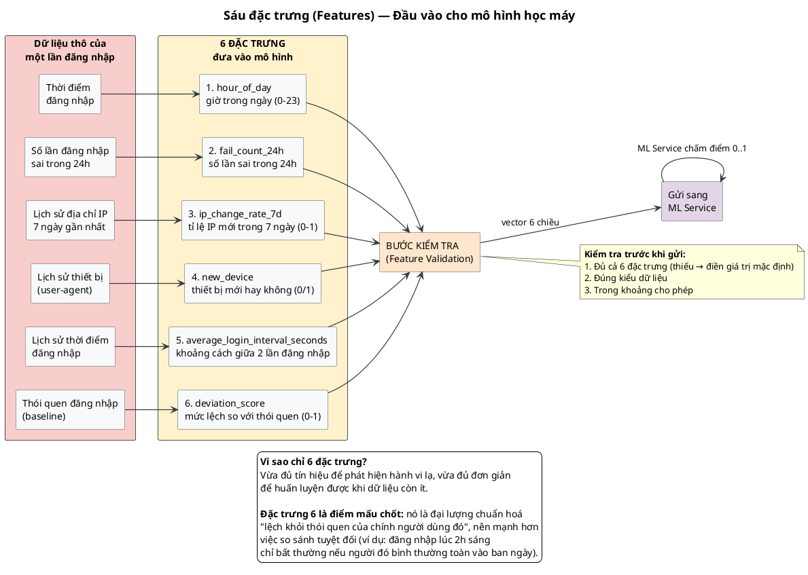

### 4.2. Bảng chi tiết

| # | Tên | Kiểu | Khoảng | Cách tính |
|---|-----|------|--------|----------|
| 1 | `hour_of_day` | Số nguyên | 0–23 | Trích từ `timestamp` |
| 2 | `fail_count_24h` | Số nguyên | ≥ 0 | Đếm `login_attempts` có `outcome='failure'` trong 24h |
| 3 | `ip_change_rate_7d` | Số thực | 0–1 | Tỉ lệ IP mới trong 7 ngày so với tổng số IP đã dùng |
| 4 | `new_device` | Boolean | 0/1 | So `user_agent` với lịch sử; hoặc đối chiếu `user_trusted_devices` |
| 5 | `average_login_interval_seconds` | Số nguyên | ≥ 0 | Trung bình khoảng cách giữa các lần đăng nhập |
| 6 | `deviation_score` | Số thực | 0–1 | Mức lệch so với thói quen (baseline) của chính user đó |

### 4.3. Vì sao `deviation_score` lại quan trọng nhất

Đây là ý tưởng cốt lõi, giải thích bằng một ví dụ:

| Người | Đăng nhập lúc 2h sáng | Kết luận |
|-------|----------------------|-----------|
| Nhân viên ngủ đêm (thường xuyên 2h sáng) | Bình thường | `deviation_score` thấp → không báo động |
| Nhân viên hành chính (luôn 9h–18h) | Bất thường | `deviation_score` cao → cảnh báo |

Cùng một hành vi, nhưng **khác nhau về mức độ bất thường** phụ thuộc vào baseline của từng người. Đây là điểm mạnh của cách tiếp cận so với quy tắc tĩnh.

### 4.4. Kiểm tra đặc trưng (DE-04)

Trước khi gửi sang ML Service, Detection Engine kiểm tra:
1. **Đủ cả 6** — thiếu thì điền giá trị mặc định (0 hoặc giá trị trung bình)
2. **Đúng kiểu** — `hour_of_day` phải là số nguyên
3. **Đúng khoảng** — `hour_of_day` phải trong 0–23

> **Vì sao cần:** mô hình học máy rất nhạy cảm với dữ liệu sai. Một giá trị `hour_of_day = 999` có thể làm mô hình cho ra kết quả hoàn toàn sai. Kiểm tra ở đầu vào rẻ hơn nhiều so với xử lý hậu quả.

---

## 5. Máy chấm điểm quy tắc (Rule Engine)

### 5.1. Nguyên lý

**Rule Engine** (máy quy tắc) = thành phần đánh giá một tập luật viết sẵn, mỗi luật là một điều kiện có thể kiểm tra bằng code.

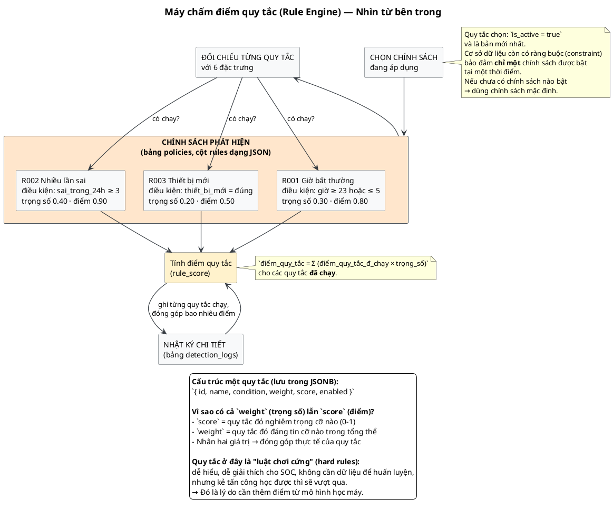

### 5.2. Quy tắc lưu ở đâu

Bảng `policies`, cột `rules` kiểu **JSONB** — cấu trúc mẫu từ schema:

```json
[
    {
        "name": "fail_count",
        "field": "fail_count_24h",
        "operator": ">",
        "value": 3,
        "weight": 0.3,
        "enabled": true
    },
    {
        "name": "new_device",
        "field": "new_device",
        "operator": "==",
        "value": true,
        "weight": 0.2,
        "enabled": true
    }
]
```

Tài liệu đặc tả mô tả dạng đầy đủ hơn (có `condition` dạng biểu thức, `score` thay vì chỉ có `weight`):

```json
{
    "id": "R001",
    "name": "Unusual Hour Login",
    "condition": "hour_of_day >= 23 OR hour_of_day <= 5",
    "weight": 0.3,
    "score": 0.8
}
```

> **Ghi chú cho nhóm phát triển:** hai dạng trên đang tồn tại song song trong tài liệu (schema SQL dùng `field/operator/value`; đặc tả use case dùng `condition/score`). **Cần thống nhất trước khi viết code** — đây là điểm có thể gây hiểu lầm khi tích hợp.

### 5.3. Công thức

**Theo đặc tả (mục 3.4 file 04):**
```
rule_score = Σ (rule.score × rule.weight)   cho các quy tắc đã chạy (triggered)
```

**Ví dụ tính tay:**

| Quy tắc | Chạy? | `score` | `weight` | Đóng góp |
|---------|------|---------|----------|----------|
| R001 Giờ bất thường (2h sáng) | ✓ | 0.8 | 0.3 | 0.24 |
| R002 Nhiều lần sai (5 lần/24h) | ✓ | 0.9 | 0.4 | 0.36 |
| R003 Thiết bị mới | ✗ | 0.5 | 0.2 | 0 |
| **Tổng `rule_score`** | | | | **0.60** |

### 5.4. Vì sao có cả `score` lẫn `weight`?

| Thuộc tính | Ý nghĩa | Ví dụ |
|------------|---------|-------|
| `score` (điểm) | Quy tắc đó **nghiêm trọng** cỡ nào (0–1) | "Nhiều lần sai" = 0.9 nghiêm trọng hơn "Thiết bị mới" = 0.5 |
| `weight` (trọng số) | Quy tắc đó **đáng tin** cỡ nào trong tổng thể | "Nhiều lần sai" = 0.4 tin cậy hơn "Giờ bất thường" = 0.3 |

Nhân hai lại → đóng góp thực tế của quy tắc vào tổng điểm.

### 5.5. Vì sao cần cả Rule **và** ML?

| | Rule Engine | Mô hình học máy |
|---|---|---|
| **Cách hoạt động** | So sánh với luật viết tay | Học từ dữ liệu |
| **Cần dữ liệu huấn luyện?** | Không | Có |
| **Giải thích được cho SOC?** | ✓ Rất dễ (biết chính xác quy tắc nào chạy) | Khó (mô hình là hộp đen) |
| **Bị đánh lừa?** | ✗ Dễ — kẻ tấn công chỉ cần tránh các quy tắc đã biết | Khó hơn nhiều |
| **Phát hiện kiểu tấn công mới?** | ✗ Không — phải viết thêm quy tắc | ✓ Tự học được |

> **Kết luận thiết kế:** trọng số `0.4` cho rule và `0.6` cho ML phản ánh sự phân bổ này — phần lớn quyết định dựa vào mô hình, nhưng vẫn giữ quy tắc làm lưới an toàn và làm căn cứ giải thích.

### 5.6. Ràng buộc "chỉ một chính sách được bật"

```sql
CONSTRAINT chk_single_active_policy
    CHECK (
        NOT (is_active AND EXISTS (
            SELECT 1 FROM policies p2
            WHERE p2.is_active = TRUE AND p2.id != id
        ))
    )
```

Quy trình **kích hoạt** (activate) chính sách — UC-DE-15:
1. Tạo policy mới → lưu với `is_active = FALSE`
2. Kích hoạt → **tắt tất cả** policy khác → bật policy này
3. Ghi `activated_at = NOW()`, ghi audit log

---

## 6. Gộp điểm và phân loại mức rủi ro

### 6.1. Công thức

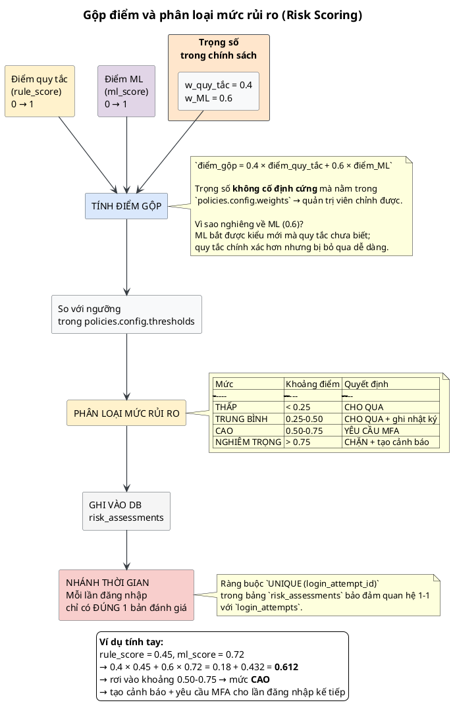

```
Risk_Score = w_rule × Rule_Score + w_ml × ML_Score
           = 0.4 × Rule_Score + 0.6 × ML_Score
```

**Trọng số không nằm cứng trong code** mà lưu trong `policies.config`:

```json
{
    "weights": {
        "rule": 0.4,
        "ml": 0.6
    },
    "thresholds": {
        "low": 0.25,
        "medium": 0.50,
        "high": 0.75
    }
}
```

→ Quản trị bảo mật có thể tinh chỉnh mà không cần sửa code, không cần deploy lại.

### 6.2. Bảng phân loại

| Mức rủi ro | Khoảng điểm | Hành động (Action) | Mô tả |
|------------|-------------|---------------------|--------|
| **LOW** (thấp) | < 0.25 | `ALLOW` | Đăng nhập bình thường |
| **MEDIUM** (trung bình) | 0.25 – 0.50 | `ALLOW_LOG` | Cho phép, ghi log cảnh báo |
| **HIGH** (cao) | 0.50 – 0.75 | `REQUIRE_MFA` | Yêu cầu xác thực MFA bổ sung |
| **CRITICAL** (nghiêm trọng) | > 0.75 | `BLOCK_ALERT` | Chặn và tạo cảnh báo |

### 6.3. Ví dụ tính tay

```
rule_score = 0.45
ml_score   = 0.72

Risk_Score = 0.4 × 0.45 + 0.6 × 0.72
          = 0.18 + 0.432
          = 0.612

0.50 ≤ 0.612 < 0.75  →  mức CAO  →  yêu cầu MFA + tạo cảnh báo
```

### 6.4. Quan hệ 1–1 với lần đăng nhập

```sql
CREATE TABLE IF NOT EXISTS risk_assessments (
    id               UUID PRIMARY KEY DEFAULT gen_random_uuid(),
    login_attempt_id UUID NOT NULL REFERENCES login_attempts(id) ON DELETE CASCADE,
    rule_score       NUMERIC(5,4),
    ml_score         NUMERIC(5,4),
    combined_score   NUMERIC(5,4),
    ml_status        TEXT CHECK (ml_status IN ('success', 'unavailable', 'error')),
    ml_model_version TEXT,
    rule_hits        JSONB,      -- quy tắc nào chạy
    ml_reason_codes  JSONB,      -- ML nghi ngờ vì lý do gì
    ml_features_used JSONB,      -- 6 đặc trưng đã dùng
    risk_level       TEXT CHECK (risk_level IN ('low','medium','high','critical')),
    decision         TEXT CHECK (decision IN ('allow','challenge','block')),
    created_at       TIMESTAMPTZ NOT NULL DEFAULT NOW(),

    CONSTRAINT uq_risk_assessment_login UNIQUE (login_attempt_id)  -- ← 1–1
);
```

> **`ml_features_used` là chi tiết quan trọng:** lưu lại **đúng 6 đặc trưng đã dùng** để tính điểm. Nhờ vậy khi SOC xem lại cảnh báo, họ biết chính xác mô hình đã "nhìn thấy" những gì — và có thể phát hiện khi dữ liệu đầu vào bị sai.

### 6.5. Cột `decision` khác gì mức rủi ro?

| Cột | Giá trị | Ý nghĩa |
|-----|---------|---------|
| `risk_level` | low / medium / high / critical | **Mức độ rủi ro** — con số khách quan |
| `decision` | allow / challenge / block | **Quyết định hành động** — chính sách đã chọn |

Một quy trình (policy) khác nhau có thể cùng một `risk_level` nhưng `decision` khác nhau. Ví dụ: quy trình "mềm" cho phép cả HIGH vẫn login, quy trình "cứng" thì chặn.

---

## 7. Bốn hành động bảo vệ

### 7.1. Bốn hành động

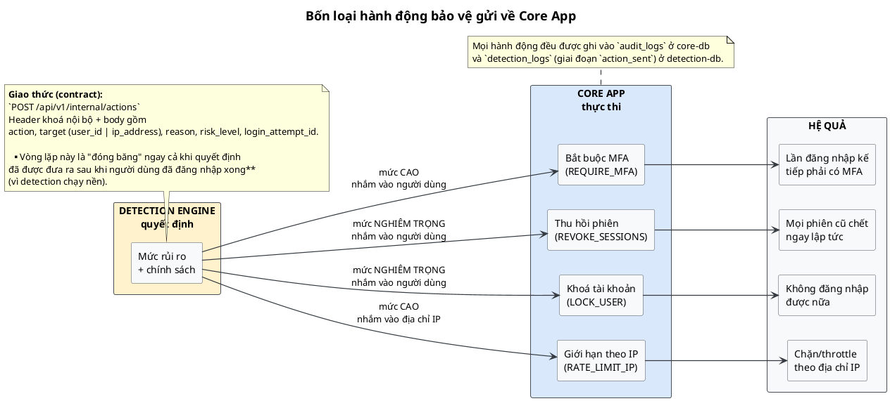

| Hành động | Đích | Khi nào | Tác động |
|-----------|------|---------|----------|
| `REQUIRE_MFA` | `user_id` | HIGH | Lần đăng nhập kế tiếp bắt buộc có MFA |
| `REVOKE_SESSIONS` | `user_id` | CRITICAL | Thu hồi **tất cả** phiên đang hoạt động |
| `LOCK_USER` | `user_id` | CRITICAL | Khoá tài khoản + thu hồi phiên |
| `RATE_LIMIT_IP` | `ip_address` | HIGH | Giới hạn tần suất theo địa chỉ IP |

### 7.2. Giao thức (contract)

```json
POST /api/v1/internal/actions
X-Internal-Secret: <shared_secret>

{
    "action": "LOCK_USER",
    "target": {
        "type": "user_id",         // hoặc "ip_address"
        "value": "uuid-cua-user"
    },
    "reason": "Risk score exceeded threshold: 0.82 (CRITICAL)",
    "risk_level": "critical",
    "login_attempt_id": "uuid-lan-dang-nhap"
}
```

### 7.3. Vòng lặp đóng băng — điểm then chốt

Vì detection chạy **bất đồng bộ**, quyết định khoá tài khoản có thể đến **sau khi** người dùng đã đăng nhập thành công và đang sử dụng hệ thống.

```
T0:  User đăng nhập thành công → nhận token → bắt đầu làm việc
                              ↓ (nền)
T1:  Detection chạy xong → phát hiện bất thường → gửi LOCK_USER
                              ↓
T2:  Core App khoá tài khoản + thu hồi phiên
```

> **Đây chính là lý do hành động `REVOKE_SESSIONS` tồn tại.** Nếu chỉ khoá tài khoản mà không thu hồi phiên, kẻ tấn công đã có token hợp lệ vẫn sử dụng được hệ thống bình thường.

### 7.4. Core App làm gì khi nhận hành động

```
VERIFY   Kiểm tra khoá nội bộ
LOOKUP   Tìm user theo target
EXECUTE  LOCK_USER      → UPDATE users SET status='locked', locked_at=NOW()
                       → UPDATE sessions SET revoked_at=NOW() WHERE revoked_at IS NULL
         REVOKE_SESSIONS→ UPDATE sessions SET revoked_at=NOW() WHERE revoked_at IS NULL
         REQUIRE_MFA    → UPDATE users SET admin_mfa_required=TRUE, detection_mfa_once=TRUE
LOG      INSERT audit_logs
RETURN   { "status": "applied", "action": ..., "details": {...} }
```

---

## 8. WF-3: Quy trình nhân viên SOC

### 8.1. Toàn bộ quy trình

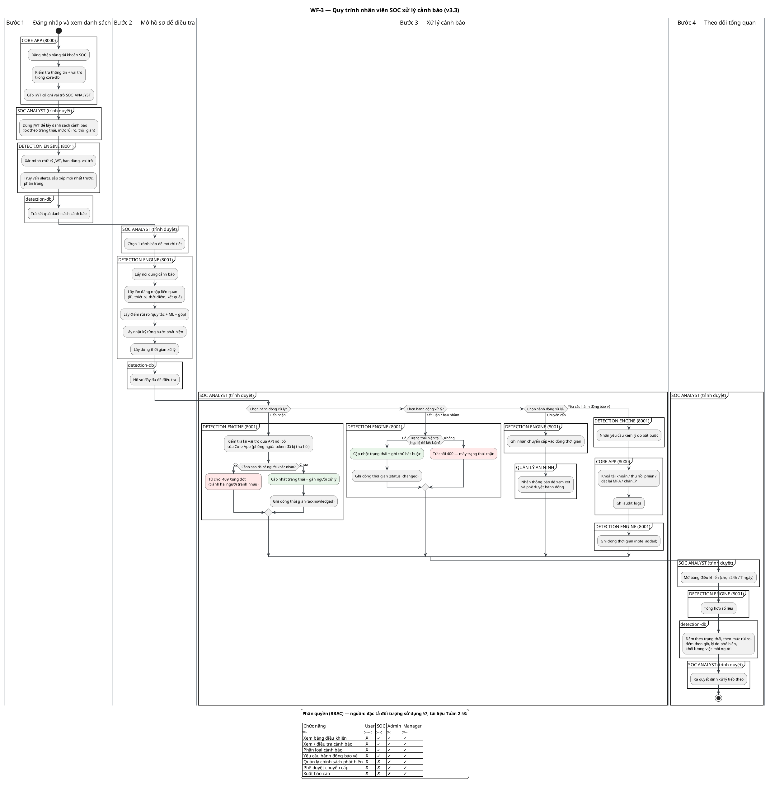

### 8.2. Bốn bước

**Bước 1 — Xem danh sách cảnh báo**
```
GET /api/v1/alerts?status=open&risk_level=high&page=1&limit=20
Authorization: Bearer {JWT}
```

**Bước 2 — Mở hồ sơ điều tra (evidence)**
```
GET /api/v1/alerts/{alert_id}/evidence
```
Trả về **5 phần** trong một lần gọi:
1. Thông tin cảnh báo
2. Thông tin lần đăng nhập (IP, thiết bị, thời điểm, kết quả)
3. Điểm rủi ro (rule / ML / gộp, mức, quyết định)
4. **Nhật ký từng bước phát hiện** (`detection_logs`)
5. **Dòng thời gian xử lý** (`alert_timeline`)

**Bước 3 — Xử lý** — xem [phần 9](#9-máy-trạng-thái-cảnh-báo)

**Bước 4 — Bảng điều khiển (dashboard)**
```
GET /api/v1/soc/dashboard?timeframe=24h
```
Số liệu tổng hợp (UC-DE-14):
- Tổng số cảnh báo theo trạng thái
- Cảnh báo theo mức rủi ro
- Cảnh báo theo thời gian (biểu đồ)
- Lý do vi phạm phổ biến nhất (top reasons)
- Khối lượng việc của từng chuyên viên

### 8.3. Ba hành động của SOC Analyst (DE-13)

| Mã | Tên | Mô tả |
|----|-----|-------|
| `ACK` | Tiếp nhận alert | Ghi nhận "tôi đang xử lý cái này" |
| `ESCALATE` | Chuyển cấp | Lên Security Manager |
| `INVESTIGATE` | Bắt đầu điều tra | Bắt đầu thu thập bằng chứng |
| `RESOLVE` | Đóng alert | Có kèm mô tả kết luận |
| `FALSE_POSITIVE` | Đánh dấu báo nhầm | Đăng nhập hợp lệ bị gắn cờ nhầm |

### 8.4. Kiểm tra lại vai trò — tại sao không tin JWT?

Mỗi hành động xử lý cảnh báo, Detection Engine **gọi lại** Core App:

```
GET /api/v1/internal/users/{actor_id}    (kèm khoá nội bộ)
```

**Lý do:** JWT đã cấp lúc đăng nhập có thể đã lỗi thời. Trong 8 giờ (thời hạn token) đó, nhân viên có thể đã bị:
- Thu hồi quyền SOC
- Bị khoá tài khoản
- Bị sa thải

→ Kiểm tra thời gian thực = **phòng thủ nhiều lớp** (defense in depth): có kiểm tra JWT, **và** kiểm tra quyền thật.

### 8.5. Cấu trúc dòng thời gian

```sql
CREATE TABLE IF NOT EXISTS alert_timeline (
    id         UUID PRIMARY KEY DEFAULT gen_random_uuid(),
    alert_id   UUID NOT NULL REFERENCES alerts(id) ON DELETE CASCADE,
    event_type TEXT NOT NULL CHECK (event_type IN (
                   'created', 'acknowledged', 'assigned', 'unassigned',
                   'escalated', 'note_added', 'status_changed',
                   'resolved', 'false_positive')),
    actor_id   UUID,                          -- tham chiếu users.id ở core-db
    actor_type TEXT NOT NULL CHECK (actor_type IN ('user', 'system')),
    old_value  TEXT,                          -- trạng thái trước
    new_value  TEXT,                          -- trạng thái sau
    comment    TEXT,                          -- lý do / ghi chú
    ip_address INET,
    created_at TIMESTAMPTZ NOT NULL DEFAULT NOW()
);
```

**9 loại sự kiện** được ghi lại. Cột `old_value` / `new_value` cho phép dựng lại chuỗi thay đổi.

> **Vì sao cần bảng này riêng mà không chỉ UPDATE bảng `alerts`?**
> Vì `alerts` chỉ lưu trạng thái **hiện tại**. Sau khi sửa xong, không còn ai biết lịch sử: ai xử lý, lúc nào, đã thử những gì, vì sao kết luận. Đây là yêu cầu bắt buộc cho **tuân thủ** (compliance) SOC 2 / ISO 27001.

### 8.6. Phân công cảnh báo (DE-12)

```
1. Round-robin cho các analyst đang active
2. Tôn trọng giới hạn max_alerts
3. Cảnh báo CRITICAL được ưu tiên cao hơn
4. Quản trị bảo mật có thể gán lại thủ công
```

Trường hồ sơ chuyên viên (từ tài liệu đối tượng sử dụng §3.1.6):
```json
{
    "id": "UUID",
    "user_id": "UUID",
    "display_name": "Nguyễn Văn A",
    "is_active": true,
    "max_alerts": 50,
    "shift_pattern": "morning|afternoon|night"
}
```

### 8.7. Chỉ số đánh giá hiệu quả (KPI) của SOC

| Chỉ số | Mục tiêu | Ý nghĩa |
|--------|----------|----------|
| Alert Response Time | < 15 phút | Từ lúc tạo cảnh báo → được tiếp nhận |
| Investigation Time | < 30 phút | Thời gian điều tra trung bình |
| Resolution Rate | > 80% | Tỉ lệ cảnh báo được xử lý trong ngày |
| False Positive Rate | < 20% | Tỉ lệ báo nhầm |

> **Vì sao False Positive Rate quan trọng?** Nếu quá 20%, SOC sẽ quá tải và bắt đầu bỏ qua cảnh báo thật. Dữ liệu phân loại `false_positive` cũng là nguồn để cải thiện mô hình.

---

## 9. Máy trạng thái cảnh báo

### 9.1. Bốn trạng thái, bốn đường đi hợp lệ

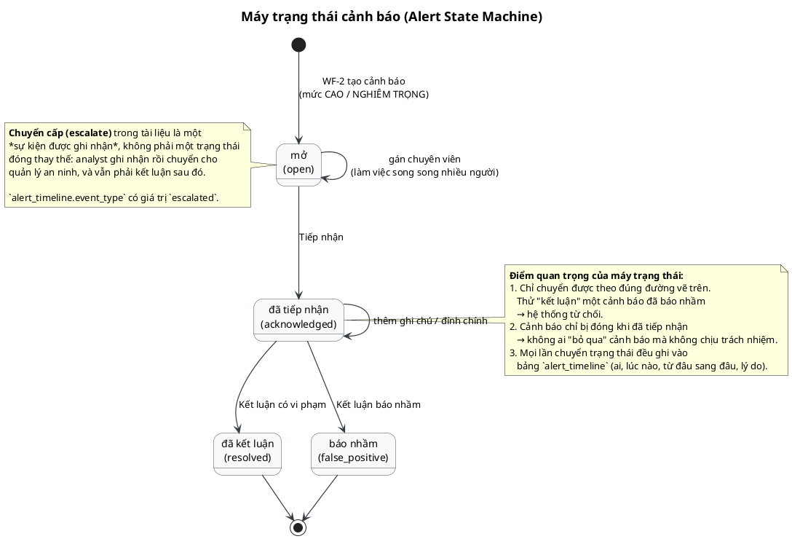

```
open ──tiếp nhận──→ acknowledged ──kết luận────→ resolved
                          │
                          ├──báo nhầm──────→ false_positive
```

### 9.2. Luật chuyển trạng thái

| Từ | Sang | Điều kiện | Mã lỗi nếu vi phạm |
|----|------|-----------|-------------------|
| *(mới tạo)* | `open` | WF-2 tạo cảnh báo | — |
| `open` | `acknowledged` | Analyst tiếp nhận | — |
| `open` | `resolved` | Cho phép (đặc tả cho phép) | — |
| `acknowledged` | `resolved` | Có mô tả kết luận | — |
| `acknowledged` | `false_positive` | Có ghi chú lý do | — |
| `resolved` | *(bất kỳ)* | ❌ Cảnh báo đã đóng | `400` |
| `false_positive` | *(bất kỳ)* | ❌ Đã kết luận là báo nhầm | `400` |

### 9.3. Vì sao bắt buộc có máy trạng thái?

**Tình huống thực tế:** analyst A nhận cảnh báo, điều tra, kết luận là hợp lệ. Sau đó analyst B mở lại (không nhớ là đã xử lý) và bấm "kết luận" lần nữa với kết luận ngược lại.

→ **Nếu không có máy trạng thái:** dữ liệu bị mâu thuẫn, không ai biết kết luận nào đúng.
→ **Nếu có máy trạng thái:** hệ thống trả `400`, buộc analyst B phải mở timeline để đọc lại lịch sử.

### 9.4. Vì sao phải "tiếp nhận" trước khi "kết luận"?

Để **không ai bỏ qua cảnh báo mà không chịu trách nhiệm**. Mỗi cảnh báo đều phải có người nhận trách nhiệm, có thời điểm tiếp nhận rõ ràng để tính KPI "Alert Response Time".

### 9.5. Về "chuyển cấp" (escalate)

Trong tài liệu, `escalate` là **sự kiện được ghi nhận**, không phải trạng thái đóng:
- Ghi vào `alert_timeline` với `event_type = 'escalated'`
- Thông báo cho Security Manager
- **Vẫn phải kết luận sau đó** (đóng alert)

Quy trình phê duyệt của Security Manager:

```
SOC Analyst chuyển cấp
        ↓
Security Manager xem xét
        ↓
   ┌────┼─────────────┐
   ↓    ↓             ↓
Phê   Từ chối      Chuyển
duyệt             cho người khác
```

---

## 10. Bảy bảng dữ liệu detection-db

### 10.1. Sơ đồ

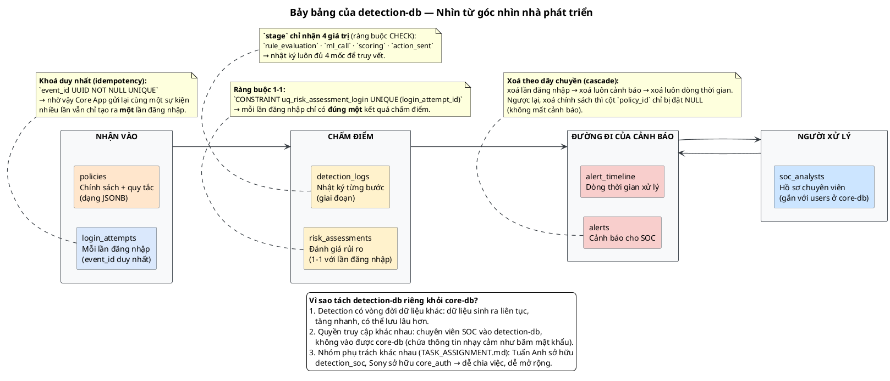

### 10.2. Bảng tra cứu nhanh

| Bảng | Số dòng ước tính | Mục đích | Ràng buộc đáng chú ý |
|------|-------------------|----------|----------------------|
| `policies` | Vài chính sách | Quy tắc + trọng số + ngưỡng (JSONB) | Chỉ 1 policy `is_active` tại một thời điểm |
| `login_attempts` | Rất nhiều (mỗi lần login 1 dòng) | Mọi sự kiện đăng nhập | `event_id UNIQUE` (chống trùng) |
| `risk_assessments` | = số `login_attempts` | Kết quả chấm điểm | `UNIQUE (login_attempt_id)` (quan hệ 1–1) |
| `detection_logs` | Rất nhiều (4 dòng / lần login) | Nhật ký từng bước | `stage` chỉ 4 giá trị |
| `alerts` | Ít hơn nhiều (chỉ HIGH/CRITICAL) | Cảnh báo cho SOC | `status` chỉ 4 giá trị |
| `alert_timeline` | Trung bình | Lịch sử xử lý | `event_type` chỉ 9 giá trị |
| `soc_analysts` | Vài chục | Hồ sơ chuyên viên | `user_id UNIQUE` (1–1 với users) |

### 10.3. Tại sao tỉ lệ số dòng lệch nhau rất xa?

```
100.000 lần đăng nhập
   ↓
100.000 login_attempts
   ↓
100.000 risk_assessments      (1–1)
   ↓
400.000 detection_logs        (4 giai đoạn × 100.000)
   ↓
  3.000 alerts               (chỉ 3% rủi ro cao)
   ↓
  9.000 alert_timeline       (3 sự kiện × 3.000)
```

**Bài học vận hành:** `detection_logs` là bảng **lớn nhất** (gấp 4 lần `login_attempts`). Cần chính sách lưu trữ (retention) riêng cho bảng này — ví dụ giữ 90 ngày rồi xoá, trong khi `alerts` và `alert_timeline` phải giữ lâu hơn để phục vụ điều tra và tuân thủ.

### 10.4. Quy tắc xoá theo dây chuyền (cascade)

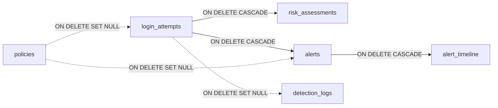

| Quan hệ | Hành động khi xoá | Lý do |
|---------|-------------------|-------|
| `login_attempts` → `risk_assessments` | CASCADE (xoá) | Đánh giá rủi ro vô nghĩa nếu không có lần đăng nhập |
| `login_attempts` → `alerts` | CASCADE (xoá) | Cảnh báo không tồn tại độc lập |
| `alerts` → `alert_timeline` | CASCADE (xoá) | Dòng thời gian không tồn tại độc lập |
| `login_attempts` → `detection_logs` | SET NULL (giữ lại) | **Giữ nhật ký kiểm toán** dù lần đăng nhập bị xoá |
| `policies` → `alerts` | SET NULL (giữ lại) | Cảnh báo cũ vẫn cần giữ để điều tra |

> **Nguyên tắc:** dữ liệu **phụ thuộc** (con) thì xoá theo; dữ liệu **lịch sử / kiểm toán** thì giữ lại.

### 10.5. Mười chỉ mục (index) phục vụ truy vấn SOC

| Bảng | Chỉ mục | Phục vụ truy vấn |
|------|--------|-----------------|
| `login_attempts` | `idx_login_attempts_status` | Worker lấy lần đăng nhập chờ xử lý |
| `login_attempts` | `idx_login_attempts_user_id` | Tra cứu lịch sử theo user (UC-DE-14) |
| `login_attempts` | `idx_login_attempts_ip` | Tìm theo IP khi điều tra |
| `login_attempts` | `idx_login_attempts_username` | Tìm theo username |
| `alerts` | `idx_alerts_status` | Lọc cảnh báo theo trạng thái |
| `alerts` | `idx_alerts_created` | Sắp xếp mới nhất trước |
| `alerts` | `idx_alerts_assigned_to` | Cảnh báo của tôi |
| `risk_assessments` | `idx_risk_assessments_risk_level` | Thống kê theo mức rủi ro |
| `risk_assessments` | `idx_risk_assessments_ml_status` | Theo dõi tỉ lệ ML lỗi |
| `detection_logs` | `idx_detection_logs_triggered` (partial) | Chỉ lấy quy tắc đã chạy |

> **Chỉ mục một phần** (partial index) — `WHERE triggered = TRUE` — chỉ lập chỉ mục cho các dòng có `triggered = true`. Vì phần lớn dòng nhật ký có `triggered` rỗng hoặc false, cách này tiết kiệm rất nhiều dung lượng.

---

## 11. Xử lý lỗi và suy giảm êm

### 11.1. Mười tình huống

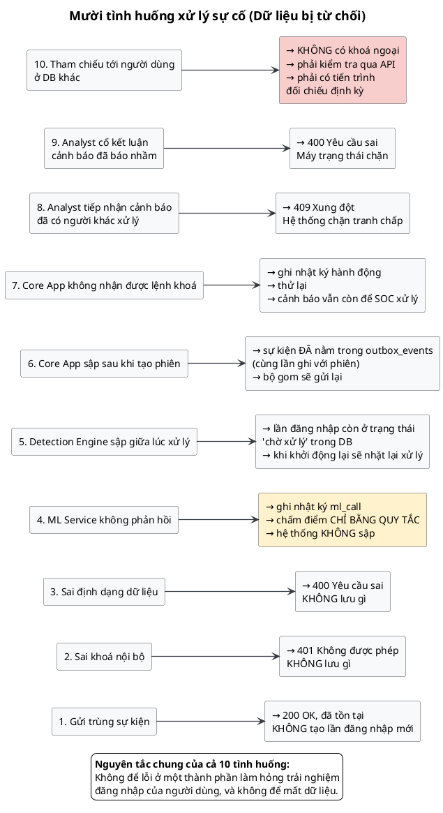

### 11.2. Bảng tra cứu

| # | Tình huống | Phản ứng | Người dùng bị ảnh hưởng? |
|---|------------|----------|---------------------------|
| 1 | Gửi trùng sự kiện | `200 OK`, bỏ qua | Không |
| 2 | Sai khoá nội bộ | `401` | Không |
| 3 | Sai định dạng JSON | `400` | Không |
| 4 | ML không phản hồi | Chấm điểm chỉ bằng quy tắc | Không |
| 5 | Detection sập giữa lúc xử lý | Lần đăng nhập còn `pending` → xử lý lại khi khởi động | Không |
| 6 | Core App sập sau khi tạo phiên | Sự kiện đã trong outbox → gửi lại | Không |
| 7 | Core App không nhận lệnh khoá | Ghi nhật ký, thử lại, cảnh báo vẫn còn cho SOC | Có (tạm thời) |
| 8 | Analyst nhận cảnh báo đã có người xử lý | `409 Conflict` | Không |
| 9 | Kết luận cảnh báo đã báo nhầm | `400` | Không |
| 10 | Tham chiếu tới user ở DB khác | Phải kiểm tra qua API, cần đối chiếu định kỳ | Không |

### 11.3. Suy giảm êm (graceful degradation) — nguyên tắc số một

**Định nghĩa:** khi một thành phần không sẵn sàng, hệ thống **giảm chất lượng dịch vụ** nhưng vẫn **hoạt động**, thay vì **ngừng hoàn toàn**.

Ba kịch bản ML (theo DE-06):

| Tình huống | Xử lý |
|-----------|--------|
| ML timeout | Dùng `rule_score` với trọng số cao hơn |
| ML error | Ghi log, tiếp tục chấm điểm chỉ bằng quy tắc |
| ML degraded | Cảnh báo nhưng vẫn dùng kết quả |
| — | Thông báo tới hệ thống giám sát |

> **Câu hỏi hay gặp trong phỏng vấn:** *"Nếu ML Service sập hoàn toàn, hệ thống có an toàn không?"*
> **Trả lời:** An toàn **bị giảm** chứ không **mất**. Vì `rule_score` vẫn chạy độc lập. Người dùng vẫn đăng nhập được, hệ thống vẫn phát hiện được các mẫu rõ ràng (giờ bất thường, nhiều lần sai). Chỉ là những kiểu tấn công tinh vi mới bị bỏ sót. Và nhờ cột `ml_status` lưu lại trạng thái, quản trị viên nhìn thống kê là biết ngay.

### 11.4. Nguyên tắc thiết kế rút ra

> **Không để lỗi ở thành phần phát hiện rủi ro làm hỏng trải nghiệm đăng nhập của người dùng.**

Đây là lý do cốt lõi của toàn bộ quyết định thiết kế bất đồng bộ. Nếu hệ thống bảo mật làm người dùng không đăng nhập được, chính hệ thống đó đã tự tạo ra một cuộc tấn công từ chối dịch vụ (DoS).

---

## 12. WF-6: Suy luận học máy

### 12.1. Toàn bộ vòng đời

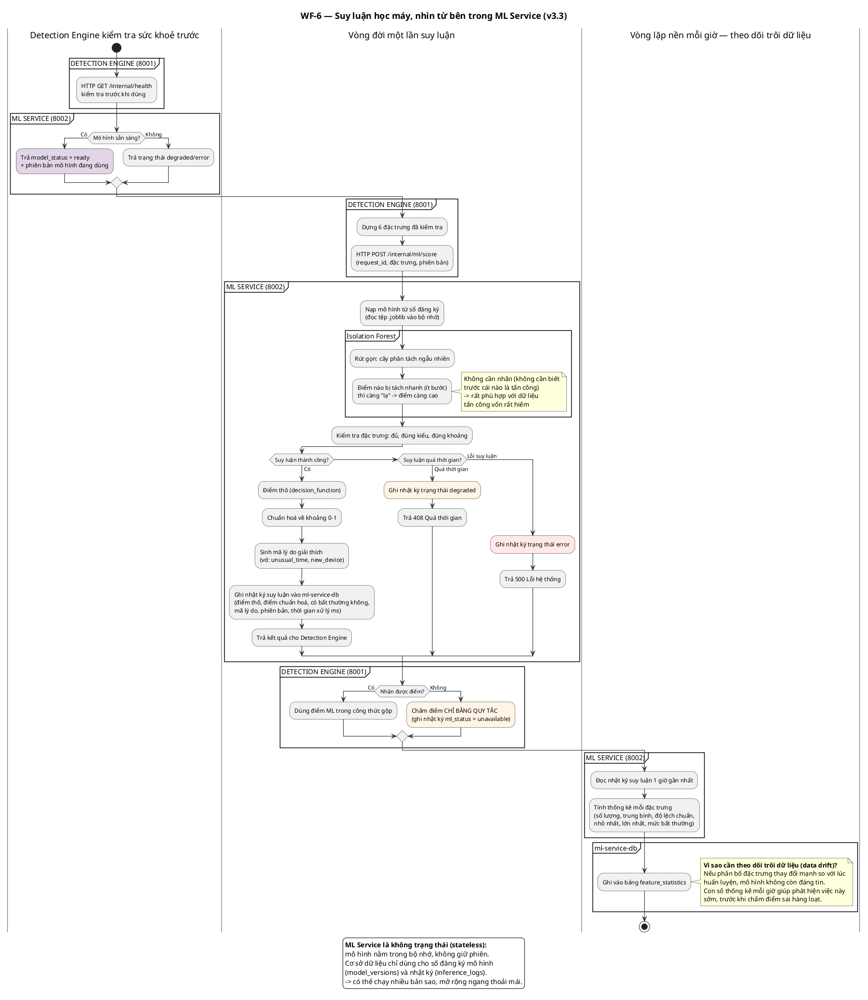

### 12.2. Isolation Forest — thuật toán

**Isolation Forest** (rừng cách ly) = thuật toán phát hiện điểm bất thường theo hướng **không giám sát** (unsupervised).

**Ý tưởng gốc — đảo ngược với thuật toán phân loại thông thường:**

| | Phân loại (classification) | Phát hiện bất thường (anomaly detection) |
|---|---|---|
| Học từ | Các ví dụ **bình thường** | Các ví dụ **bình thường** |
| Mục tiêu | Tách 2 nhóm rõ rệch | Tìm điểm **xa lạ nhất** |
| Cần nhãn? | ✓ Cần gán nhãn thủ công | ✗ Không cần |

**Cách hoạt động:**
1. Xây cây phân tách (decision tree) bằng cách chọn ngẫu nhiên một đặc trưng và một ngưỡng ngẫu nhiên
2. Lặp lại cho đến khi mỗi lá chứa đúng 1 điểm dữ liệu
3. **Điểm bất thường = điểm bị tách nhanh** (cần ít bước đi xuống lá)

```
Điểm "bình thường"  → phải đi sâu 8–10 bước mới tách được  →  điểm thấp
Điểm "lạ"          → tách được sau 2 bước              →  điểm cao
```

**Vì sao phù hợp với bài toán này:**

| Đặc điểm dữ liệu tấn công | Isolation Forest xử lý thế nào |
|--------------------------|------------------------------|
| Rất hiếm (thường < 1% dữ liệu) | ✓ Không cần nhãn, tự tìm điểm lạ |
| Không có mẫu đại diện đủ | ✓ Chỉ cần học từ dữ liệu bình thường |
| Luôn thay đổi (chiến thuật mới) | ✓ Không cần viết lại quy tắc |

### 12.3. Quy trình chuẩn hoá điểm

```
1. IsolationForest.predict(features)
        ↓
2. decision_function()  →  điểm thô (raw_score)
        ↓
3. Chuẩn hoá:  normalized_score = 1 - normalize(raw_score)   → khoảng 0–1
        ↓
4. is_anomaly = (raw_score < threshold)
        ↓
5. Sinh mã lý do (reason_codes) để giải thích
```

**Vì sao cần chuẩn hoá về 0–1?**
Vì Detection Engine cần **cộng** `ml_score` với `rule_score` trong cùng công thức. `rule_score` nằm trong 0–1, nên `ml_score` cũng phải nằm trong 0–1. Nếu không chuẩn hoá, phép cộng sẽ vô nghĩa.

**Giá trị trả về:**
```json
{
    "request_id": "UUID",
    "normalized_anomaly_score": 0.72,
    "is_anomaly": true,
    "model_version": "v1.0-isolation-forest",
    "reason_codes": ["unusual_time", "new_device"],
    "model_status": "ready"
}
```

### 12.4. ML Service không trạng thái (stateless)

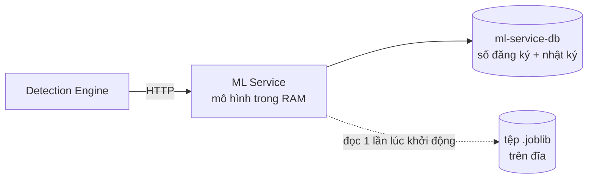

- Mô hình nạp từ tệp `.joblib` vào **bộ nhớ** lúc khởi động
- Cơ sở dữ liệu chỉ dùng cho: sổ đăng ký mô hình (`model_versions`) + nhật ký (`inference_logs`) + thống kê (`feature_statistics`)
- Không giữ phiên, không lưu trạng thái request

→ **Có thể chạy N bản sao** phía sau một cân bằng tải (load balancer), mở rộng ngang không giới hạn.

### 12.5. Theo dõi trôi dữ liệu (data drift monitoring)

**Định nghĩa:** *drift* (trôi) = phân bố dữ liệu thay đổi so với thời điểm huấn luyện.

**Ví dụ thực tế:** Mô hình được huấn luyện khi 90% người dùng đăng nhập từ Việt Nam. Sau này công ty mở chi nhánh ở Singapore → 60% đăng nhập từ Singapore. Mô hình cũ bắt đầu coi người dùng Singapore là "bất thường" → hàng loạt cảnh báo sai.

**Cơ chế phát hiện:** worker chạy **mỗi giờ**, tính toán thống kê mỗi đặc trưng từ `inference_logs` 1 giờ gần nhất, ghi vào `feature_statistics`:

| Trường | Ý nghĩa |
|--------|---------|
| `count` | Số lượng quan sát |
| `mean` | Giá trị trung bình |
| `std` | Độ lệch chuẩn (độ phân tán) |
| `min` / `max` | Giá trị nhỏ nhất / lớn nhất |
| `anomaly_rate` | Tỉ lệ bị coi là bất thường |

**Khi `anomaly_rate` tăng đột biến** → cảnh báo cho quản trị viên: cần huấn luyện lại mô hình.

---

## 13. Vấn đề tham chiếu chéo 3 cơ sở dữ liệu

### 13.1. Bản chất vấn đề

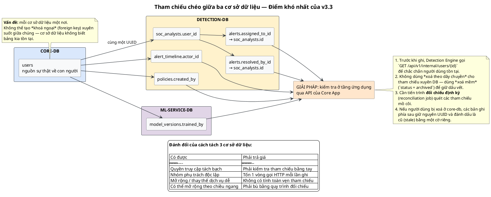

**Ví dụ cụ thể:** Detection Engine cần ghi `alert_timeline.actor_id` = UUID của chuyên viên SOC. Nhưng bảng `users` nằm ở **core-db**, còn `alert_timeline` nằm ở **detection-db**.

**Cơ sở dữ liệu PostgreSQL không cho phép** tạo *khoá ngoại* (foreign key) xuyên suốt giữa hai cơ sở dữ liệu khác nhau — vì cơ sở dữ liệu bên kia không nằm trong cùng một *cụm* (cluster).

### 13.2. Bốn cột bị ảnh hưởng

| Cột | Nằm ở đâu | Tham chiếu tới | Cách kiểm tra |
|------|-----------|---------------|--------------|
| `policies.created_by` | detection-db | `users.id` (core-db) | API kiểm tra user tồn tại |
| `soc_analysts.user_id` | detection-db | `users.id` (core-db) | API kiểm tra user tồn tại |
| `alert_timeline.actor_id` | detection-db | `users.id` (core-db) | API kiểm tra user tồn tại |
| `model_versions.trained_by` | ml-service-db | `users.id` (core-db) | API kiểm tra user tồn tại |

### 13.3. Bốn quy tắc bắt buộc (từ ERD v3.3)

```
1. Không bao giờ tạo tham chiếu mồ côi ở tầng ứng dụng
2. Dùng xoá mềm (status='archived') thay vì ON DELETE CASCADE
   cho tham chiếu xuyên cơ sở dữ liệu
3. Chạy tiến trình đối chiếu định kỳ (reconciliation job)
   để phát hiện tham chiếu mồ côi
4. Nếu user bị xoá ở core-db, các bản ghi phía sau
   giữ nguyên UUID và đánh dấu là cũ (stale) bằng cờ riêng
```

### 13.4. Tại sao chọn xoá mềm thay vì xoá cứng?

Nếu xoá cứng user ở core-db và dùng `ON DELETE CASCADE` cho tham chiếu xuyên DB (giả sử), thì:

- Mất toàn bộ cảnh báo đã giải quyết
- Mất dòng thời gian (bằng chứng tuân thủ)
- Mất lịch sử chấm điểm
- → Sập thảm: một thao tác xoá tài khoản làm sạch cả bằng chứng điều tra

Giải pháp: đánh dấu `users.status = 'archived'`, giữ nguyên mọi tham chiếu.

### 13.5. Đánh đổi tổng kết

| ✅ Có được | ❌ Phải trả giá |
|-----------|----------------|
| Quyền truy cập tách bạch (SOC không vào được core-db) | 1 vòng gọi HTTP mỗi lần ghi |
| Nhóm phụ trách độc lập | Không có tính toàn vẹn tham chiếu |
| Mở rộng/thay thế dịch vụ dễ dàng | Cần tiến trình đối chiếu định kỳ |
| Mở rộng ngang | Bù bằng quy trình nghiệp vụ chặt chẽ |

---

## 14. Vòng đời một lần đăng nhập

### 14.1. Dòng thời gian

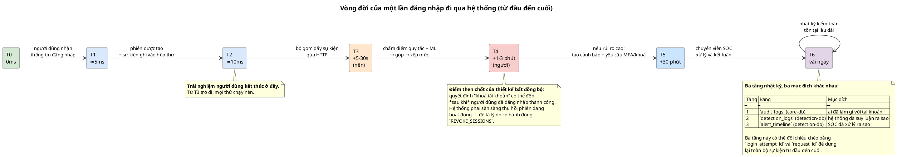

| Mốc | Thời gian | Diễn ra ở đâu | Ai chờ? |
|-----|-----------|---------------|--------|
| **T0** | 0 ms | Người dùng nhận form đăng nhập | Người dùng |
| **T1** | ≈ 5 ms | Phiên được tạo + sự kiện ghi vào hộp thư | Người dùng |
| **T2** | ≈ 10 ms | **Trả token** — kết thúc trải nghiệm | Người dùng |
| **T3** | + 5–30 giây | Bộ gom đẩy sự kiện qua HTTP | Không ai |
| **T4** | + 1–3 giây | Chấm điểm quy tắc + ML → gộp → xếp mức | Không ai |
| **T5** | + vài giây | Tạo cảnh báo + yêu cầu MFA/khoá tài khoản | Không ai |
| **T6** | + 1–3 phút | Chuyên viên SOC xử lý và kết luận | Nhân viên |
| **T7** | + 30 phút | Nhật ký kiểm toán tồn tại lâu dài | — |

### 14.2. Ba tầng nhật ký, ba mục đích

| Tầng | Bảng | Cơ sở dữ liệu | Ghi bởi ai | Trả lời câu hỏi |
|------|------|---------------|-----------|----------------|
| 1 | `audit_logs` | core-db | Core App | *Ai đã làm gì với tài khoản?* |
| 2 | `detection_logs` | detection-db | Detection Engine | *Hệ thống đã suy luận ra sao?* |
| 3 | `alert_timeline` | detection-db | SOC / hệ thống | *SOC đã xử lý ra sao?* |

### 14.3. Đối chiếu chéo bằng khoá

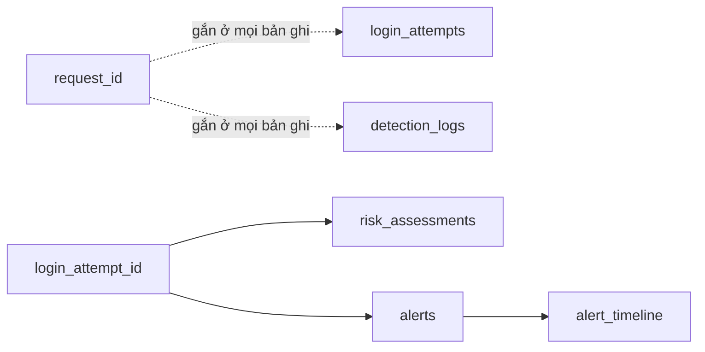

| Khoá | Nối những gì |
|------|-------------|
| `request_id` | `login_attempts` ↔ `detection_logs` (mọi lần ghi trong 1 request) |
| `login_attempt_id` | `login_attempts` ↔ `risk_assessments` ↔ `alerts` |
| `alert_id` | `alerts` ↔ `alert_timeline` |

> **Kỹ thuật:** dùng `request_id` là cách chẩn đoán (troubleshooting) hiệu quả nhất. Khi có khiếu nại, tra một `request_id` là dựng được **toàn bộ** chuỗi xử lý của lần đăng nhập đó — kể cả các bước thất bại.

### 14.4. Câu hỏi trả lời được nhờ thiết kế này

| Câu hỏi | Nguồn dữ liệu |
|---------|--------------|
| "Tại sao tôi bị khoá tài khoản lúc 14:23?" | `login_attempts.timestamp` + `risk_assessments` + `detection_logs` |
| "Lúc đó quy tắc nào đã chạy?" | `detection_logs` có `rule_name`, `triggered`, `score_contribution` |
| "Mô hình nghi ngờ vì lý do gì?" | `risk_assessments.ml_reason_codes` |
| "Ai đã xử lý cảnh báo này?" | `alert_timeline.actor_id` + `comment` |
| "Cảnh báo này có phải báo nhầm không?" | `alerts.status = 'false_positive'` + tỉ lệ tổng thể |
| "Tỉ lệ ML lỗi tuần này?" | `risk_assessments.ml_status` (`success`/`unavailable`/`error`) |
| "Tuần này có bao nhiêu cảnh báo báo nhầm?" | `alerts` GROUP BY `status` |

---

## 15. Bản đồ 16 chức năng nghiệp vụ

### 15.1. Bản đồ

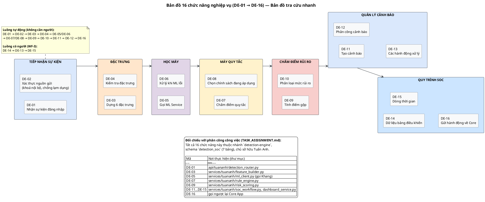

### 15.2. Bảng tra cứu đầy đủ

| Mã | Tên chức năng | Nhóm | Use case | Ưu tiên |
|----|---------------|------|----------|----------|
| DE-01 | Nhận LoginEvent | Tiếp nhận sự kiện | UC-DE-01 | Bắt buộc |
| DE-02 | Xác thực event source | Tiếp nhận sự kiện | UC-DE-01 | Bắt buộc |
| DE-03 | Feature Building | Feature Engineering | UC-DE-02 | Bắt buộc |
| DE-04 | Feature Validation | Feature Engineering | UC-DE-02 | Bắt buộc |
| DE-05 | Gọi ML Service | ML Integration | UC-DE-03 | Bắt buộc |
| DE-06 | ML Fallback | ML Integration | UC-DE-03 | Bắt buộc |
| DE-07 | Rule Evaluation | Rule Engine | UC-DE-04 | Bắt buộc |
| DE-08 | Active Policy Selection | Rule Engine | UC-DE-04 | Bắt buộc |
| DE-09 | Tính điểm gộp | Risk Scoring | UC-DE-05 | Bắt buộc |
| DE-10 | Risk Level Classification | Risk Scoring | UC-DE-05 | Bắt buộc |
| DE-11 | Alert Creation | Alert Management | UC-DE-06 | Bắt buộc |
| DE-12 | Alert Assignment | Alert Management | UC-DE-06 | Bắt buộc |
| DE-13 | Alert Actions | Alert Management | UC-DE-13 | Bắt buộc |
| DE-14 | SOC Dashboard Data | SOC Workflow | UC-DE-08 | Bắt buộc |
| DE-15 | Alert Timeline | SOC Workflow | UC-DE-09→12 | Bắt buộc |
| DE-16 | Action Request to Core | SOC Workflow | UC-DE-07 | Bắt buộc |

### 15.3. Đối chiếu phân công công việc

Từ `TASK_ASSIGNMENT.md`, toàn bộ 16 chức năng thuộc:
- **Nhánh:** `detection-engine`
- **Schema:** `detection_soc` (7 bảng)
- **Chủ sở hữu:** Tuấn Anh

| Chức năng | Thư mục thực hiện |
|-----------|-------------------|
| DE-01 | `api/tuananh/detection_router.py` |
| DE-03 | `services/tuananh/feature_builder.py` |
| DE-05 | `services/tuananh/ml_client.py` (HTTP client → Khang) |
| DE-07 | `services/tuananh/rule_engine.py` |
| DE-09 | `services/tuananh/r risk_scoring.py` |
| DE-11…DE-15 | `services/tuananh/soc_workflow.py`, `dashboard_service.py` |
| DE-16 | gọi ngược lại Core App |

### 15.4. Ba luồng chính

```
LUỒNG TỰ ĐỘNG (không cần người):
DE-01 → DE-02 → DE-03 → DE-04 → DE-05/DE-06 → DE-07/DE-08
     → DE-09 → DE-10 → DE-11 → DE-12 → DE-16

LUỒNG CÓ NGƯỜI (WF-3):
DE-14 (dashboard) → DE-13 (hành động) → DE-15 (dòng thời gian)

CẦU NỐI HAI LUỒNG:
DE-16 (gửi hành động bảo vệ về lõi)
```

---

## Phụ lục A — Danh sách thuật ngữ

| Thuật ngữ (EN) | Tiếng Việt | Giải thích ngắn |
|----------------|------------|------------------|
| **Outbox pattern** | Mẫu hộp thư giao dịch | Ghi tín hiệu trong cùng transaction với dữ liệu chính, worker gửi sau |
| **Idempotency** | Tính lũy | Thực hiện nhiều lần cho cùng kết quả như một lần |
| **Idempotency key** | Khoá chống trùng | `event_id` UNIQUE để nhận biết sự kiện đã xử lý |
| **Asynchronous** | Bất đồng bộ | Không chờ kết quả trước khi trả về cho người dùng |
| **Synchronous** | Đồng bộ | Chờ xong toàn bộ chuỗi xử lý rồi mới trả về |
| **Graceful degradation** | Suy giảm êm | Lỗi một phần → giảm chất lượng dịch vụ nhưng vẫn chạy |
| **Feature engineering** | Kỹ thuật tạo đặc trưng | Biến dữ liệu thô thành con số mô hình hiểu được |
| **Feature** | Đặc trưng | Con số đặc trưng cho hành vi, là đầu vào mô hình |
| **Feature validation** | Kiểm tra đặc trưng | Xác nhận đủ, đúng kiểu, đúng khoảng |
| **Rule engine** | Máy quy tắc | Đánh giá các luật viết sẵn |
| **Weight** | Trọng số | Mức độ đóng góp của một thành phần |
| **Threshold** | Ngưỡng | Giá trị phân định ranh giới các mức |
| **Anomaly score** | Điểm bất thường | Mức độ lạ của hành vi (0–1) |
| **Isolation Forest** | Rừng cách ly | Thuật toán phát hiện điểm bất thường không giám sát |
| **Supervised learning** | Học có giám sát | Cần nhãn đã gán sẵn |
| **Unsupervised learning** | Học không giám sát | Không cần nhãn, tự tìm điểm lạ |
| **Data drift** | Trôi dữ liệu | Phân bố dữ liệu thay đổi so với lúc huấn luyện |
| **Reason codes** | Mã lý do | Mã giải thích vì sao bị nghi ngờ |
| **Stateless** | Không trạng thái | Không giữ phiên giữa các request |
| **Round-robin** | Luân phiên | Phân công cảnh báo lần lượt cho từng người |
| **RBAC** | Phân quyền theo vai trò | Quyền hạn gắn với vai trò (role) |
| **SOC** | Trung tâm giám sát an ninh | Security Operations Center — nơi xử lý cảnh báo |
| **False positive** | Báo nhầm | Cảnh báo sai, đăng nhập thực ra hợp lệ |
| **True positive** | Phát hiện đúng | Cảnh báo đúng, thực sự có vi phạm |
| **Cascade delete** | Xoá theo dây chuyền | Xoá cha → tự động xoá con |
| **Soft delete** | Xoá mềm | Đánh dấu đã xoá, giữ dữ liệu |
| **Foreign key** | Khoá ngoại | Ràng buộc toàn vẹn tham chiếu giữa hai bảng |
| **JSONB** | Kiểu dữ liệu JSON của PostgreSQL | Lưu cấu trúc linh hoạt, vẫn index được |
| **CHECK constraint** | Ràng buộc kiểm tra | Chỉ cho phép giá trị trong danh sách cho trước |
| **Partial index** | Chỉ mục một phần | Chỉ lập chỉ mục cho một phần dữ liệu |
| **Audit trail** | Dấu vết kiểm toán | Nhật ký không thể sửa, dùng chứng minh tuân thủ |
| **Defense in depth** | Phòng thủ nhiều lớp | Nhiều lớp kiểm soát, một lớp hỏng vẫn an toàn |
| **Internal secret** | Khoá nội bộ | Khoá dùng chung xác thực giao tiếp giữa các dịch vụ nội bộ |

---

## Phụ lục B — Điểm cần thống nhất trước khi viết code

Khi đọc tài liệu, có 4 điểm chưa thống nhất giữa các file. Đây là danh sách nên trao đổi với cả nhóm:

| # | Điểm | Khác biệt | Gợi ý |
|---|------|-----------|--------|
| 1 | **Cấu trúc quy tắc** | Schema SQL dùng `field`/`operator`/`value`/`weight`; đặc tả use case dùng `condition`/`score`/`weight` | Chọn một dạng, ghi vào hợp đồng API |
| 2 | **Ngưỡng mức rủi ro** | Đặc tả: `0.25/0.50/0.75`; code mẫu `app/detection.py`: `0.2/0.5/0.8` | Lấy theo đặc tả v3.3 (0.25/0.50/0.75) |
| 3 | **Cách gộp điểm** | Đặc tả: **cộng** từng quy tắc (`Σ`); code mẫu: lấy **max** | Xác nhận, cần ghi rõ trong đặc tả |
| 4 | **Đường dẫn endpoint** | Tài liệu dùng `/api/v1/internal/login-events`; code mẫu dùng `/internal/v1/detect` | Thống nhất theo `docs/diagrams/README.md` |

> **Ghi chú:** các file trong `app/` (do ai đó viết để thử nghiệm) dùng cấu trúc bảng `policy_versions` (v2) thay vì `policies` (v3.3), và tính điểm ML bằng heuristic thay vì gọi ML Service. Khi triển khai, cần theo đúng schema v3.3 trong `infra/postgres/schema-detection-v3.3.sql`.

---

## Phụ lục C — Cách render lại các hình

```bash
# Cần Java + plantuml.jar
java -jar plantuml.jar docs/diagrams/v3.3-detect/*.puml

# Hoặc dùng make
cd docs/diagrams/v3.3-detect
for f in *.puml; do
  java -Dfile.encoding=UTF-8 -jar plantuml.jar -tsvg -o . "$f"
  java -Dfile.encoding=UTF-8 -jar plantuml.jar -tpng -o . "$f"
done
```

**Tệp trong thư mục này:**

| Tệp | Nội dung |
|-----|----------|
| `00-tong-quan` | Bức tranh toàn cảnh hệ thống |
| `01-vi-sao-bat-dong-bo` | So sánh đồng bộ vs bất đồng bộ |
| `02-wf2-duong-dien-chinh` | Luồng WF-2 chi tiết |
| `03-sau-dac-trung` | Sáu đặc trưng |
| `04-may-cham-diem-quy-tac` | Máy chấm điểm quy tắc |
| `05-gop-diem-phan-loai` | Gộp điểm & phân loại |
| `06-hanh-dong-ve-core` | Bốn hành động bảo vệ |
| `07-wf3-quy-trinh-soc` | Quy trình SOC |
| `08-may-trang-thai-canh-bao` | Máy trạng thái cảnh báo |
| `09-du-lieu-detection-db` | Bảy bảng dữ liệu |
| `10-tinh-huong-xu-ly-loi` | Mười tình huống lỗi |
| `11-wf6-suy-luan-ml` | Suy luận học máy |
| `12-tham-chieu-cheo-3-db` | Tham chiếu chéo 3 DB |
| `13-vong-doi-mot-lan-dang-nhap` | Vòng đời đầu-cuối |
| `14-ban-do-16-chuc-nang` | Bản đồ 16 chức năng |

---

**Phiên bản tài liệu:** 1.0
**Ngày:** 2026-10-04
**Dựa trên:** Sentinel Auth v3.3
