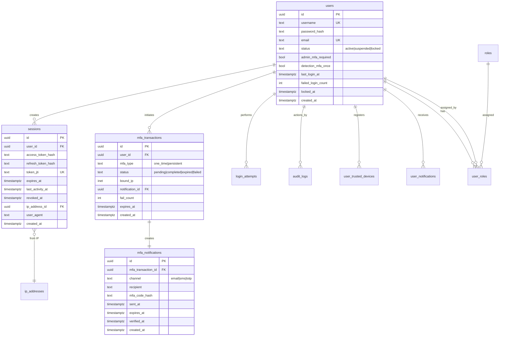
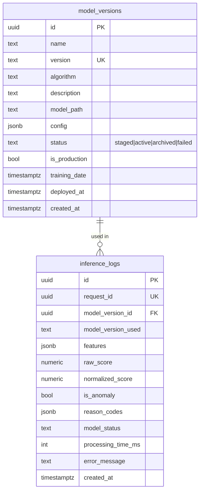

# SENTINEL AUTH - TÀI LIỆU TỔNG HỢP v3.3

> **Phiên bản:** 3.3  
> **Ngày:** 2026-09-13  
> **Trạng thái:** Hoàn thành thiết kế

---

## MỤC LỤC

1. [Tổng quan hệ thống](#1-tổng-quan-hệ-thống)
2. [Kiến trúc hệ thống](#2-kiến-trúc-hệ-thống)
3. [Database Schema](#3-database-schema)
4. [ERD - Entity Relationship Diagram](#4-erd---entity-relationship-diagram)
5. [Core App - Tài liệu](#5-core-app---tài-liệu)
6. [Detection Engine - Tài liệu](#6-detection-engine---tài-liệu)
7. [ML Service - Tài liệu](#7-ml-service---tài-liệu)
8. [API Contracts](#8-api-contracts)
9. [ADR - Architecture Decision Records](#9-adr---architecture-decision-records)

---

## 1. TỔNG QUAN HỆ THỐNG

### 1.1 Giới thiệu

**Sentinel Auth** là hệ thống xác thực và phát hiện bất thường (Anomaly Detection) cho đăng nhập, kết hợp:
- **Xác thực đa yếu tố (MFA)**
- **Phát hiện bất thường bằng Rule Engine**
- **Phát hiện bất thường bằng ML (Isolation Forest)**
- **SOC Workflow cho điều tra alert**

### 1.2 Các thành phần chính

| Thành phần | Mô tả | Database |
|-------------|--------|----------|
| **Core App** | Xác thực, MFA, quản lý user/session | core-db (13 tables) |
| **Detection Engine** | Rule Engine, Risk Scoring, SOC Workflow | detection-db (7 tables) |
| **ML Service** | ML Inference (Isolation Forest) | ml-service-db (3 tables) |

### 1.3 Actors (Người dùng hệ thống)

| Actor | Mô tả | Role |
|-------|--------|------|
| **User** | Người dùng/nhân viên sử dụng tài khoản | USER |
| **SOC Analyst** | Chuyên viên giám sát an toàn thông tin | SOC_ANALYST |
| **Security Administrator** | Quản trị viên bảo mật/hệ thống | SECURITY_ADMIN |
| **Security Manager** | Quản lý an toàn thông tin | SECURITY_MANAGER |

---

## 2. KIẾN TRÚC HỆ THỐNG

### 2.1 Architecture Diagram

```
┌─────────────────────────────────────────────────────────────────────────────────────────────┐
│                              SENTINEL AUTH - ARCHITECTURE v3.3                              │
├─────────────────────────────────────────────────────────────────────────────────────────────┤
│                                                                                             │
│   ┌─────────────────┐     ┌─────────────────┐     ┌─────────────────┐                    │
│   │    USER         │     │   SOC ANALYST   │     │  SEC ADMIN      │                    │
│   │   Browser       │     │   Dashboard     │     │   Portal        │                    │
│   └────────┬────────┘     └────────┬────────┘     └────────┬────────┘                    │
│            │                         │                        │                             │
│            │ HTTP/REST              │ HTTP/REST              │ HTTP/REST                   │
└────────────┼────────────────────────┼────────────────────────┼──────────────────────────────┘
             │                        │                        │
             ▼                        ▼                        ▼
┌────────────────────────────────────────────────────────────────────────────────────────────┐
│                                                                                            │
│  ┌─────────────────┐    ┌─────────────────┐    ┌─────────────────┐                      │
│  │    CORE-APP     │    │DETECTION-ENGINE │    │   ML-SERVICE    │                      │
│  │                  │    │                  │    │                  │                      │
│  │ • Auth/Login    │    │ • Rule Engine   │    │ • ML Inference  │                      │
│  │ • MFA/OTP       │    │ • Risk Scoring │    │ • Model Registry│                      │
│  │ • Session Mgmt  │    │ • Alert Mgmt   │    │ • Health Check  │                      │
│  │ • User Mgmt     │    │ • SOC Workflow │    │                  │                      │
│  │                  │    │                  │    │                  │                      │
│  │ Port: 8000       │    │ Port: 8001       │    │ Port: 8002       │                      │
│  │                  │    │                  │    │                  │                      │
│  │ [core-db]       │    │ [detection-db]  │    │ [ml-service-db] │                      │
│  │  13 tables       │    │  7 tables       │    │  3 tables       │                      │
│  └────────┬────────┘    └────────┬────────┘    └─────────────────┘                      │
│           │                      │                                                        │
│           │ LoginEvent           │ ML Request                                             │
│           │ ═════════════════════╪═══════════════════════════►                         │
│           │                      │                                                        │
│           │ Action               │                                                        │
│           │ ◄════════════════════│                                                        │
│           │                      │                                                        │
└───────────┼──────────────────────┼────────────────────────────────────────────────────────┘
            │                      │
            ▼                      ▼
     ┌───────────┐          ┌───────────┐
     │  CORE DB   │          │DETECTION │
     │ (PostgreSQL)│          │  DB      │
     │ 13 tables  │          │ (PostgreSQL)│
     └───────────┘          │ 7 tables  │
                            └───────────┘
```

### 2.2 Data Flow

```
┌─────────────────────────────────────────────────────────────────────────────┐
│                         LOGIN FLOW - DATA FLOW                              │
├─────────────────────────────────────────────────────────────────────────────┤
│                                                                             │
│  [User] ───► [Core App] ───► [Core DB]                                     │
│                    │                                                        │
│                    │ LoginEvent                                             │
│                    ▼                                                        │
│            [Detection Engine]                                               │
│                    │                                                        │
│                    │ ML Request (6 features)                                 │
│                    ▼                                                        │
│              [ML Service]                                                   │
│                    │                                                        │
│                    │ ML Response                                            │
│                    │ (anomaly_score, reason_codes)                          │
│                    ▼                                                        │
│         [Detection Engine]                                                  │
│         Rule Score + ML Score ──► Risk Assessment ──► Alert?               │
│                    │                                                        │
│                    │ Action (REQUIRE_MFA, LOCK_USER, etc.)                   │
│                    ▼                                                        │
│             [Core App] ───► [Core DB]                                      │
│                                                                             │
└─────────────────────────────────────────────────────────────────────────────┘
```

### 2.3 Service Responsibilities

| Service | Trách nhiệm |
|---------|-------------|
| **Core App** | Xác thực credential, quản lý MFA challenge, tạo/thu hồi session, quản lý user accounts |
| **Detection Engine** | Nhận LoginEvent, chạy Rule Engine, gọi ML Service, tính Risk Score, tạo Alert |
| **ML Service** | ML Inference với Isolation Forest, normalize score, trả về anomaly evidence |

---

## 3. DATABASE SCHEMA

### 3.1 Tổng quan Database

| Database | Service | Số bảng | Mô tả |
|----------|---------|---------|--------|
| **core-db** | core-app | 13 | Users, sessions, MFA, audit logs |
| **detection-db** | detection-engine | 7 | Login attempts, alerts, policies |
| **ml-service-db** | ml-service | 3 | Model registry, inference logs |

### 3.2 Core DB (13 tables)

```
┌─────────────────────────────────────────────────────────────────────────┐
│                              CORE-DB                                     │
├─────────────────────────────────────────────────────────────────────────┤
│                                                                          │
│  ┌─────────────┐    ┌─────────────┐    ┌─────────────┐                │
│  │   USERS     │    │   ROLES     │    │  USER_ROLES │                │
│  ├─────────────┤    ├─────────────┤    ├─────────────┤                │
│  │ id (PK)     │◄──►│ id (PK)     │◄───│ id (PK)     │                │
│  │ username    │    │ name        │    │ user_id (FK)│                │
│  │ email       │    │ name_vi     │    │ role_id (FK)│                │
│  │ password    │    └─────────────┘    │ assigned_by  │                │
│  │ status      │                       └─────────────┘                │
│  └─────────────┘                                                     │
│        │                                                              │
│        │ 1:N                                                         │
│        ▼                                                              │
│  ┌─────────────────────────────────────────────────────────┐          │
│  │                    CORE TABLES                          │          │
│  ├─────────────────────────────────────────────────────────┤          │
│  │ SESSIONS          │ JWT token management              │          │
│  │ MFA_TRANSACTIONS  │ MFA challenge lifecycle           │          │
│  │ MFA_NOTIFICATIONS │ OTP email/SMS tracking           │          │
│  │ AUDIT_LOGS        │ Immutable audit trail            │          │
│  │ USER_TRUSTED_DEVICES │ Remember-me devices          │          │
│  │ SYSTEM_SETTINGS   │ Dynamic configuration            │          │
│  │ OUTBOX_EVENTS     │ Transactional outbox            │          │
│  │ USER_NOTIFICATIONS│ In-app notifications           │          │
│  │ RATE_LIMITS      │ Rate limiting counters          │          │
│  │ IP_ADDRESSES      │ Normalized IP tracking          │          │
│  └─────────────────────────────────────────────────────────┘          │
│                                                                          │
└─────────────────────────────────────────────────────────────────────────┘
```

### 3.3 Detection DB (7 tables)

```
┌─────────────────────────────────────────────────────────────────────────┐
│                           DETECTION-DB                                   │
├─────────────────────────────────────────────────────────────────────────┤
│                                                                          │
│  ┌─────────────┐                                                      │
│  │  POLICIES   │  Detection rules (JSONB) + weights + thresholds       │
│  ├─────────────┤                                                      │
│  │ id (PK)     │                                                      │
│  │ version     │                                                      │
│  │ rules (JSONB)│                                                     │
│  │ config (JSONB)│                                                    │
│  │ is_active   │                                                      │
│  └─────────────┘                                                      │
│        │                                                              │
│        │ 1:N                                                         │
│        ▼                                                              │
│  ┌─────────────────────────────────────────────────────────┐          │
│  │              DETECTION TABLES                           │          │
│  ├─────────────────────────────────────────────────────────┤          │
│  │ LOGIN_ATTEMPTS    │ All login events from core-app    │          │
│  │ RISK_ASSESSMENTS  │ Per-attempt scoring (1:1)         │          │
│  │ DETECTION_LOGS   │ Detailed audit trail              │          │
│  │ SOC_ANALYSTS     │ Analyst profiles (linked to users)│          │
│  │ ALERTS           │ SOC alerts (1:N to login_attempts)│          │
│  │ ALERT_TIMELINE   │ SOC action audit trail            │          │
│  └─────────────────────────────────────────────────────────┘          │
│                                                                          │
└─────────────────────────────────────────────────────────────────────────┘
```

### 3.4 ML Service DB (3 tables)

```
┌─────────────────────────────────────────────────────────────────────────┐
│                          ML-SERVICE-DB                                  │
├─────────────────────────────────────────────────────────────────────────┤
│                                                                          │
│  ┌───────────────────┐    ┌───────────────────┐                       │
│  │  MODEL_VERSIONS  │    │  INFERENCE_LOGS   │                       │
│  ├───────────────────┤    ├───────────────────┤                       │
│  │ id (PK)          │    │ id (PK)           │                       │
│  │ version (UK)      │───►│ model_version_id  │                       │
│  │ algorithm         │    │ request_id (UK)   │                       │
│  │ status            │    │ features (JSONB) │                       │
│  │ config (JSONB)    │    │ normalized_score │                       │
│  │ model_path        │    │ is_anomaly       │                       │
│  └───────────────────┘    │ reason_codes     │                       │
│                            │ model_status    │                       │
│                            └───────────────────┘                       │
│                                                                          │
│  ┌───────────────────┐                                                │
│  │FEATURE_STATISTICS │  Data drift monitoring                         │
│  ├───────────────────┤                                                │
│  │ feature_name      │                                                │
│  │ mean, std, min   │                                                │
│  │ anomaly_rate      │                                                │
│  └───────────────────┘                                                │
│                                                                          │
│  Note: ML Service is primarily stateless.                               │
│  Database is for registry and logging only.                              │
│                                                                          │
└─────────────────────────────────────────────────────────────────────────┘
```

---

## 4. ERD - ENTITY RELATIONSHIP DIAGRAM

### 4.1 Core App ERD



### 4.2 Detection Engine ERD

```mermaid
erDiagram

    policies ||--o{ login_attempts : "applied to"
    policies ||--o{ risk_assessments : "evaluated with"
    policies ||--o{ alerts : "context"
    
    login_attempts ||--|| risk_assessments : "evaluated by"
    login_attempts ||--o{ detection_logs : "generates"
    login_attempts ||--o{ alerts : "triggers"
    login_attempts ||--o| alerts : "primary_alert"
    
    alerts }o--|| soc_analysts : "assigned_to"
    alerts }o--|| soc_analysts : "resolved_by"
    alerts ||--o{ alert_timeline : "has"
    
    alert_timeline }o--|| users : "performed_by"

    policies {
        uuid id PK
        text version UK
        jsonb rules "JSONB array"
        jsonb config "weights, thresholds"
        bool is_active
        timestamptz created_at
    }

    login_attempts {
        uuid id PK
        uuid event_id UK
        uuid user_id
        text username_attempted
        text outcome
        bool mfa_used
        inet ip_address
        text user_agent
        timestamptz timestamp
        text status "pending|processed|failed"
        uuid policy_id FK
        uuid request_id
        uuid primary_alert_id
        text risk_level
        text detection_decision
        timestamptz created_at
    }

    risk_assessments {
        uuid id PK
        uuid login_attempt_id FK UK
        uuid policy_id FK
        numeric rule_score
        numeric ml_score
        numeric combined_score
        text ml_status
        text risk_level
        text decision
        timestamptz created_at
    }

    detection_logs {
        uuid id PK
        uuid login_attempt_id FK
        text stage "rule_evaluation|ml_call|scoring|action_sent"
        text stage_detail
        bool triggered
        numeric score_contribution
        text decision
        text reason
        jsonb details
        timestamptz created_at
    }

    soc_analysts {
        uuid id PK
        uuid user_id FK UK
        text display_name
        bool is_active
        int max_alerts
        timestamptz created_at
    }

    alerts {
        uuid id PK
        uuid login_attempt_id FK
        uuid policy_id FK
        text status "open|acknowledged|resolved|false_positive"
        text risk_level
        text detection_reason
        jsonb detection_scores
        uuid assigned_to_id FK
        uuid resolved_by_id FK
        timestamptz resolved_at
        text notes
        timestamptz created_at
    }

    alert_timeline {
        uuid id PK
        uuid alert_id FK
        text event_type
        uuid actor_id FK
        text actor_type "user|system"
        text old_value
        text new_value
        text comment
        inet ip_address
        timestamptz created_at
    }
```

### 4.3 ML Service ERD



---

## 5. CORE APP - TÀI LIỆU

### 5.1 Bảng yêu cầu chức năng nghiệp vụ

#### 5.1.1 User Functions

| Mã | Đối tượng | Chức năng | Mã YC | Use Case | Ưu tiên |
|----|-----------|------------|--------|----------|----------|
| U-01 | User | Đăng nhập | YCNV-U-01 | UC-01 | Bắt buộc |
| U-02 | User | Thực hiện MFA | YCNV-U-02 | UC-02 | Bắt buộc |
| U-03 | User | Xem và quản lý session | YCNV-U-03 | UC-03 | Bắt buộc |
| U-04 | User | Xác nhận/báo cáo login attempt | YCNV-U-04 | UC-04 | Nên có |
| U-05 | User | Quản lý thiết bị tin cậy | YCNV-U-05 | UC-05 | Mở rộng |

#### 5.1.2 SOC Analyst Functions

| Mã | Đối tượng | Chức năng | Mã YC | Use Case | Ưu tiên |
|----|-----------|------------|--------|----------|----------|
| S-01 | SOC Analyst | Theo dõi SOC Dashboard | YCNV-S-01 | UC-06 | Bắt buộc |
| S-02 | SOC Analyst | Tra cứu lịch sử đăng nhập | YCNV-S-02 | UC-07 | Bắt buộc |
| S-03 | SOC Analyst | Xem bằng chứng Rule/ML/Risk | YCNV-S-03 | UC-08 | Bắt buộc |
| S-04 | SOC Analyst | Tiếp nhận và điều tra Alert | YCNV-S-04 | UC-09 | Bắt buộc |
| S-05 | SOC Analyst | Phân loại kết quả điều tra | YCNV-S-05 | UC-10 | Bắt buộc |
| S-06 | SOC Analyst | Yêu cầu hành động bảo vệ | YCNV-S-06 | UC-11 | Bắt buộc |
| S-07 | SOC Analyst | Đóng hồ sơ Incident | YCNV-S-07 | UC-12 | Bắt buộc |

#### 5.1.3 Security Administrator Functions

| Mã | Đối tượng | Chức năng | Mã YC | Use Case | Ưu tiên |
|----|-----------|------------|--------|----------|----------|
| A-01 | Security Admin | Quản lý tài khoản và role | YCNV-A-01 | UC-13 | Bắt buộc |
| A-02 | Security Admin | Quản lý MFA/Auth Policy | YCNV-A-02 | UC-14 | Bắt buộc |
| A-03 | Security Admin | Quản lý RuleSet/Threshold | YCNV-A-03 | UC-15 | Bắt buộc |
| A-04 | Security Admin | Cấu hình kênh cảnh báo | YCNV-A-04 | UC-16 | Nên có |
| A-05 | Security Admin | Quản lý Trust/Block List | YCNV-A-05 | UC-17 | Mở rộng |
| A-06 | Security Admin | Tra cứu Audit Log | YCNV-A-06 | UC-18 | Bắt buộc |
| A-07 | Security Admin | Quản lý tham số vận hành | YCNV-A-07 | UC-19 | Nên có |

#### 5.1.4 Security Manager Functions

| Mã | Đối tượng | Chức năng | Mã YC | Use Case | Ưu tiên |
|----|-----------|------------|--------|----------|----------|
| M-01 | Security Manager | Xem Dashboard tổng hợp | YCNV-M-01 | UC-20 | Bắt buộc |
| M-02 | Security Manager | Xuất báo cáo tổng hợp | YCNV-M-02 | UC-21 | Bắt buộc |

### 5.2 Danh sách Use Case

| UC | Tên Use Case | Actor chính | Ưu tiên |
|----|--------------|-------------|----------|
| UC-01 | Đăng nhập | User | Bắt buộc |
| UC-02 | Thực hiện MFA | User | Bắt buộc |
| UC-03 | Xem và quản lý session | User | Bắt buộc |
| UC-04 | Xác nhận/báo cáo login attempt | User | Nên có |
| UC-05 | Quản lý thiết bị tin cậy | User | Mở rộng |
| UC-06 | Theo dõi SOC Dashboard | SOC Analyst | Bắt buộc |
| UC-07 | Tra cứu lịch sử đăng nhập | SOC Analyst | Bắt buộc |
| UC-08 | Xem bằng chứng Rule/ML/Risk | SOC Analyst | Bắt buộc |
| UC-09 | Tiếp nhận và điều tra Alert | SOC Analyst | Bắt buộc |
| UC-10 | Phân loại kết quả điều tra | SOC Analyst | Bắt buộc |
| UC-11 | Yêu cầu hành động bảo vệ | SOC Analyst | Bắt buộc |
| UC-12 | Đóng hồ sơ Incident | SOC Analyst | Bắt buộc |
| UC-13 | Quản lý tài khoản và role | Security Admin | Bắt buộc |
| UC-14 | Quản lý MFA/Auth Policy | Security Admin | Bắt buộc |
| UC-15 | Quản lý RuleSet/Threshold | Security Admin | Bắt buộc |
| UC-16 | Cấu hình kênh cảnh báo | Security Admin | Nên có |
| UC-17 | Quản lý Trust/Block List | Security Admin | Mở rộng |
| UC-18 | Tra cứu Audit Log | Security Admin | Bắt buộc |
| UC-19 | Quản lý tham số vận hành | Security Admin | Nên có |
| UC-20 | Xem Dashboard tổng hợp | Security Manager | Bắt buộc |
| UC-21 | Xuất báo cáo tổng hợp | Security Manager | Bắt buộc |

---

## 6. DETECTION ENGINE - TÀI LIỆU

### 6.1 Bảng yêu cầu chức năng nghiệp vụ

| Mã | Chức năng | Mô tả | Ưu tiên |
|----|-----------|--------|----------|
| DE-01 | Nhận LoginEvent | Nhận event từ Core App qua HTTP | Bắt buộc |
| DE-02 | Feature Building | Tạo 6 features từ login event | Bắt buộc |
| DE-03 | Gọi ML Service | Gửi request lên ML Service | Bắt buộc |
| DE-04 | Rule Evaluation | Đánh giá rules với features | Bắt buộc |
| DE-05 | Risk Scoring | Tính Risk Score = w_rule × rule_score + w_ml × ml_score | Bắt buộc |
| DE-06 | Tạo Alert | Tạo alert khi risk_level >= high | Bắt buộc |
| DE-07 | Gửi Action | Gửi action về Core App | Bắt buộc |
| DE-08 | SOC Dashboard | Cung cấp data cho dashboard | Bắt buộc |
| DE-09 | Alert Management | Tiếp nhận, điều tra, phân loại alert | Bắt buộc |
| DE-10 | SOC Workflow | Quản lý trạng thái alert + timeline | Bắt buộc |
| DE-11 | Tra cứu Login History | Cung cấp API tra cứu | Bắt buộc |
| DE-12 | Policy Management | CRUD policies, activate/deactivate | Bắt buộc |
| DE-13 | Evidence Viewer | Hiển thị Rule/ML evidence cho SOC | Bắt buộc |
| DE-14 | Health Check | Báo cáo trạng thái service | Bắt buộc |

### 6.2 Danh sách Use Case

| UC | Tên Use Case | Actor | Ưu tiên |
|----|--------------|-------|----------|
| UC-DE-01 | Nhận LoginEvent | Core App | Bắt buộc |
| UC-DE-02 | Build Features | Hệ thống | Bắt buộc |
| UC-DE-03 | Gọi ML Service | Hệ thống | Bắt buộc |
| UC-DE-04 | Evaluate Rules | Hệ thống | Bắt buộc |
| UC-DE-05 | Calculate Risk Score | Hệ thống | Bắt buộc |
| UC-DE-06 | Tạo Alert | Hệ thống | Bắt buộc |
| UC-DE-07 | Gửi Action về Core | Hệ thống | Bắt buộc |
| UC-DE-08 | Xem SOC Dashboard | SOC Analyst | Bắt buộc |
| UC-DE-09 | Tiếp nhận Alert | SOC Analyst | Bắt buộc |
| UC-DE-10 | Điều tra Alert | SOC Analyst | Bắt buộc |
| UC-DE-11 | Xem Evidence | SOC Analyst | Bắt buộc |
| UC-DE-12 | Phân loại Alert | SOC Analyst | Bắt buộc |
| UC-DE-13 | Yêu cầu Action | SOC Analyst | Bắt buộc |
| UC-DE-14 | Tra cứu Login History | SOC Analyst | Bắt buộc |

### 6.3 Risk Scoring Formula

```
Risk_Score = w_rule × Rule_Score + w_ml × ML_Score

Trong đó:
- w_rule = 0.4 (configurable)
- w_ml = 0.6 (configurable)
- Rule_Score = Sum(triggered_rule.score × rule.weight)
- ML_Score = normalized_anomaly_score
```

### 6.4 Risk Level Thresholds

| Risk Level | Threshold | Action |
|------------|-----------|--------|
| LOW | < 0.25 | Allow |
| MEDIUM | 0.25 - 0.50 | Allow (log) |
| HIGH | 0.50 - 0.75 | Challenge (MFA) |
| CRITICAL | > 0.75 | Block + Alert |

---

## 7. ML SERVICE - TÀI LIỆU

### 7.1 Bảng yêu cầu chức năng nghiệp vụ

| Mã | Chức năng | Mô tả |
|----|-----------|--------|
| ML-01 | Nhận ML Request | Nhận request với 6 features |
| ML-02 | Validate Features | Kiểm tra feature schema |
| ML-03 | Feature Preprocessing | Tiền xử lý theo training pipeline |
| ML-04 | ML Inference | Chạy Isolation Forest model |
| ML-05 | Score Normalization | Calibrate score về 0-1 |
| ML-06 | Generate Reason Codes | Sinh reason codes từ feature analysis |
| ML-07 | Trả ML Response | Trả normalized_anomaly_score, is_anomaly |
| ML-08 | Health Check | Báo cáo model availability |
| ML-09 | Model Management | Load/unload model versions |
| ML-10 | Fallback Handling | Graceful degradation khi ML down |

### 7.2 Features Contract

| Feature | Kiểu | Range | Ý nghĩa |
|---------|------|-------|---------|
| `hour_of_day` | Integer | 0-23 | Giờ trong ngày |
| `fail_count_24h` | Integer | ≥0 | Số lần fail trong 24h |
| `ip_change_rate_7d` | Float | 0-1 | Tỷ lệ thay đổi IP |
| `new_device` | Boolean | true/false | Thiết bị mới |
| `average_login_interval_seconds` | Integer | ≥0 | Khoảng login TB |
| `deviation_score` | Float | 0-1 | Mức lệch baseline |

### 7.3 ML Response

| Trường | Kiểu | Mô tả |
|---------|------|--------|
| `request_id` | UUID | Echo từ request |
| `normalized_anomaly_score` | Float (0-1) | Điểm bất thường đã normalize |
| `is_anomaly` | Boolean | Cờ phân loại bất thường |
| `model_version` | String | Phiên bản model |
| `reason_codes` | Array | Codes: unusual_time, new_device, etc. |
| `model_status` | String | ready/degraded/error |

---

## 8. API CONTRACTS

### 8.1 Core → Detection Engine

#### LoginEvent (POST /internal/login-events)

```json
{
  "event_id": "550e8400-e29b-41d4-a716-446655440000",
  "user_id": "uuid or null",
  "username_attempted": "john_doe",
  "outcome": "success",
  "mfa_used": false,
  "ip_address": "192.168.1.100",
  "user_agent": "Mozilla/5.0...",
  "timestamp": "2026-09-13T14:30:00Z"
}
```

### 8.2 Detection Engine → Core App

#### Action (POST /internal/actions)

```json
{
  "action": "REQUIRE_MFA",
  "target": {
    "type": "user_id",
    "value": "uuid"
  },
  "reason": "Risk score exceeded threshold",
  "risk_level": "high",
  "login_attempt_id": "uuid"
}
```

#### Action Types

| Action | Mô tả |
|--------|--------|
| `REQUIRE_MFA` | Yêu cầu user thực hiện MFA |
| `REVOKE_SESSIONS` | Thu hồi tất cả sessions của user |
| `LOCK_USER` | Khóa tài khoản tạm thời |
| `RATE_LIMIT_IP` | Rate limit IP address |

### 8.3 Detection Engine → ML Service

#### ML Request (POST /internal/score)

```json
{
  "request_id": "550e8400-e29b-41d4-a716-446655440000",
  "features": {
    "hour_of_day": 14,
    "fail_count_24h": 2,
    "ip_change_rate_7d": 0.15,
    "new_device": true,
    "average_login_interval_seconds": 28800,
    "deviation_score": 0.3
  }
}
```

#### ML Response

```json
{
  "request_id": "550e8400-e29b-41d4-a716-446655440000",
  "normalized_anomaly_score": 0.72,
  "is_anomaly": true,
  "model_version": "v1.0-isolation-forest",
  "reason_codes": ["unusual_time", "new_device"],
  "model_status": "ready"
}
```

---

## 9. ADR - ARCHITECTURE DECISION RECORDS

### ADR-001: Authentication and Detection are Separate Paths

**Quyết định:** Core App và Detection Engine là 2 service riêng biệt, giao tiếp qua HTTP.

**Lý do:**
- Tách biệt concerns: auth vs detection
- Independent scaling
- Separate deployment
- Clear contract via HTTP

### ADR-002: Transactional Outbox

**Quyết định:** Core App sử dụng transactional outbox pattern để đảm bảo event delivery.

**Lý do:**
- Reliability: Event không bị lost khi service crash
- Atomicity: Event được tạo cùng với business transaction
- Durability: Event được persist trong DB

### ADR-003: 3NF Database Normalization

**Quyết định:** Database được normalize ở mức 3NF.

**Lý do:**
- No redundant data
- Data integrity
- Normalized tables for enums: roles, soc_analysts

### ADR-004: Core App Enforces Security Actions

**Quyết định:** Core App là nơi duy nhất thực hiện security actions (lock user, revoke sessions, etc.).

**Lý do:**
- Centralized security enforcement
- Prevention of race conditions
- Audit trail consistency

### ADR-005: Model Lifecycle and Inference Evidence

**Quyết định:** ML Service có model registry và inference logging.

**Lý do:**
- Model versioning and rollback
- Debugging and monitoring
- Data drift detection

### ADR-006: Service Separation

**Quyết định:** Ba services riêng biệt: Core App, Detection Engine, ML Service.

**Lý do:**
- Independent scaling
- Technology flexibility (Python for ML, Go/Rust for Core)
- Clear boundaries
- Fault isolation

---

## 10. FILE INDEX

### Documentation Files

| File | Mô tả |
|------|--------|
| `SENTINEL_AUTH_TONG_HOP_v3.3.md` | Document tổng hợp này |
| `01-bang-yeu-cau-*.md` | Core App - Bảng YC |
| `02-dac-ta-use-case-*.md` | Core App - Use Cases |
| `03-phan-tich-doi-tuong-*.md` | Core App - Actors |
| `03-bang-yeu-cau-ml-service.md` | ML Service - Bảng YC |
| `04-dac-ta-use-case-ml-service.md` | ML Service - Use Cases |
| `04-bang-yeu-cau-*.md` | Detection Engine - Bảng YC |
| `05-phan-tich-doi-tuong-ml-service.md` | ML Service - Actors |
| `05-dac-ta-use-case-*.md` | Detection Engine - Use Cases |
| `06-phan-tich-doi-tuong-*.md` | Detection Engine - Actors |
| `ERD_v3.3.md` | ERD hoàn chỉnh |

### Database Schema Files

| File | Mô tả |
|------|--------|
| `schema-core-v3.3.sql` | Core DB (13 tables) |
| `schema-detection-v3.3.sql` | Detection DB (7 tables) |
| `schema-ml-service-v3.3.sql` | ML Service DB (3 tables) |

---

## 11. NEXT STEPS

### Phase 1: Implementation (Sau khi có tài liệu)
- [ ] Core App implementation
- [ ] Detection Engine implementation
- [ ] ML Service implementation

### Phase 2: Integration
- [ ] Core ↔ Detection Engine integration
- [ ] Detection Engine ↔ ML Service integration
- [ ] Docker compose setup

### Phase 3: Testing
- [ ] Unit tests
- [ ] Integration tests
- [ ] SOC workflow tests

---

**Document Version:** 3.3  
**Last Updated:** 2026-09-13  
**Status:** ✅ Design Complete
