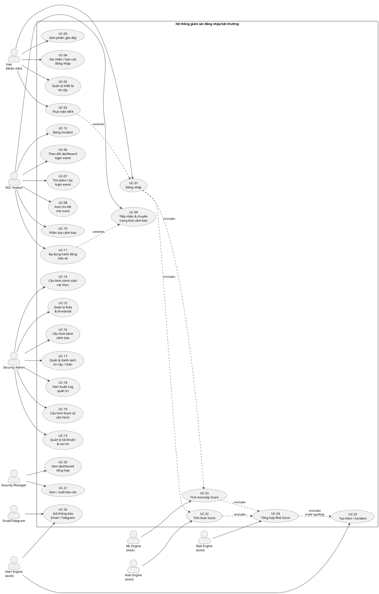
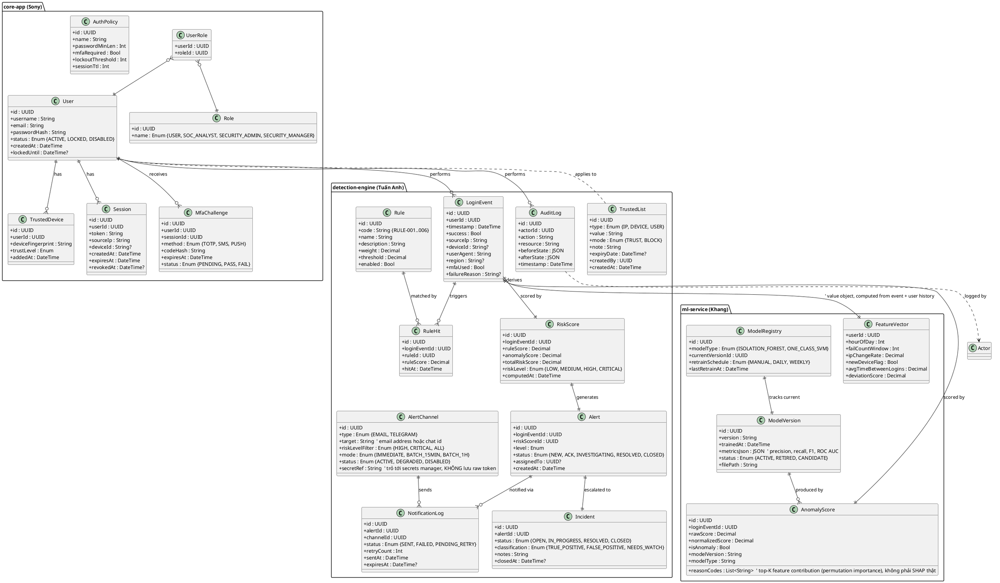
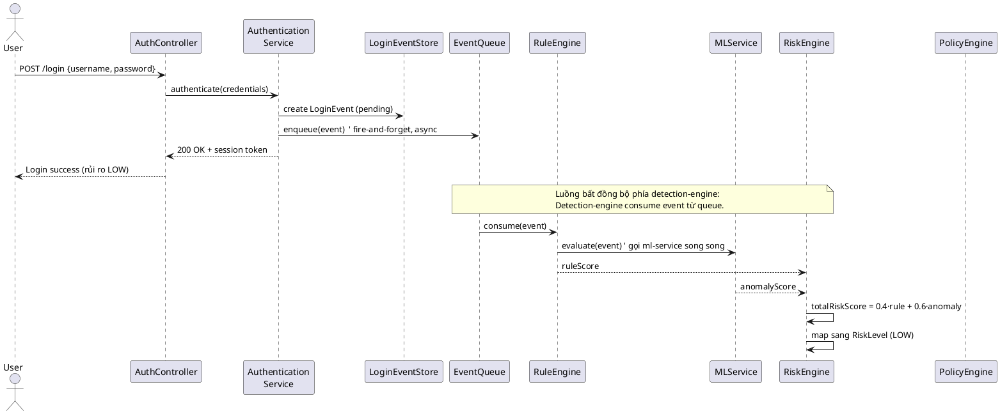
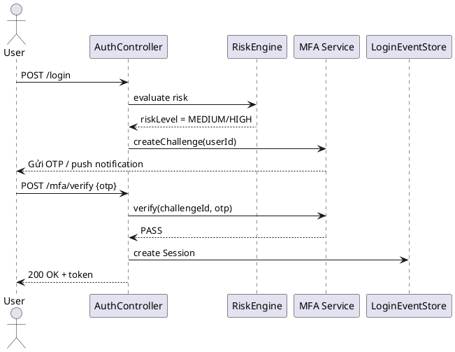
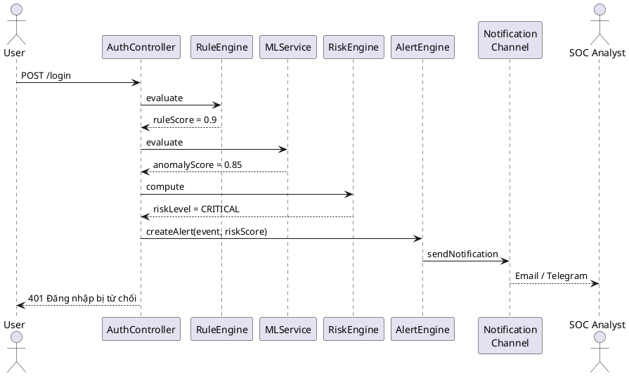
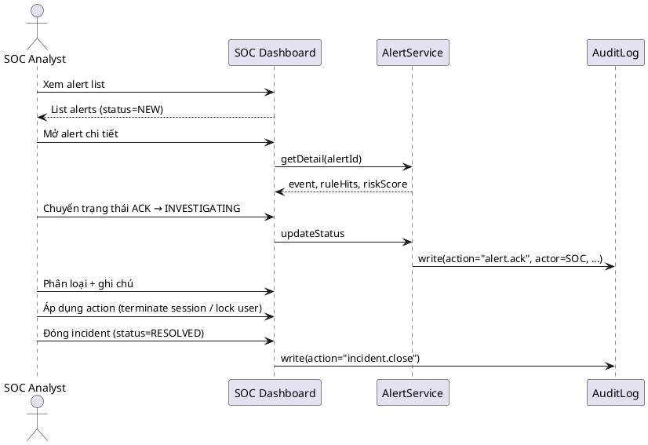
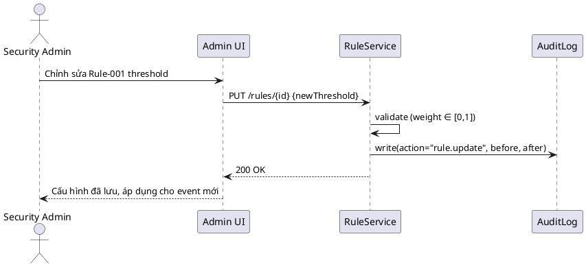
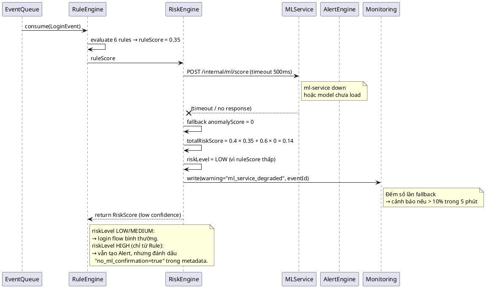

# Đề xuất nội dung mục 3.1 — Yêu cầu chức năng

> **Mục đích**: Cung cấp bộ khung phân tích đủ chi tiết để 3 thành viên (Sony – core-app, Tuấn Anh – detection-engine, Khang – ml-service) cùng viết mục 3.1 của báo cáo theo đúng yêu cầu của giáo viên.
>
> **Cấu trúc mục 3.1 theo yêu cầu**:
> 1. Sơ đồ Use-case tổng quát
> 2. Đặc tả Use-case chi tiết
> 3. Sơ đồ lớp (Class diagram)
> 4. Biểu đồ tuần tự (Sequence diagram)

---

## 0. Phạm vi, ràng buộc & giả định

Phần này cần đưa vào đầu mục 3.1 (hoặc cuối phần 2 của báo cáo) để giáo viên và người đọc hiểu rõ hệ thống đặt tả trong bối cảnh nào. Trung thực học thuật — không phải production spec.

### 0.1. Phạm vi (in-scope)
- Hệ thống **giám sát & cảnh báo đăng nhập bất thường** cho một tổ chức vừa (~10.000 user), phục vụ 4 vai trò: User, SOC Analyst, Security Admin, Security Manager.
- Module **authentication** (login, MFA, session, trusted device) + **detection** (rule-based + ML anomaly) + **alerting** + **SOC dashboard**.
- Chạy được end-to-end trên `docker-compose` (3 microservice + PostgreSQL + TimescaleDB).

### 0.2. Ngoài phạm vi (out-of-scope) — ghi rõ để giáo viên không trừ điểm
- Tích hợp với **IdP bên ngoài** (SAML, OAuth2/OIDC provider) — hệ thống tự quản lý user/password.
- **MFA qua SMS thật, email thật** — dùng giả lập trong demo; production cần tích hợp Twilio/SES.
- **Mobile app, native iOS/Android** — chỉ có web dashboard.
- **Threat hunting nâng cao** (graph analysis, UEBA full feature) — chỉ có rule + 1 ML model đơn giản.
- **SIEM integration** (Splunk, Chronicle) — alert chỉ gửi email/Telegram.
- **Multi-tenant** — chỉ 1 tenant duy nhất.
- **GDPR/PIPA compliance đầy đủ** — có đề cập best-practice (audit log, PII masking, retention) nhưng không triển khai end-to-end.

### 0.3. Giả định (assumptions)
- **Synthetic data** cho ML training: 10.000 login event, 70% normal + 30% anomaly, có nhãn. Do Khang sinh theo spec trong `PLAN.md` mục 8. **Không đại diện cho dữ liệu production thật** — chỉ để demo pipeline hoạt động đúng.
- **Isolation Forest** với `contamination=0.3` đã được biết trước (do data synthetic phân bố biết trước). Production phải tune lại bằng cross-validation trên data thật.
- **Rule engine** chỉ có 6 rule cố định (RULE-001 → RULE-006 trong `day2.docx`). Không có rule DSL cho admin tự viết rule.
- **Mật khẩu demo** dùng `Password123!` hoặc tương tự. Production cần enforce mạnh hơn (entropy, breach check).
- **Notification channel** dùng Telegram Bot token giả (fake), SMTP relay local. Production cần config thật.

### 0.4. Ràng buộc kỹ thuật
- **Stack đã chốt**: Python 3.11+ + FastAPI + SQLAlchemy 2.0 + PostgreSQL 15 + TimescaleDB 2.x + scikit-learn. Chi tiết trong `PLAN.md` mục 2,7.
- **Kiến trúc**: true microservice, 3 process riêng, giao tiếp qua HTTP. Không share DB.
- **Thời gian**: 4 tuần (theo `ROADMAP.md`).
- **Quy mô demo**: ≤ 100.000 login event, ≤ 1.000 user. Không benchmark ở scale lớn hơn.

### 0.5. Rủi ro đã biết & đối phó
- **TimescaleDB không cài được trên máy thành viên**: fallback dùng PostgreSQL plain + index trên `timestamp` (theo `ROADMAP.md` risk register).
- **Frontend quá phức tạp (Next.js không kịp)**: fallback dùng Streamlit (Tuấn Anh tự làm trong 1-2 ngày).
- **ML accuracy thấp trên data thật**: đã chấp nhận là demo, không phải production. Báo cáo nói rõ điều này.
- **Phân công Tuấn Anh bị quá tải**: đã cân bằng lại trong section 5.2 (Sony hỗ trợ UC-18, UC-21).

---

## 1. Sơ đồ Use-case tổng quát

### 1.1. Đề xuất sơ đồ

### 1.2. Mô tả các actor

| Actor | Loại | Mô tả ngắn |
|-------|------|------------|
| **User** (Nhân viên) | Con người | Sử dụng tài khoản tổ chức để đăng nhập, thực hiện MFA, tiếp nhận cảnh báo tài khoản. |
| **SOC Analyst** | Con người | Theo dõi sự kiện, tiếp nhận cảnh báo, điều tra và xử lý incident. |
| **Security Admin** | Con người | Quản trị tài khoản, vai trò, chính sách xác thực, Rule/threshold. |
| **Security Manager** | Con người | Xem dashboard tổng hợp, báo cáo, xu hướng rủi ro (không xử lý chi tiết). |
| **Rule Engine** | Auto | Module nội bộ chạy Rule-based detection. |
| **ML Engine** | Auto | Module nội bộ chạy Isolation Forest. |
| **Risk Engine** | Auto | Module nội bộ tổng hợp điểm rủi ro. |
| **Alert Engine** | Auto | Module nội bộ tạo và phân phối cảnh báo. |
| **Email/Telegram** | Bên ngoài | Kênh thông báo cuối cùng. |

### 1.3. Quan hệ include / extend (giải thích)

| Quan hệ | Ý nghĩa |
|---------|---------|
| `UC-01 ..> UC-22 : <<include>>` | Đăng nhập luôn chạy Rule Engine. |
| `UC-01 ..> UC-23 : <<include>>` | Đăng nhập luôn chạy ML Engine. |
| `UC-22 ..> UC-24 : <<include>>` | Rule Score là đầu vào bắt buộc của Risk Engine. |
| `UC-23 ..> UC-24 : <<include>>` | Anomaly Score là đầu vào bắt buộc của Risk Engine. |
| `UC-24 ..> UC-25 : <<include>>` | Nếu vượt ngưỡng, Risk Engine tạo Alert. |
| `UC-02 ..> UC-01 : <<extend>>` | MFA chỉ chạy khi rủi ro MEDIUM/HIGH. |
| `UC-11 ..> UC-09 : <<extend>>` | Áp dụng hành động bảo vệ là phần mở rộng trong quy trình xử lý alert. |

---

## 2. Đặc tả Use-case chi tiết

> Mỗi UC được mô tả theo template chuẩn gồm: mã, tên, actor, mô tả, tiên quyết, luồng chính, luồng thay thế / ngoại lệ, yêu cầu đặc biệt, hậu điều kiện.
>
> Trong báo cáo, có thể viết **đầy đủ 26 UC** hoặc chỉ chọn **10 UC điển hình** (khuyến nghị). Dưới đây là **10 UC điển hình** bao phủ đủ 4 actor + các luồng chính.

> **Mẫu đặc tả chung** (áp dụng cho mọi UC): mỗi UC được mô tả theo template chuẩn gồm: mã, tên, actor, mô tả, tiên quyết, luồng chính, luồng thay thế / ngoại lệ, yêu cầu đặc biệt, hậu điều kiện. Trong báo cáo, có thể viết **đầy đủ 26 UC** (như bên dưới) hoặc chỉ chọn **10 UC điển hình**. Dưới đây trình bày **đầy đủ 26 UC** bao phủ đủ 4 actor + các luồng chính + luồng tự động.
>
> | Trường | Ý nghĩa |
> |--------|---------|
> | **Mã UC** | UC-xx |
> | **Tên** | Tên ngắn gọn |
> | **Actor chính** | Người/khối tương tác trực tiếp |
> | **Actor phụ** | Người/khối liên quan gián tiếp |
> | **Mô tả** | Mục đích use-case trong 2-3 câu |
> | **Tiên quyết** | Điều kiện để UC có thể bắt đầu |
> | **Luồng chính** | Các bước happy path (1, 2, 3, …) |
> | **Luồng thay thế** | Các nhánh rẽ (1a, 1b, …) |
> | **Luồng ngoại lệ** | Lỗi hệ thống, mất kết nối, … |
> | **Yêu cầu đặc biệt** | Bảo mật, hiệu năng, audit |
> | **Hậu điều kiện** | Trạng thái hệ thống sau khi UC kết thúc |

### 2.1. UC-01 — Đăng nhập

| Trường | Nội dung |
|--------|---------|
| **Mã UC** | UC-01 |
| **Tên** | Đăng nhập vào hệ thống |
| **Actor chính** | User |
| **Actor phụ** | Rule Engine, ML Engine, Risk Engine, Policy/Response Engine |
| **Mô tả** | User nhập tài khoản và mật khẩu. Hệ thống xác thực, ghi nhận login event, đánh giá rủi ro và ra quyết định cho phép / yêu cầu MFA / từ chối. |
| **Tiên quyết** | User có tài khoản đang `ACTIVE`; hệ thống đang hoạt động. |
| **Luồng chính** | 1. User nhập username và password vào form đăng nhập. 2. Hệ thống kiểm tra tồn tại tài khoản, trạng thái `ACTIVE`, chưa bị khóa. 3. Hệ thống xác minh mật khẩu (so sánh hash). 4. Dù thành công hay thất bại, hệ thống tạo bản ghi `LoginEvent` chuẩn hóa. 5. `LoginEvent` được chuyển đồng thời cho Rule Engine → Rule Score và ML Engine → Anomaly Score. 6. Risk Engine tổng hợp thành `Total Risk Score` và `Risk Level`. 7. Nếu Risk Level = LOW và chính sách không yêu cầu MFA → tạo session, trả access token cho User. |
| **Luồng thay thế** | 3a. Sai mật khẩu → tăng biến đếm `failed_attempts`, kiểm tra ngưỡng khóa (theo AuthPolicy). Nếu đạt ngưỡng → khóa tài khoản tạm thời và ghi AuditLog. 6a. Risk Level = MEDIUM/HIGH → chuyển sang UC-02 (MFA). 6b. Risk Level = CRITICAL → chuyển sang UC-25 (tạo Alert), từ chối cấp session. |
| **Luồng ngoại lệ** | 2a. Tài khoản bị khóa → trả thông báo "tài khoản tạm khóa", không tạo session. 5a. Rule Engine / ML Engine không phản hồi (timeout) → sử dụng Rule Score mặc định = 0, ghi log cảnh báo. |
| **Yêu cầu đặc biệt** | Hash mật khẩu = Argon2id. Không log plaintext password hoặc OTP. Rate limit 5 lần/phút/IP. Tất cả bước đều ghi AuditLog. |
| **Hậu điều kiện** | Có 1 bản ghi `LoginEvent` mới; có thể có 1 bản ghi `RiskScore`, có thể có 1 `Session` mới; có thể có 1 `Alert`. |

---

### 2.2. UC-02 — Thực hiện MFA

| Trường | Nội dung |
|--------|---------|
| **Mã UC** | UC-02 |
| **Tên** | Thực hiện xác thực đa yếu tố |
| **Actor chính** | User |
| **Actor phụ** | MFA Service, Risk Engine |
| **Mô tả** | User cung cấp yếu tố xác thực thứ hai (OTP / push) sau khi đăng nhập có rủi ro MEDIUM/HIGH hoặc theo chính sách. |
| **Tiên quyết** | User vừa đăng nhập thành công bước xác thực thứ nhất. Risk Engine yêu cầu MFA hoặc AuthPolicy bật MFA bắt buộc. |
| **Luồng chính** | 1. Hệ thống sinh `MfaChallenge` (OTP code, expiresAt) và gửi tới phương thức đã đăng ký. 2. User nhập OTP / xác nhận push. 3. Hệ thống xác minh OTP hợp lệ và còn hạn. 4. Tạo session, trả access token. |
| **Luồng thay thế** | 2a. OTP sai hoặc hết hạn → cho phép thử tối đa N lần, sau đó hủy session login, có thể tạo Alert. 3a. MFA fail → từ chối cấp session, ghi log, tạo Alert nếu vượt ngưỡng. |
| **Yêu cầu đặc biệt** | OTP hash lưu DB; OTP chỉ tồn tại tối đa 60 giây; không log OTP plaintext. |
| **Hậu điều kiện** | Có bản ghi `MfaChallenge` với status PASS/FAIL; có hoặc không có `Session` mới. |

---

### 2.3. UC-03 — Xem phiên đăng nhập gần đây

| Trường | Nội dung |
|--------|---------|
| **Mã UC** | UC-03 |
| **Tên** | Xem các phiên đăng nhập gần đây |
| **Actor chính** | User |
| **Mô tả** | User xem danh sách các phiên đăng nhập gần nhất của tài khoản mình (thiết bị, IP, thời gian, trạng thái). |
| **Tiên quyết** | User đã đăng nhập và đang có session hợp lệ. |
| **Luồng chính** | 1. User truy cập trang "Phiên đăng nhập". 2. Hệ thống truy vấn `Session` theo `userId`, sắp xếp theo `createdAt` giảm dần. 3. Hệ thống hiển thị: thiết bị, IP, trình duyệt, thời điểm đăng nhập, trạng thái còn hiệu lực / đã thu hồi. |
| **Luồng thay thế** | 3a. User thấy phiên lạ → yêu cầu thu hồi phiên (revoke session) và có thể đổi mật khẩu. |
| **Yêu cầu đặc biệt** | Phân trang tối đa 20 phiên / trang. Không hiển thị token plaintext. |
| **Hậu điều kiện** | Không thay đổi dữ liệu (trừ trường hợp user thu hồi). |

---

### 2.4. UC-06 — Theo dõi dashboard login event (gần thời gian thực)

| Trường | Nội dung |
|--------|---------|
| **Mã UC** | UC-06 |
| **Tên** | SOC Dashboard — Login Event real-time |
| **Actor chính** | SOC Analyst |
| **Actor phụ** | Alert Engine |
| **Mô tả** | SOC Analyst xem dashboard cập nhật gần thời gian thực về login event và alert phát sinh trong hệ thống. |
| **Tiên quyết** | SOC Analyst có role `SOC_ANALYST` và session còn hiệu lực. |
| **Luồng chính** | 1. SOC Analyst truy cập dashboard. 2. Hệ thống truy vấn `LoginEvent` trong khoảng thời gian mặc định (24 giờ gần nhất), nhóm theo mức rủi ro. 3. Hiển thị: tổng số event, tỉ lệ thành công/thất bại, top user có rủi ro cao, top IP đáng ngờ, số alert mới. 4. Dashboard tự refresh mỗi 30 giây (hoặc dùng WebSocket/SSE). |
| **Luồng thay thế** | 4a. SOC Analyst muốn filter → chuyển sang UC-07. |
| **Yêu cầu đặc biệt** | Tải dữ liệu < 2 giây; phải có phân trang + filter nhanh. |
| **Hậu điều kiện** | Không thay đổi dữ liệu. |

---

### 2.5. UC-09 — Tiếp nhận & chuyển trạng thái cảnh báo

| Trường | Nội dung |
|--------|---------|
| **Mã UC** | UC-09 |
| **Tên** | Tiếp nhận và chuyển trạng thái Alert |
| **Actor chính** | SOC Analyst |
| **Actor phụ** | Alert Engine |
| **Mô tả** | SOC Analyst tiếp nhận alert, đánh dấu đã nhận, chuyển sang trạng thái đang điều tra và ghi chú xử lý. |
| **Tiên quyết** | Alert đang ở trạng thái `NEW`. |
| **Luồng chính** | 1. SOC Analyst mở chi tiết alert. 2. Hệ thống hiển thị thông tin: user, IP, thiết bị, rule đã kích hoạt, Risk Score, lịch sử login gần đây. 3. SOC Analyst chuyển trạng thái: `NEW → ACK → INVESTIGATING`. 4. SOC Analyst ghi chú xử lý vào trường `notes`. 5. Hệ thống cập nhật `Alert.status`, ghi `AuditLog`. |
| **Luồng thay thế** | 5a. Chuyển sang UC-10 (phân loại) → UC-11 (áp dụng hành động) → UC-12 (đóng incident). |
| **Yêu cầu đặc biệt** | Mỗi lần chuyển trạng thái phải có timestamp + actor, không cho phép sửa trạng thái đã `CLOSED`. |
| **Hậu điều kiện** | `Alert` được cập nhật; có thêm bản ghi `AuditLog`. |

---

### 2.6. UC-11 — Áp dụng hành động bảo vệ

| Trường | Nội dung |
|--------|---------|
| **Mã UC** | UC-11 |
| **Tên** | Áp dụng hành động bảo vệ cho User |
| **Actor chính** | SOC Analyst |
| **Actor phụ** | User (chịu tác động), Risk Engine |
| **Mô tả** | SOC Analyst thực hiện hoặc đề xuất một hành động bảo vệ: yêu cầu MFA lại, kết thúc phiên, giới hạn đăng nhập, khóa tạm thời. |
| **Tiên quyết** | Alert đang ở trạng thái `INVESTIGATING`. |
| **Luồng chính** | 1. SOC Analyst chọn hành động trong giao diện. 2. Hệ thống kiểm tra quyền (action cho phép với role `SOC_ANALYST`). 3. Áp dụng: yêu cầu MFA lại / thu hồi session / khóa user tạm thời / rate limit IP. 4. Ghi AuditLog với action, lý do, actor, timestamp. |
| **Luồng thay thế** | 2a. Không đủ quyền → đề xuất action cho Admin. |
| **Yêu cầu đặc biệt** | Mỗi action phải có lý do (reason) bắt buộc; không thể xóa vết. |
| **Hậu điều kiện** | `User.status` hoặc `Session.status` thay đổi; có `AuditLog` mới. |

---

### 2.7. UC-13 — Quản lý tài khoản & vai trò

| Trường | Nội dung |
|--------|---------|
| **Mã UC** | UC-13 |
| **Tên** | Quản lý tài khoản người dùng & vai trò |
| **Actor chính** | Security Admin |
| **Mô tả** | Admin tạo / khóa / mở khóa tài khoản; gán / thu hồi vai trò cho user. |
| **Tiên quyết** | Admin có role `SECURITY_ADMIN`. |
| **Luồng chính** | 1. Admin chọn "Tạo tài khoản" hoặc "Sửa tài khoản". 2. Nhập username, email, role mặc định. 3. Hệ thống kiểm tra trùng username/email. 4. Lưu `User`, gán `Role`, ghi `AuditLog`. |
| **Luồng thay thế** | 4a. Khóa user → cập nhật `User.status = LOCKED`. 4b. Reset password → sinh password tạm, yêu cầu đổi sau lần đăng nhập đầu. |
| **Yêu cầu đặc biệt** | Không thể xóa user (soft delete); mọi thay đổi phải có AuditLog. |
| **Hậu điều kiện** | `User` hoặc `UserRole` được cập nhật. |

---

### 2.8. UC-15 — Quản lý Rule & threshold

| Trường | Nội dung |
|--------|---------|
| **Mã UC** | UC-15 |
| **Tên** | Quản lý Rule phát hiện & ngưỡng rủi ro |
| **Actor chính** | Security Admin |
| **Mô tả** | Admin tạo / sửa / bật / tắt Rule; cấu hình threshold cho từng Rule Score và Anomaly Score; thay đổi ngưỡng Risk Level. |
| **Tiên quyết** | Admin có role `SECURITY_ADMIN`. |
| **Luồng chính** | 1. Admin vào trang quản lý Rule. 2. Xem danh sách Rule với trạng thái, weight, threshold hiện tại. 3. Chỉnh sửa rule hoặc threshold → nhấn Lưu. 4. Hệ thống validate (rule phải có code + weight hợp lệ). 5. Lưu thay đổi, ghi AuditLog với nội dung trước/sau. |
| **Luồng thay thế** | 5a. Bật/tắt rule → cập nhật `Rule.enabled` mà không xóa. |
| **Yêu cầu đặc biệt** | Không áp dụng ngược cho sự kiện đã phát sinh; chỉ áp dụng cho sự kiện mới. |
| **Hậu điều kiện** | `Rule` được cập nhật; `AuditLog` mới. |

---

### 2.9. UC-18 — Xem Audit Log quản trị

| Trường | Nội dung |
|--------|---------|
| **Mã UC** | UC-18 |
| **Tên** | Xem nhật ký kiểm toán |
| **Actor chính** | Security Admin (hoặc SOC Analyst theo quyền) |
| **Mô tả** | Tra cứu các thao tác quản trị (đổi rule, đổi policy, khóa user, …) theo actor, thời gian, resource. |
| **Tiên quyết** | Có quyền xem AuditLog. |
| **Luồng chính** | 1. Admin chọn "Audit Log". 2. Hệ thống cho phép filter theo actor, action, resource, khoảng thời gian. 3. Hiển thị danh sách các bản ghi kèm nội dung trước/sau. |
| **Luồng thay thế** | 3a. Xuất CSV/Excel phục vụ báo cáo. |
| **Yêu cầu đặc biệt** | Audit Log không được sửa / xóa từ UI. |
| **Hậu điều kiện** | Không thay đổi dữ liệu. |

---

### 2.10. UC-20 — Xem dashboard tổng hợp

| Trường | Nội dung |
|--------|---------|
| **Mã UC** | UC-20 |
| **Tên** | Xem dashboard tổng hợp cho Security Manager |
| **Actor chính** | Security Manager |
| **Mô tả** | Manager xem số liệu tổng hợp: tổng login event, số alert theo mức rủi ro, xu hướng theo thời gian, tỉ lệ true/false positive. |
| **Tiên quyết** | Manager có role `SECURITY_MANAGER`. |
| **Luồng chính** | 1. Manager truy cập dashboard. 2. Hệ thống truy vấn số liệu tổng hợp (aggregate). 3. Hiển thị các biểu đồ: line chart (xu hướng theo ngày), bar chart (alert theo mức rủi ro), pie chart (tỉ lệ TP/FP). |
| **Luồng thay thế** | 3a. Drill-down vào 1 mức rủi ro → xem chi tiết top 10 alert. |
| **Yêu cầu đặc biệt** | Không cho phép click sâu tới chi tiết user; phải dùng UC-21 để xuất báo cáo. |
| **Hậu điều kiện** | Không thay đổi dữ liệu. |

---

### 2.11. UC-22 — Tính Rule Score (auto)

| Trường | Nội dung |
|--------|---------|
| **Mã UC** | UC-22 |
| **Tên** | Rule Engine tính điểm rule |
| **Actor chính** | Rule Engine (auto) |
| **Mô tả** | Tự động chạy 6 rule đã cấu hình trên `LoginEvent` vừa phát sinh, sinh ra các `RuleHit` và `RuleScore` tổng. |
| **Tiên quyết** | Có `LoginEvent` mới. |
| **Luồng chính** | 1. Nhận `LoginEvent`. 2. Với mỗi `Rule.enabled`, kiểm tra điều kiện (RULE-001 → RULE-006). 3. Với rule được kích hoạt → tạo `RuleHit(ruleId, loginEventId, ruleScore)`. 4. Tổng hợp `RuleScore = Σ weight_i × hit_i` (chuẩn hóa về 0-1). 5. Trả `RuleScore` cho Risk Engine. |
| **Yêu cầu đặc biệt** | Xử lý trong < 200 ms / event. |
| **Hậu điều kiện** | Có N bản ghi `RuleHit`; có 1 `RuleScore` (lưu kèm trong `RiskScore`). |

---

### 2.12. UC-23 — Tính Anomaly Score (auto)

| Trường | Nội dung |
|--------|---------|
| **Mã UC** | UC-23 |
| **Tên** | ML Engine tính điểm bất thường |
| **Actor chính** | ML Engine (auto) |
| **Mô tả** | Feature Pipeline trích đặc trưng từ `LoginEvent` + lịch sử user; Isolation Forest dự đoán; chuẩn hóa Anomaly Score về [0, 1]. |
| **Tiên quyết** | Có `LoginEvent`; model ở trạng thái `ACTIVE`. |
| **Luồng chính** | 1. Nhận `LoginEvent`. 2. Feature Pipeline sinh `FeatureVector` (giờ, fail_count, new_device_flag, ip_change_rate, …). 3. Model dự đoán `raw_score`. 4. Chuẩn hóa về `normalized_score ∈ [0,1]`. 5. Ghi `AnomalyScore` với `modelVersion`, `reasonCodes`. 6. Trả cho Risk Engine. |
| **Luồng thay thế** | 2a. User mới → dùng baseline toàn cục (global baseline) thay baseline cá nhân. |
| **Yêu cầu đặc biệt** | Inference < 500 ms; phải ghi `modelVersion` để truy vết. |
| **Hậu điều kiện** | Có 1 bản ghi `AnomalyScore`. |

> **Ghi chú về `reasonCodes`** (mục đích học thuật, tránh hiểu nhầm): Isolation Forest là mô hình tree-based không có cơ chế giải thích built-in. `reasonCodes` ở đây **không phải** SHAP value hay LIME explanation, mà là **top-K feature có contribution lớn nhất** tới raw_score, được tính bằng **permutation importance** hoặc **feature ablation** đơn giản (xáo trộn từng feature và đo delta raw_score, lấy K=3 feature có delta lớn nhất). Đây là phương pháp gần đúng, không chính xác bằng SHAP nhưng đủ để SOC biết "tại sao login này bị chấm cao". Code đề xuất trong `ml-service/app/explain.py`.

---

### 2.13. UC-25 — Tạo Alert / Incident (auto)

| Trường | Nội dung |
|--------|---------|
| **Mã UC** | UC-25 |
| **Tên** | Alert Engine tạo cảnh báo |
| **Actor chính** | Alert Engine (auto) |
| **Mô tả** | Khi Risk Level vượt ngưỡng, Alert Engine tạo `Alert` + `Incident`, đẩy lên dashboard và gửi thông báo qua kênh cấu hình. |
| **Tiên quyết** | `RiskScore.riskLevel ∈ {HIGH, CRITICAL}` (hoặc ngưỡng cấu hình). |
| **Luồng chính** | 1. Nhận `RiskScore` từ Risk Engine. 2. Tạo `Alert(loginEventId, level, status=NEW)`. 3. Tạo `Incident(alertId, status=OPEN)`. 4. Đẩy lên dashboard real-time. 5. Gọi UC-26 (gửi thông báo). |
| **Yêu cầu đặc biệt** | Mỗi login event chỉ tạo tối đa 1 alert; CRITICAL phải đẩy trong < 1 phút. |
| **Hậu điều kiện** | Có 1 `Alert` mới, 1 `Incident` mới. |

---

> **Lưu ý bổ sung**: Bộ đặc tả này mở rộng phần 2 với **14 UC còn lại** chưa được đặc tả ở trên, bao gồm: **UC-04, UC-05, UC-07, UC-08, UC-10, UC-12, UC-14, UC-16, UC-17, UC-19, UC-21, UC-24, UC-26**. Các UC này bổ sung đầy đủ các chức năng tương tác và tự động còn thiếu trong mục 2.2–2.14, đảm bảo tất cả 26 use-case trong sơ đồ ở mục 1.1 đều có đặc tả chi tiết.

### 2.14. UC-04 — Xác nhận / báo cáo đăng nhập

|| Trường | Nội dung |
|--------|---------|
|| **Mã UC** | UC-04 |
|| **Tên** | Xác nhận hoặc báo cáo đăng nhập bất thường |
|| **Actor chính** | User |
|| **Actor phụ** | SOC Analyst, Alert Engine |
|| **Mô tả** | User xác nhận rằng một sự kiện đăng nhập là hợp lệ hoặc báo cáo nghi ngờ đó là đăng nhập trái phép. Phản hồi của User giúp hệ thống giảm false positive và cải thiện độ chính xác của Rule Engine. |
|| **Tiên quyết** | User nhận được thông báo qua email/Telegram về một đăng nhập mới; User có session hợp lệ trong hệ thống. |
|| **Luồng chính** | 1. User nhận email/Telegram thông báo đăng nhập mới. 2. User truy cập trang "Xác nhận đăng nhập" qua link trong thông báo. 3. Hệ thống hiển thị thông tin: IP, thiết bị, thời gian, vị trí địa lý của đăng nhập đó. 4. User chọn hành động: "Đúng là tôi" (xác nhận) hoặc "Không phải tôi" (báo cáo). 5. Hệ thống cập nhật `LoginEvent.isConfirmed`, ghi `AuditLog`, đồng thời phản hồi cho Alert Engine để điều chỉnh trọng số rule nếu cần. |
|| **Luồng thay thế** | 4a. User chọn "Không phải tôi" → chuyển alert liên quan sang `INVESTIGATING`, gửi thông báo cho SOC Analyst. 4b. User không phản hồi sau 24 giờ → hệ thống tự động đánh dấu `isConfirmed = null`, không ảnh hưởng đến Rule Engine. |
|| **Luồng ngoại lệ** | 2a. Link xác nhận đã hết hạn (sau 72 giờ) → hiển thị thông báo hết hạn, không cho phép xác nhận. 3a. Login event không tồn tại → trả lỗi 404. |
|| **Yêu cầu đặc biệt** | Link xác nhận phải là HMAC-signed token, không chứa thông tin nhạy cảm trong URL. Không log email của User ra plaintext. Phản hồi của User được dùng làm ground-truth label cho ML model. |
|| **Hậu điều kiện** | `LoginEvent.isConfirmed` được cập nhật; có `AuditLog` mới; `Alert` liên quan có thể được chuyển trạng thái. |

---

### 2.15. UC-05 — Quản lý thiết bị tin cậy

|| Trường | Nội dung |
|--------|---------|
|| **Mã UC** | UC-05 |
|| **Tên** | Quản lý danh sách thiết bị tin cậy |
|| **Actor chính** | User |
|| **Mô tả** | User xem, thêm mới, gỡ bỏ thiết bị đã đăng nhập thành công khỏi danh sách thiết bị tin cậy. Thiết bị tin cậy giúp giảm yêu cầu MFA ở những lần đăng nhập tiếp theo từ đúng thiết bị đó. |
|| **Tiên quyết** | User đã đăng nhập thành công; có ít nhất một `Session` với `deviceId` đã được ghi nhận. |
|| **Luồng chính** | 1. User truy cập trang "Thiết bị tin cậy". 2. Hệ thống truy vấn `TrustedDevice` theo `userId`, hiển thị danh sách kèm trust level và ngày thêm. 3. User chọn "Thêm thiết bị hiện tại" → hệ thống tạo `TrustedDevice` từ `Session.deviceId` hiện tại, mặc định trust level = BASIC. 4. User có thể nâng cấp trust level (BASIC → FULL) hoặc xóa thiết bị khỏi danh sách. 5. Hệ thống lưu thay đổi, ghi `AuditLog`. |
|| **Luồng thay thế** | 3a. Thiết bị đã tồn tại trong danh sách → thông báo đã tồn tại, không tạo trùng. 4a. User xóa thiết bị → xóa khỏi `TrustedDevice`, đăng nhập từ thiết bị này lần sau sẽ bị đánh giá lại rủi ro bình thường. |
|| **Luồng ngoại lệ** | 2a. Chưa có thiết bị nào → hiển thị thông báo hướng dẫn đăng nhập từ thiết bị mới trước. |
|| **Yêu cầu đặc biệt** | Mỗi User tối đa 5 thiết bị tin cậy (theo AuthPolicy). `deviceFingerprint` phải được hash trước khi lưu. Không cho phép xóa thiết bị đang active (đang có session). |
|| **Hậu điều kiện** | `TrustedDevice` được thêm / xóa / cập nhật; có `AuditLog` mới. |

---

### 2.16. UC-07 — Tìm kiếm / lọc login event

|| Trường | Nội dung |
|--------|---------|
|| **Mã UC** | UC-07 |
|| **Tên** | Tìm kiếm và lọc login event |
|| **Actor chính** | SOC Analyst |
|| **Mô tả** | SOC Analyst sử dụng bộ lọc đa chiều (theo user, IP, thời gian, mức rủi ro, trạng thái, quốc gia, …) để tìm kiếm các login event cụ thể phục vụ điều tra. |
|| **Tiên quyết** | SOC Analyst có role `SOC_ANALYST` và session còn hiệu lực. |
|| **Luồng chính** | 1. SOC Analyst mở giao diện tìm kiếm nâng cao. 2. Nhập một hoặc nhiều điều kiện lọc: username, IP, khoảng thời gian, risk level, success/fail, country. 3. Hệ thống truy vấn `LoginEvent` kết hợp `RiskScore` và `Alert` theo điều kiện. 4. Kết quả hiển thị dạng bảng có phân trang (mặc định 50 dòng/trang), có thể sắp xếp theo cột. 5. SOC Analyst có thể click vào một dòng để xem chi tiết (chuyển sang UC-08). |
|| **Luồng thay thế** | 4a. Không có kết quả → hiển thị thông báo "Không tìm thấy sự kiện phù hợp". 4b. Xuất kết quả ra CSV/Excel để phục vụ báo cáo. |
|| **Luồng ngoại lệ** | 3a. Câu truy vấn quá rộng (nhiều hơn 10.000 dòng) → giới hạn ở 10.000, yêu cầu thu hẹp điều kiện lọc. |
|| **Yêu cầu đặc biệt** | Thời gian tìm kiếm < 3 giây cho khoảng thời gian ≤ 30 ngày. Chỉ mục (index) phải có trên các trường thường dùng: `userId`, `sourceIp`, `timestamp`, `riskLevel`. |
|| **Hậu điều kiện** | Không thay đổi dữ liệu. |

---

### 2.17. UC-08 — Xem chi tiết risk score

|| Trường | Nội dung |
|--------|---------|
|| **Mã UC** | UC-08 |
|| **Tên** | Xem chi tiết điểm rủi ro và phân tích |
|| **Actor chính** | SOC Analyst |
|| **Actor phụ** | Rule Engine, ML Engine |
|| **Mô tả** | SOC Analyst xem chi tiết điểm rủi ro của một login event, bao gồm Rule Score (từng rule hit), Anomaly Score (từ ML), và tổng Risk Score cùng với giải thích lý do đằng sau từng thành phần. |
|| **Tiên quyết** | Có `LoginEvent` và `RiskScore` tương ứng đã được tạo. SOC Analyst có quyền truy cập. |
|| **Luồng chính** | 1. SOC Analyst chọn một login event từ dashboard hoặc kết quả tìm kiếm. 2. Hệ thống truy vấn `RiskScore` kèm `RuleHit` và `AnomalyScore` liên quan. 3. Hiển thị: tổng Risk Score, Risk Level, biểu đồ tròn (đóng góp của Rule Score vs Anomaly Score), danh sách rule đã hit (RULE-001…006) với weight và điểm riêng, Anomaly Score với reason codes, feature vector gốc. 4. Hiển thị lịch sử đăng nhập cùng user trong 30 ngày gần nhất. |
|| **Luồng thay thế** | 3a. Anomaly Score không có (user mới, model chưa chạy) → hiển thị chỉ Rule Score, ghi chú "ML chưa áp dụng". |
|| **Luồng ngoại lệ** | 2a. RiskScore bị xóa hoặc không tồn tại → trả lỗi, không hiển thị chi tiết. |
|| **Yêu cầu đặc biệt** | Giao diện phải hiển thị giải thích (explanation) bằng ngôn ngữ tự nhiên cho từng rule hit. Không hiển thị `modelVersion` nội bộ của ML Engine. |
|| **Hậu điều kiện** | Không thay đổi dữ liệu. |

---

### 2.18. UC-10 — Phân loại cảnh báo

|| Trường | Nội dung |
|--------|---------|
|| **Mã UC** | UC-10 |
|| **Tên** | Phân loại Alert (True Positive / False Positive) |
|| **Actor chính** | SOC Analyst |
|| **Mô tả** | SOC Analyst phân loại một alert đang ở trạng thái `INVESTIGATING` thành: True Positive (đúng là rủi ro thật), False Positive (cảnh báo sai), hoặc Needs Watch (cần theo dõi thêm). Kết quả phân loại được dùng làm ground-truth để tái huấn luyện ML model. |
|| **Tiên quyết** | Alert đang ở trạng thái `INVESTIGATING`. |
|| **Luồng chính** | 1. SOC Analyst mở chi tiết alert và đã điều tra đầy đủ (xem UC-08, UC-09). 2. SOC Analyst chọn một trong ba phân loại: `TRUE_POSITIVE`, `FALSE_POSITIVE`, `NEEDS_WATCH`. 3. SOC Analyst nhập ghi chú phân loại (bắt buộc, tối thiểu 10 ký tự). 4. Hệ thống cập nhật `Incident.classification`, ghi `AuditLog`. 5. Nếu `TRUE_POSITIVE` → khuyến nghị chuyển sang UC-11 (áp dụng hành động bảo vệ). 6. Dữ liệu phân loại được gửi về ML pipeline để cập nhật training set. |
|| **Luồng thay thế** | 3a. SOC Analyst muốn chuyển phân loại sau khi đã lưu → chỉ cho phép sửa trong vòng 24 giờ, sau đó khóa. |
|| **Luồng ngoại lệ** | 2a. Alert đang ở trạng thái khác (`NEW`, `ACK`) → không cho phép phân loại, phải chuyển sang `INVESTIGATING` trước. |
|| **Yêu cầu đặc biệt** | Phân loại `FALSE_POSITIVE` phải đi kèm lý do chi tiết. Mỗi phân loại phải có `AuditLog`. Dữ liệu phân loại được batch gửi về ML pipeline hàng ngày qua internal API. |
|| **Hậu điều kiện** | `Incident.classification` được cập nhật; có `AuditLog` mới; training dataset được bổ sung. |

---

### 2.19. UC-12 — Đóng incident

|| Trường | Nội dung |
|--------|---------|
|| **Mã UC** | UC-12 |
|| **Tên** | Đóng incident sau khi xử lý xong |
|| **Actor chính** | SOC Analyst |
|| **Mô tả** | SOC Analyst đóng một incident sau khi đã hoàn tất điều tra, áp dụng hành động bảo vệ (nếu cần) và phân loại alert. Việc đóng incident đánh dấu kết thúc quy trình xử lý cho alert tương ứng. |
|| **Tiên quyết** | Incident đang ở trạng thái `OPEN` hoặc `IN_PROGRESS`; Alert đã được phân loại (UC-10). |
|| **Luồng chính** | 1. SOC Analyst mở chi tiết incident. 2. Hệ thống kiểm tra: Alert đã được phân loại chưa? Còn hành động bảo vệ nào chưa áp dụng không? 3. Nếu mọi điều kiện đã thỏa mãn → SOC Analyst nhấn "Đóng incident". 4. Hệ thống cập nhật `Incident.status = CLOSED`, `Incident.closedAt = now`. 5. Hệ thống đồng thời cập nhật `Alert.status = CLOSED`. 6. Ghi `AuditLog` với actor, timestamp và phân loại đã chọn. |
|| **Luồng thay thế** | 2a. Alert chưa phân loại → hiển thị cảnh báo, yêu cầu phân loại trước khi đóng. 2b. Còn hành động bảo vệ chưa áp dụng → hiển thị danh sách và yêu cầu xử lý trước. |
|| **Luồng ngoại lệ** | 3a. Incident đã ở trạng thái `CLOSED` rồi → không cho phép thao tác lại, trả thông báo "Incident đã đóng". |
|| **Yêu cầu đặc biệt** | Không cho phép đóng incident khi Alert vẫn ở `NEW`/`ACK`. AuditLog phải ghi đầy đủ trạng thái trước và sau. Incident tự động đóng sau 30 ngày không hoạt động (configurable). |
|| **Hậu điều kiện** | `Incident.status = CLOSED`; `Alert.status = CLOSED`; có `AuditLog` mới. |

---

### 2.20. UC-14 — Cấu hình chính sách xác thực

|| Trường | Nội dung |
|--------|---------|
|| **Mã UC** | UC-14 |
|| **Tên** | Cấu hình chính sách xác thực |
|| **Actor chính** | Security Admin |
|| **Mô tả** | Security Admin tạo mới, chỉnh sửa hoặc kích hoạt / vô hiệu hóa các chính sách xác thực (AuthPolicy) như độ dài mật khẩu tối thiểu, yêu cầu MFA, ngưỡng khóa tài khoản, thời gian sống của session. |
|| **Tiên quyết** | Admin có role `SECURITY_ADMIN`. |
|| **Luồng chính** | 1. Admin vào trang "Chính sách xác thực". 2. Hệ thống hiển thị danh sách `AuthPolicy` hiện có, đánh dấu policy đang active. 3. Admin chọn tạo mới hoặc chỉnh sửa policy hiện có. 4. Nhập các tham số: passwordMinLen, mfaRequired, lockoutThreshold, lockoutDuration, sessionTtl, allowedIpRange. 5. Hệ thống validate (passwordMinLen ≥ 8, lockoutThreshold ≤ 10, sessionTtl > 0). 6. Lưu policy; nếu đánh dấu active → tự động hủy active cũ. 7. Ghi `AuditLog` với chi tiết thay đổi (trước/sau). |
|| **Luồng thay thế** | 6a. Policy đang active mà bị sửa → tạo phiên bản mới (versioning), giữ phiên bản cũ trong lịch sử. |
|| **Luồng ngoại lệ** | 5a. Validate thất bại → hiển thị lỗi cụ thể tại trường, không lưu. |
|| **Yêu cầu đặc biệt** | Mỗi thay đổi policy phải được approve bởi Security Manager (hoặc có two-person rule) trước khi active. Không áp dụng ngược cho session đang active. |
|| **Hậu điều kiện** | `AuthPolicy` được tạo / cập nhật; có `AuditLog` mới; phiên bản cũ được lưu trữ. |

---

### 2.21. UC-16 — Cấu hình kênh cảnh báo

|| Trường | Nội dung |
|--------|---------|
|| **Mã UC** | UC-16 |
|| **Tên** | Cấu hình kênh thông báo cảnh báo |
|| **Actor chính** | Security Admin |
|| **Actor phụ** | Alert Engine |
|| **Mô tả** | Security Admin cấu hình các kênh gửi thông báo (Email, Telegram) cho Alert Engine, bao gồm: địa chỉ nhận theo vai trò, mức alert được phép gửi qua kênh nào, tần suất gửi (ngay lập tức / batch). |
|| **Tiên quyết** | Admin có role `SECURITY_ADMIN`. |
|| **Luồng chính** | 1. Admin vào trang "Cấu hình kênh cảnh báo". 2. Hệ thống hiển thị danh sách kênh đã cấu hình: email, telegram. 3. Admin thêm / sửa kênh: nhập địa chỉ email hoặc Telegram chat ID, chọn risk level gửi (HIGH, CRITICAL hoặc ALL), chọn chế độ (immediate / batch 15min / batch 1h). 4. Hệ thống validate (email hợp lệ, chat ID hợp lệ). 5. Gửi thông báo test qua kênh vừa cấu hình. 6. Admin xác nhận nhận được test → lưu cấu hình, ghi `AuditLog`. |
|| **Luồng thay thế** | 5a. Test thất bại → hiển thị lỗi kết nối, không lưu cho đến khi test thành công. |
|| **Luồng ngoại lệ** | 4a. Email / Telegram service không khả dụng → ghi cảnh báo trong hệ thống, vẫn lưu cấu hình nhưng đánh dấu trạng thái `DEGRADED`. |
|| **Yêu cầu đặc biệt** | Không lưu API token / bot token trong config file (phải dùng secrets manager). Rate limit gửi: tối đa 100 thông báo/phút/kênh. |
|| **Hậu điều kiện** | `AlertChannel` được tạo / cập nhật; có `AuditLog` mới; Alert Engine sử dụng cấu hình mới từ lần gửi tiếp theo. |

---

### 2.22. UC-17 — Quản lý danh sách tin cậy / chặn

|| Trường | Nội dung |
|--------|---------|
|| **Mã UC** | UC-17 |
|| **Tên** | Quản lý danh sách IP / thiết bị / User tin cậy và chặn |
|| **Actor chính** | Security Admin |
|| **Mô tả** | Security Admin tạo, sửa, xóa các mục trong `TrustedList` bao gồm IP, thiết bị, User ở chế độ TRUST (tin cậy, bỏ qua một số rule) hoặc BLOCK (chặn hoàn toàn). Danh sách này được Rule Engine tham chiếu trước khi tính Rule Score. |
|| **Tiên quyết** | Admin có role `SECURITY_ADMIN`. |
|| **Luồng chính** | 1. Admin vào trang "Danh sách tin cậy / chặn". 2. Hệ thống hiển thị tất cả `TrustedList` entries, filter theo type và mode. 3. Admin thêm entry: chọn type (IP / DEVICE / USER), nhập value, chọn mode (TRUST / BLOCK), nhập ghi chú lý do. 4. Hệ thống validate: value phải đúng định dạng (IP hợp lệ, UUID hợp lệ, …); không trùng lặp entry đang active. 5. Lưu entry, ghi `AuditLog`. 6. Entry có hiệu lực ngay lập tức đối với các login event mới. |
|| **Luồng thay thế** | 3a. Entry BLOCK IP → Rule Engine tự động skip tất cả rule, coi login là CRITICAL. 3b. Entry TRUST IP → giảm Rule Score thêm -0.2. 5a. Xóa entry → soft delete, lưu lại trong lịch sử. |
|| **Luồng ngoại lệ** | 4a. IP/DEVICE/User đã tồn tại trong danh sách → từ chối thêm trùng, gợi ý chỉnh sửa entry hiện có. |
|| **Yêu cầu đặc biệt** | Danh sách BLOCK phải có expiry date (tối đa 90 ngày, có thể gia hạn). Mỗi entry phải có lý do và người tạo. |
|| **Hậu điều kiện** | `TrustedList` entry mới được tạo / cập nhật; có `AuditLog`; Rule Engine sử dụng danh sách mới. |

---

### 2.23. UC-19 — Cấu hình tham số vận hành

|| Trường | Nội dung |
|--------|---------|
|| **Mã UC** | UC-19 |
|| **Tên** | Cấu hình tham số vận hành hệ thống |
|| **Actor chính** | Security Admin |
|| **Mô tả** | Security Admin cấu hình các tham số vận hành chung của hệ thống: ngưỡng Risk Level (điểm số để chuyển LOW→MEDIUM→HIGH→CRITICAL), timeout cho Rule Engine / ML Engine, batch size cho feature pipeline, retention period cho log và event. |
|| **Tiên quyết** | Admin có role `SECURITY_ADMIN`. |
|| **Luồng chính** | 1. Admin vào trang "Tham số vận hành". 2. Hệ thống hiển thị bảng các tham số hiện tại với giá trị mặc định và giá trị đang active. 3. Admin chỉnh sửa giá trị: riskThresholds (các ngưỡng điểm), engineTimeout, batchSize, logRetentionDays, eventRetentionDays. 4. Hệ thống validate: ngưỡng phải tăng dần (LOW < MEDIUM < HIGH < CRITICAL), timeout > 0. 5. Lưu thay đổi, ghi `AuditLog` với trước/sau. 6. Các engine tải lại cấu hình mà không cần restart (hot reload). |
|| **Luồng thay thế** | 5a. Admin muốn rollback → gọi chức năng "Khôi phục mặc định" hoặc khôi phục từ lịch sử thay đổi. |
|| **Luồng ngoại lệ** | 4a. Validate thất bại → hiển thị lỗi tại trường, không lưu. |
|| **Yêu cầu đặc biệt** | Mỗi thay đổi ngưỡng phải được ghi rõ thời điểm áp dụng (ngay lập tức hoặc lên lịch). Không cho phép sửa tham số qua direct DB access — bắt buộc qua UI/API. |
|| **Hậu điều kiện** | Các tham số vận hành được cập nhật; `AuditLog` mới; các engine sử dụng giá trị mới. |

---

### 2.24. UC-21 — Xem / xuất báo cáo

|| Trường | Nội dung |
|--------|---------|
|| **Mã UC** | UC-21 |
|| **Tên** | Xem và xuất báo cáo tổng hợp |
|| **Actor chính** | Security Manager |
|| **Mô tả** | Security Manager xem các báo cáo tổng hợp theo khoảng thời gian (ngày / tuần / tháng / quý) và xuất ra định dạng PDF, Excel hoặc CSV phục vụ đánh giá,汇报 hoặc audit. |
|| **Tiên quyết** | Manager có role `SECURITY_MANAGER`. |
|| **Luồng chính** | 1. Manager truy cập trang "Báo cáo". 2. Chọn loại báo cáo: Tổng quan đăng nhập, Alert & Incident, Xu hướng rủi ro, Tỉ lệ True/False Positive. 3. Chọn khoảng thời gian báo cáo. 4. Hệ thống truy vấn dữ liệu tổng hợp, sinh báo cáo. 5. Hiển thị trước (preview) trên giao diện. 6. Manager chọn "Xuất" → chọn định dạng (PDF / Excel / CSV). |
|| **Luồng thay thế** | 3a. Khoảng thời gian quá rộng (> 1 năm) → yêu cầu thu hẹp hoặc chia nhỏ báo cáo. 6a. Xuất Excel/CSV → hệ thống gen file server-side, cung cấp link tải (hết hạn sau 24 giờ). |
|| **Luồng ngoại lệ** | 4a. Không có dữ liệu trong khoảng thời gian → báo cáo trống, vẫn cho phép xuất. |
|| **Yêu cầu đặc biệt** | Báo cáo phải có header chuẩn: tên tổ chức, ngày xuất, khoảng thời gian, người xuất. Dữ liệu trong báo cáo không chứa thông tin nhạy cảm cá nhân (chỉ aggregate). |
|| **Hậu điều kiện** | Không thay đổi dữ liệu. File báo cáo được lưu trong hệ thống lưu trữ. |

---

### 2.25. UC-24 — Tổng hợp Risk Score (auto)

|| Trường | Nội dung |
|--------|---------|
|| **Mã UC** | UC-24 |
|| **Tên** | Risk Engine tổng hợp điểm rủi ro |
|| **Actor chính** | Risk Engine (auto) |
|| **Actor phụ** | Rule Engine, ML Engine |
|| **Mô tả** | Risk Engine nhận Rule Score và Anomaly Score từ các engine tương ứng, kết hợp với danh sách tin cậy/chặn để tính Total Risk Score và xác định Risk Level (LOW / MEDIUM / HIGH / CRITICAL) cho một login event. |
|| **Tiên quyết** | Có `RuleScore` và `AnomalyScore` cho cùng một `LoginEvent`. |
|| **Luồng chính** | 1. Nhận `RuleScore` (weight w1) và `AnomalyScore` (weight w2) cho `LoginEvent`. 2. Kiểm tra `TrustedList`: nếu IP/device/user có trong BLOCK list → totalScore = 1.0, riskLevel = CRITICAL → chuyển bước 5. 3. Tính `totalRiskScore = w1 × ruleScore + w2 × anomalyScore` (w1, w2 được cấu hình trong UC-19). 4. Xác định `riskLevel` dựa trên các ngưỡng đã cấu hình: LOW < threshold1 ≤ MEDIUM < threshold2 ≤ HIGH < threshold3 ≤ CRITICAL. 5. Lưu `RiskScore(loginEventId, ruleScore, anomalyScore, totalRiskScore, riskLevel)`. 6. Nếu riskLevel ≥ HIGH → gọi UC-25 (tạo Alert). |
|| **Luồng thay thế** | 2a. IP trong TRUST list → giảm totalRiskScore đi 0.2 (floor về 0). 3a. ML Engine chưa trả kết quả (timeout) → chỉ dùng Rule Score, đánh dấu `anomalyScore = null`. |
|| **Yêu cầu đặc biệt** | Xử lý trong < 100 ms / event. Tham số w1, w2 và ngưỡng phải tải từ config (UC-19), không hardcode. |
|| **Hậu điều kiện** | Có 1 bản ghi `RiskScore` mới; có thể gọi UC-25. |

---

### 2.26. UC-26 — Gửi thông báo Email / Telegram (auto)

|| Trường | Nội dung |
|--------|---------|
|| **Mã UC** | UC-26 |
|| **Tên** | Alert Engine gửi thông báo qua Email / Telegram |
|| **Actor chính** | Alert Engine (auto) |
|| **Actor phụ** | Email Server, Telegram Bot (bên ngoài) |
|| **Mô tả** | Alert Engine gửi thông báo qua Email và/hoặc Telegram tới các recipient đã cấu hình trong UC-16 khi một Alert mới được tạo (UC-25). Thông báo chứa thông tin cơ bản về alert và link tới trang chi tiết. |
|| **Tiên quyết** | Có `Alert` mới được tạo (UC-25). Kênh thông báo đã được cấu hình (UC-16). |
|| **Luồng chính** | 1. Alert Engine nhận `Alert` mới từ UC-25. 2. Truy vấn `AlertChannel` để lấy danh sách kênh và recipient phù hợp với alert level. 3. Với mỗi kênh: soạn nội dung thông báo (template có: user, IP, risk level, thời gian, link chi tiết alert). 4. Gửi qua kênh: Email qua SMTP/API, Telegram qua Bot API. 5. Ghi `AuditLog` với trạng thái gửi: SENT / FAILED / PENDING_RETRY. 6. Nếu gửi thất bại → đưa vào hàng đợi retry (tối đa 3 lần, backoff 5 phút). |
|| **Luồng thay thế** | 3a. Chế độ batch → thu thập alert trong khoảng thời gian batch, gửi 1 email tổng hợp thay vì nhiều email riêng lẻ. 4a. Email failed → ghi log, không ảnh hưởng alert status. |
|| **Luồng ngoại lệ** | 4a. Email server không khả dụng → retry 3 lần, sau đó đánh dấu `FAILED`, gửi cảnh báo nội bộ cho Security Admin. 4b. Telegram Bot token không hợp lệ → đánh dấu kênh `DEGRADED`, không retry vô hạn. |
|| **Yêu cầu đặc biệt** | Rate limit 100 thông báo/phút/kênh. Không chứa thông tin đăng nhập (password, OTP) trong nội dung thông báo. Notification có thời hạn: link trong email hết hạn sau 72 giờ. |
|| **Hậu điều kiện** | `NotificationLog` được tạo cho mỗi lần gửi; trạng thái gửi được ghi nhận. |

---

## 3. Sơ đồ lớp (Class diagram)

**Mô tả các lớp chính**:

| Lớp | Module | Vai trò |
|-----|--------|---------|
| `User`, `Role`, `UserRole` | core-app | Định danh & phân quyền |
| `TrustedDevice`, `Session`, `MfaChallenge`, `AuthPolicy` | core-app | Xác thực & MFA |
| `LoginEvent` | detection-engine | Sự kiện đăng nhập đã chuẩn hóa |
| `Rule`, `RuleHit`, `RiskScore` | detection-engine | Rule engine output |
| `Alert`, `Incident`, `AuditLog`, `TrustedList` | detection-engine | Cảnh báo & truy vết |
| `AlertChannel`, `NotificationLog` | detection-engine | Cấu hình & ghi nhận gửi thông báo |
| `FeatureVector` (value object), `AnomalyScore` | ml-service | Feature & output ML |
| `ModelVersion`, `ModelRegistry` | ml-service | Vòng đời model & registry |

---

## 4. Biểu đồ tuần tự (Sequence diagram)

### 4.1. ST-01 — Đăng nhập (happy path, rủi ro LOW)

> **Lưu ý kiến trúc**: Trong hệ thống thực, việc đánh giá rủi ro (Rule Engine, ML Engine, Risk Engine) chạy **bất đồng bộ** — core-app tạo `LoginEvent`, đẩy vào hàng đợi nội bộ rồi trả token ngay cho User. Detection-engine consume event từ queue và xử lý độc lập. Sequence dưới đây vẽ theo hai lane (đồng bộ phía user, bất đồng bộ phía detection) để phản ánh đúng thực tế.

### 4.2. ST-02 — Đăng nhập có MFA (rủi ro MEDIUM/HIGH)

### 4.3. ST-03 — Đăng nhập bất thường (CRITICAL → tạo Alert)

### 4.4. ST-04 — SOC xử lý Alert đến khi đóng Incident

### 4.5. ST-05 — Admin cấu hình Rule / threshold

### 4.6. ST-06 — ML Service timeout, fallback về Rule-only

> **Lưu ý**: Trong hệ thống thực, detection-engine **luôn** đặt timeout 500ms khi gọi ml-service (theo PLAN.md mục 3.2). Nếu ml-service không phản hồi (down, network partition, model chưa load), detection-engine **không chờ** mà dùng `anomalyScore = 0` (fallback) và ghi cảnh báo degraded. Sequence này thể hiện đúng fallback đó.

---

## 5. Tổng kết & khuyến nghị viết báo cáo

### 5.1. Trình tự viết mục 3.1 trong báo cáo Word
1. **Mở đầu** (1-2 trang): Khái quát mục tiêu & phạm vi yêu cầu chức năng → trỏ về phần 1, 2.
2. **3.1.1 Sơ đồ Use-case tổng quát**: Chèn hình render PlantUML ở mục 1.1 + bảng mô tả actor + bảng quan hệ include/extend.
3. **3.1.2 Đặc tả Use-case chi tiết**: Chọn ~10 UC điển hình (UC-01, 02, 06, 09, 11, 13, 15, 18, 20, 22, 23, 25), mỗi UC ~ ½-1 trang.
4. **3.1.3 Sơ đồ lớp**: Chèn hình render + bảng mô tả các lớp.
5. **3.1.4 Biểu đồ tuần tự**: 5-6 sequence (ST-01, ST-02, ST-03, ST-04, ST-05, ST-06 — ST-06 là error path cho ML timeout) + giải thích ngắn.

### 5.2. Phân công

> **Lưu ý**: Phân công dưới đây cân bằng tải giữa 3 người. Tuấn Anh (detection-engine) làm nhiều nhất về rule/risk/alert; Sony (core-app) hỗ trợ thêm các UC liên quan giao diện/list/export; Khang (ml-service) làm ML + phần UI dashboard đơn giản (Streamlit).

- **Sony (core-app)** chịu tráchhiệm chính:
  - UC-01, UC-02, UC-03 (đăng nhập, MFA, phiên)
  - UC-13, UC-14 (quản lý user, cấu hình auth policy)
  - UC-18, UC-21 (Audit Log viewer, xuất báo cáo) — *hỗ trợ Tuấn Anh*
  - ST-01, ST-02 (phần authentication + MFA)
  - Các class trong package `core-app`
- **Tuấn Anh (detection-engine)** chịu trách nhiệm chính:
  - UC-04 → UC-12 (User xác nhận, SOC dashboard, alert workflow)
  - UC-15, UC-16, UC-17, UC-19 (quản lý rule, channel, trusted list, tham số vận hành)
  - UC-22, UC-24, UC-25, UC-26 (rule engine, risk engine, alert, notification)
  - ST-03, ST-04, ST-05
  - Các class trong package `detection-engine`
- **Khang (ml-service)** chịu trách nhiệm chính:
  - UC-23 (anomaly score)
  - Dashboard SOC frontend (Streamlit, nếu chọn)
  - Phần ML trong ST-02, ST-06 (inference + error path)
  - Các class trong package `ml-service`

**Chung (3 người cùng review)**:
- Sơ đồ Use-case tổng quát (1 bản duy nhất do Sony tạo, 2 người kia review).
- Phần mở đầu & tổng kết mục 3.1.
- Mỗi người tự viết UC của mình trước, sau đó đổi chéo review (Tuấn Anh review UC của Sony, Sony review của Khang, Khang review của Tuấn Anh).

**Deadline nội bộ**:
- Ngày +3: tất cả UC draft xong (26/26).
- Ngày +5: tất cả UC được review chéo, fix xong.
- Ngày +7: ghép vào báo cáo Word, nộp bản nháp.
- Ngày +9: bản cuối, đã ghép PNG diagrams.

### 5.3. Công cụ gợi ý

- **PlantUML** (`*.puml`) là công cụ chính: extension VS Code hoặc PlantUML Server → render PNG → chèn vào Word. File mẫu đã có sẵn trong `docs/use-case.puml`, `docs/class.puml`, `docs/sequence-*.puml` và đã được render thành `docs/diagrams/*.png`.
- Mermaid là phương án dự phòng nếu máy thành viên không cài được PlantUML server.

### 5.4. Quyết định đã chốt (không cần thống nhất lại)

Tham khảo `PLAN.md` mục 2:
- **Backend**: Python 3.11+ + FastAPI (async) + Pydantic v2 + SQLAlchemy 2.0.
- **Kiến trúc**: True microservice — 3 process riêng (core-app, detection-engine, ml-service), giao tiếp HTTP, không share DB.
- **Database**: PostgreSQL + TimescaleDB extension cho `login_events` hypertable.
- **ML**: Isolation Forest trên synthetic data (10k dòng, 70% normal / 30% anomaly), contamination=0.3, random_state=42.
- **Frontend**: chọn sau (khuyến nghị mặc định: Streamlit cho dashboard SOC, đơn giản, Tuấn Anh tự làm được).
- **Scope MVP**: Cả code chạy được + báo cáo Word (không chỉ tài liệu).